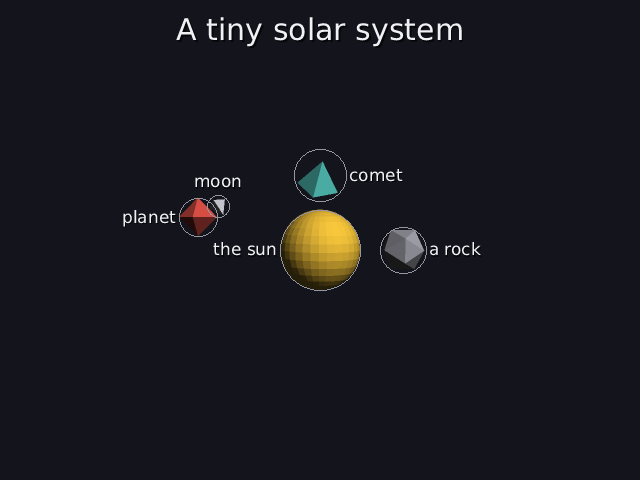
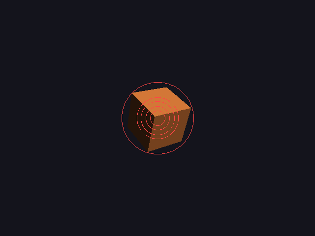

# sarah's video renderer

A 3D engine written from scratch in C++17, built so that **an AI can write
the scenes**, and you can walk around inside them while they play.

AI models are good at saying *what* should be in a scene ("a big cube, a
sphere next to it, a pyramid on top") but bad at picking *coordinates*:
things overlap, hide each other or end up off screen. So in this engine the
AI never writes numbers. It writes **dan**, a small scene language (`.dan` files) of objects,
relations and motions, and a **solver** works out where everything goes,
which paths moving things take so they never collide (unless they're meant
to), and where the camera should stand. A CPU software rasterizer then draws
it, live in a window you can walk around in, with the things an explainer
needs (like [Manim](https://www.manim.community/)): titles, labels that
place themselves, math formulas typeset by its own small TeX that
**write themselves in** and **turn into the next formula** (Manim's Write
and Transform), smooth outline text, arrows, easing, fades, and mp4 export up to 1080p.

The AI writes a `.dan` file; the engine reloads it every time it's saved and
writes `<file>.dan.report` with every error and every problem the solver
found, so the AI can fix its own scene.




```
# scenes/labels.dan
title "A tiny solar system"
sun    = sphere big gold important label "the sun"
planet = octahedron red orbits sun 1 turn 0s-20s label "planet"
moon   = tetrahedron small white orbits planet 3 turns 0s-20s label "moon"
comet  = pyramid small teal flies_past sun 4s-12s smooth label "comet"

# scenes/transform.dan (excerpt)
math "E = mc^2" 0s-20s write 1.5s becomes "E^2 = (mc^2)^2 + (pc)^2" at 4s-6s

# scenes/math.dan (excerpt)
math "F = G\frac{m_1 m_2}{r^2}" 0s-10s
sun    = sphere big gold important label math "m_1" always

# scenes/lazy.dan
cube        = cube big orange important
sphere      = sphere blue near cube
pyramid     = pyramid white above cube
torus       = torus teal left_of sphere
octahedron  = octahedron small grey near moon     # a mistake: there is no moon

# scenes/impact.dan
planet = octahedron red orbits sun 1 turn 0s-20s
comet  = pyramid small white
comet hits planet at 12s from 8s sticks
```

| no solver | greedy | + refinement | + auto camera |
|---|---|---|---|
|  |  |  |  |
| 36 overlapping pairs | 0 overlaps, 6 hidden on screen | 0 hidden | fits the frame |

The circles are each object's bounding sphere: red = overlapping something.

## What's in it

**Renderer** (no graphics libraries; every pixel is computed on the CPU)
- `.obj` mesh loading with validation
- model, view and perspective projection matrices, written out by hand
- back-face culling, bounding-box triangle setup, barycentric rasterization
- z-buffer; **smooth shading**: per-corner normals with a 40° crease angle
  (spheres look round, cubes stay sharp), Phong-blended per pixel, Lambert
  plus a Blinn-Phong highlight ([docs/36](docs/36-smooth-shading.md))
- ~1 ms per frame for ~2000 triangles at 640×480

- **near-plane clipping** (Sutherland–Hodgman in clip space), so you can
  stand inside a scene
- **anti-aliasing** (`--aa`, 2×2 supersampling; 3×3 for HD video), every
  color mixed in **linear light** rather than sRGB bytes ([docs/35](docs/35-linear-light.md))
- **any picture size**: `--hd` renders 1920×1080 at 16:9 with the same layout,
  everything on screen scaled with the height ([docs/34](docs/34-hd.md))
- **see-through** objects
  (sorted far to near, blended, no depth writes)
- **smooth lines and arrows** (distance-to-segment coverage, depth-tested)
- **outline text**: TrueType glyph outlines (read with `stb_truetype`), flattened
  by de Casteljau subdivision and filled by our own nonzero-winding coverage
  rasterizer, with UTF-8 and kerning ([docs/29](docs/29-outline-fonts.md))
- **math**: our own small TeX (a box model: powers, indices, fractions,
  roots, Greek, TeX's spacing), with errors that point at the column
  ([docs/30](docs/30-math.md))
- **vector paths**: titles and formulas kept as loops of points, filled by
  the winding rule or stroked, measured by arc length ([docs/37](docs/37-vector-paths.md))
- **Write**: letters traced then filled, each overlapping the next
  (Manim's lag ratio and DrawBorderThenFill) ([docs/38](docs/38-write.md))
- **Transform**: `becomes "..." at 4s-6s` turns a formula into the next;
  pieces are matched by longest common subsequence (like a diff) and glide,
  the rest fade ([docs/39](docs/39-transform.md))

**Live player**
- a frame loop driven by a real-time clock (frame-rate independent)
- a timeline of timed changes (move, rotate, scale, orbit) that's replayed
  from the start each frame, so you can jump to any moment, and looping is free
- **walk around** while it plays: Tab, then WASD + mouse (yaw/pitch fly
  camera, level movement, the same speed in every direction)
- **parent/child links**: a ring follows its planet, a moon its planet, a
  comet that hit something rides along with it
- SDL3 is used **only** to open a window, read the keys and mouse, and show
  the finished image

**Layout solver** (the part that's being proven out)
- objects as bounding spheres; relations: `near`, `left_of`, `right_of`,
  `above`, `below`, `in_front_of`, `behind`; size words; importance
- dependency ordering (topological sort) with cycle and typo reporting
- greedy placement over candidate spots
- gradient-descent refinement with spring, overlap, relation and
  **screen-space visibility** terms, plus a backtracking line search
- automatic camera framing from a view word, tightened by a binary search on
  the projected size
- **moving objects** (`orbits`, `flies_past`): exact orbit radii from
  point-to-circle distances (moons included, through a planet's "reach"),
  fly-by lines checked with point-to-segment distances, and time sampling
  that provably can't miss a collision ([docs/16](docs/16-motion-placement.md));
  fly-bys past things that are themselves moving ([docs/32](docs/32-flyby-movers.md));
  the camera frames where moving things really are over time, with the same
  can't-miss bound ([docs/33](docs/33-framing-by-sampling.md))
- **intended collisions** (`hits ... at 12s`): intercepts a moving target
  exactly on time, only that pair may touch, then it sticks
  ([docs/18](docs/18-intended-collisions.md))
- **easing** (Manim's rate functions: smooth, sine, rush_into, ...), with the
  collision checks speeded up by each curve's steepest slope ([docs/23](docs/23-easing.md))
- **labels** placed every frame by the label-placement algorithm the project
  started from: priority, candidate boxes, greedy, a gradient nudge, a hard
  check, and hysteresis against flicker ([docs/28](docs/28-labels.md)); labels,
  titles and formulas can each have a time range, and a label can be `always` on
- **room for words**: the solver keeps the title band clear and spaces labelled
  objects so every label fits, checked by running the real label layout
  ([docs/31](docs/31-room-for-words.md))
- a plain-text report of every overlap, hidden pair and relation verdict:
  the feedback the AI will read
- stress tests: 18 adversarial scenes (crowded, cyclic, contradictory,
  typo-ridden, empty, moving, colliding on purpose, eased, labelled, flying
  past movers) and 181 automatic checks.
  They found 4 bugs, each fixed in its own commit ([docs/15](docs/15-stress-tests.md))

**The dan language** ([docs/21](docs/21-scene-language.md))
- hand-written lexer and recursive-descent parser, building the same
  structures the C++ scenes do (a test proves they're identical)
- every error in one go, with line, column and a **did you mean** from edit
  distance (Damerau–Levenshtein, optimal string alignment): the feedback the
  AI will get

- **live reload**: save the `.dan` file and the window updates; a broken save
  keeps the last good scene and says why in the `.report` file ([docs/22](docs/22-live-reload.md))

`make test` runs both test programs: the solver's 181 checks and the
engine's 118 (clipping, the fly camera, fonts, math, labels, text, lines,
fades, easing, looping, the parser, live reload, picture sizes, linear
light, smooth shading, vector paths, write, transform).

## Build and run

Needs a C++17 compiler and SDL3 (`brew install sdl3`).

```
make run              scene 1: three objects animated over 12 s
make run SCENE=2      scene 2: a small solar system, 20 s
./main 3 framed       scene 3: the "lazy AI" scene above, fully solved
./main 3 greedy       ... or stopped after one step (naive, greedy, refined, framed)
./main 4              scene 4: orbits, a moon, and a fly-by, fully solved
./main 4 naive        ... or with naive paths (naive, orbits, flights, framed)
./main 5              scene 5: collisions that are meant to happen
./main scenes/impact.dan    any .dan file: edit and save it while it plays, it reloads live
./main scenes/broken.dan    ... or one full of mistakes, to see the error messages
./main scenes/labels.dan --aa                 labels, titles, a moon and a comet, with smooth edges
./main scenes/math.dan --aa                   formulas, and formulas as labels
./main scenes/showcase.dan --aa               everything at once
./main scenes/write.dan --hd --aa             a title and formula writing themselves in, at 1080p
./main scenes/transform.dan --hd --aa         E = mc^2 turning into the next formulas
./main paths picture.png                      a formula filled, outlined, and as its points
./main stress flyby_mover                     a probe flying past a planet that is itself orbiting
./main scenes/labels.dan --aa --video out.mp4 the same, as an mp4 (needs ffmpeg)
./main scenes/showcase.dan --hd --video hd.mp4 1080p, 3x3 anti-aliased, no debugging circles
./main clip on|off    standing inside a scene, with or without near-plane clipping
./main stress crowd   any of the stress test scenes (crowd, chain, cycle, typos, ...)
make test             all the tests

In any window: Tab = walk around (WASD, mouse, Space/Shift up/down, Ctrl faster), Esc = back.
make stills           regenerate the pictures and reports in docs/images/
```

## How it works

Everything is explained in **[docs/](docs/README.md)**, one page per part of
the pipeline. Each page has the idea, the code, and a worked example with
small numbers you can check on paper. One point is followed from the cube's
`.obj` file all the way to its pixel.

```
.dan text ─► parser ─► scene description ─► solver ───────► world ─► model → view → projection → clip → viewport → rasterize → depth + shade ─► window
                (21)        (11)              (12–14, 16, 18)     (17)     (03)   (04)     (05)      (19)     (06)       (07)        (08)          (10, 20)
```

## Layout

| File | What it is |
|---|---|
| `vec3`, `mat4.h`, `transform.h` | vectors, matrices, and every transform matrix |
| `mesh` | `.obj` loading, bounding radius |
| `render` | the rasterizer |
| `object`, `camera`, `timeline.h` | things in the scene, how they change over time, parent/child links |
| `player`, `window`, `fly_camera` | the frame loop, the SDL window and input, the walking camera |
| `scene_parser`, `scenes/` | the dan language and example `.dan` files |
| `live_scene`, `frame_source.h` | reloading a `.dan` file while it plays, and writing its report |
| `label_layout` | placing labels on the screen, every frame |
| `font`, `fonts/` | outline fonts: reading TrueType files, flattening curves, filling glyphs |
| `math_layout` | the small TeX: parsing formulas and laying them out as boxes |
| `vpath` | text and formulas as vector paths: arc length, Write timing, Transform matching |
| `font8x8.h` | the public-domain bitmap font (kept for tests) |
| `stb_truetype.h` | Sean Barrett's font-file reader (only reads the files) |
| `scene_spec.h` | how a scene is described (what the AI will produce) |
| `layout` | the layout solver for still objects |
| `motion` | paths for moving objects, and collision checks over time |
| `solver` | runs both: still first, then moving |
| `test_scenes`, `solver_test.cpp`, `engine_test.cpp` | the tests |
| `world` | turns a description + solved layout into objects and a camera |
| `pixel.h` | a small single-header image library (PNG/PPM output) |
| `srgb.h` | turning sRGB bytes into amounts of light and back, and mixing colors as light |
| `shapes/` | test meshes |

## Next

- hooking up an AI to write `.dan` files, reading `.dan.report` to fix them
- more of TeX: big operators with limits, matrices, growing brackets, `\text{}`
- animating text and formulas (writing them in, morphing one into another)
- full parent/child transforms (spin and scale too) for things like wheels on
  a moving car

## Third-party files

- `stb_truetype.h` by Sean Barrett: public domain or MIT (your choice;
  both are at the end of the file). Used only to read font files; the
  curve flattening and glyph filling are this project's own.
- DejaVu fonts in `fonts/`: free to use and redistribute, licence in
  `fonts/DejaVu-LICENSE`.
- `font8x8.h`: public domain.

## How this was built

The idea, the design and the direction are mine. I used Claude (an AI
model) as a pair programmer for writing code and docs. Everything is
documented down to the arithmetic so I can explain and defend every part.
