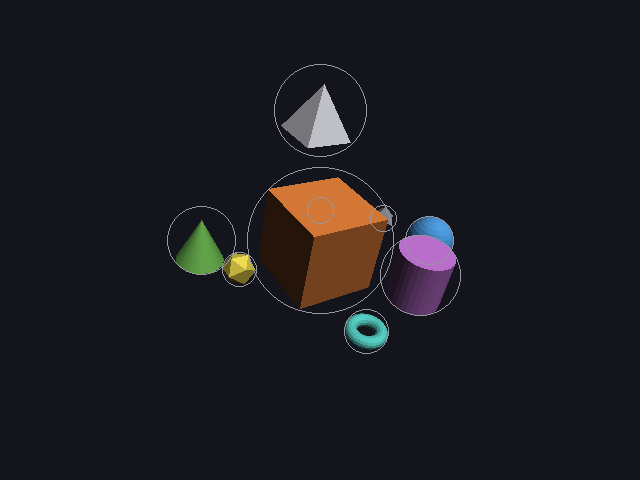

# 12 · Greedy placement (solver step B)

Step A left everything piled inside the cube. Step B places objects **one
at a time**, most important first. Each one tries a list of candidate spots
that fit its relation, and takes the best spot that's free. Once placed, an
object never moves again. That's what **greedy** means: take the best
choice right now and never go back.

It's the same idea as placing labels on a map, which this project started
from (see Christensen, Marks & Shieber, *An Empirical Study of Algorithms
for Point-Feature Label Placement*, 1995), in 3D and with spheres instead of
text boxes.

Code: `layout.cpp` (`place_greedy`, `candidates`, `crowding`, `satisfied`).

---

## 1. The algorithm

```
place the most important object at (0, 0, 0)
for every other object, in dependency order (11):
    spots = candidates from its first relation
    for each spot, best first:
        skip it if it's crowded (too close to something already placed)
        score = how many of its relations are satisfied there
    take the free spot with the highest score (earliest on a tie)
    if no spot is free: take the least crowded one, and report it
```

An object with no usable relation (like the octahedron, whose `near moon`
was dropped) is treated as `near` the most important object.

## 2. Candidate spots

Every candidate is at distance

```
D = r_object + r_other + gap         (gap = 0.4)
```

from the other object's center: the two spheres then have exactly `gap` of
empty space between them. If those are all taken, the same directions are
tried at 1.5×, 2×, 3× and 4× that distance.

**near** tries 8 directions around the other object: right, left,
front-right, front-left, back-right, back-left, front, back. Then it tries
the same 8 tilted upwards. Sides and front come first because that's what a
camera in front sees best.

**left_of / right_of / above / below / in_front_of / behind** tries straight
in that direction first. Then it fans out by **30°** and then by **60°**
towards the four directions around it, to get around whatever is in the way.

### Tilting a direction

To tilt a unit direction d by an angle θ towards a perpendicular unit
direction t, add t scaled by tan θ and normalize:

```
tilted = normalize(d + tan θ · t)       tan 30° = 0.577,  tan 60° = 1.732
```

Example: d = left = (−1, 0, 0), t = down = (0, −1, 0), θ = 60°:

```
d + 1.732·t = (−1, −1.732, 0)
length = √(1 + 3) = 2
tilted = (−0.5, −0.866, 0)          60° below "straight left" ✓
```

The two perpendicular directions come from cross products (01): pick any
vector not parallel to d, cross it with d to get one perpendicular, then
cross again to get the other.

## 3. Crowded or free?

A spot is **free** when object i there has at least `gap` of empty space to
every object placed so far:

```
crowding = Σ over placed objects j of  max(0, (r_i + r_j + gap) − |spot − p_j|)
free  ⇔  crowding = 0
```

When no spot is free, the one with the **least** crowding is used, so the
object overlaps as little as possible, and the report says so.

---

## 4. Worked example: scene 3, step by step

Radii (from 11): cube 2.42, sphere 0.80, cone 1.13, torus 0.80.

**1. cube** (importance 10) → **(0, 0, 0)**.

**2. sphere near cube.** D = 0.80 + 2.42 + 0.4 = 3.62.
First candidate, right: (3.62, 0, 0). Nothing else is placed yet, so it's
free. Is "near" satisfied? surface gap = 3.62 − 3.22 = 0.4 ≤ 2 → ok.
→ **(3.62, 0, 0)**.

**3. cone near cube.** D = 1.13 + 2.42 + 0.4 = 3.96.
Right: (3.96, 0, 0). Distance to the sphere = 0.33, but it needs
1.13 + 0.80 + 0.4 = 2.33 → crowded, skip.
Left: (−3.96, 0, 0). Distance to the sphere = 7.58 ≥ 2.33, to the cube
= 3.96 ≥ 3.96 → free. → **(−3.96, 0, 0)**.

**... (cylinder, icosahedron, pyramid the same way) ...**

**7. torus left_of sphere.** This one is hard: the space left of the sphere
is taken by the cube. D = 0.80 + 0.80 + 0.4 = 2.0, starting from the
sphere at (3.62, 0, 0).

- straight left, 1×: (1.62, 0, 0) → inside the cube (needs 3.62 from its center) ✗
- every 30° tilt and 1.5× distance → still hits the cube or the pyramid ✗
- 60° tilt **down**, 2×: direction (−0.5, −0.866, 0), distance 4:

```
spot = (3.62, 0, 0) + 4·(−0.5, −0.866, 0) = (1.62, −3.46, 0)
distance to cube center = √(1.62² + 3.46²) = 3.83 ≥ 3.62 → free ✓
left_of check: along = 3.62 − 1.62 = 2.0 ≥ reach 1.6 → ok ✓
```

→ **(1.62, −3.46, 0)**: below and to the left of the sphere, clear of the cube.

The engine's own report ([scene3-greedy.txt](images/scene3-greedy.txt))
shows the same numbers:

```
layout (greedy): 9 objects, 0 overlapping pairs, 6 pairs overlapping on screen
    cube        big     r= 2.42  at (  0.00,   0.00,   0.00)
    sphere      normal  r= 0.80  at (  3.62,   0.00,   0.00)
    cone        normal  r= 1.13  at ( -3.96,   0.00,   0.00)
    ...
    torus       normal  r= 0.80  at (  1.62,  -3.46,   0.00)
  7 of 7 relations satisfied
```

## 5. Result

| | naive (step A) | greedy (step B) |
|---|---|---|
| overlapping pairs | 36 | **0** |
| relations satisfied | 0 of 7 | **7 of 7** |



All grey circles: nothing overlaps.

### What greedy gets wrong (the next step's job)

It works in 3D only and never looks through the camera:

- the **sphere** is hidden behind the cylinder
- the **tetrahedron** ("behind cube") and the **octahedron** are hidden
  behind the cube. Their small circles sit inside the cube's circle.

The relations are all true, but you can't *see* the result. Also, greedy
never revisits a decision: the first object gets a great spot and the last
ones get whatever is left. Step C ([13](13-refinement.md)) fixes both by
letting everything move a little at once.

### Before the fix: when 30° wasn't enough

The first version only fanned out 30°, and the torus found **no** free spot.
It was placed at the farthest candidate, overlapping the icosahedron, and
the report said `no free spot for torus`. Adding 60° fans and the "least
crowded" fallback fixed it. That's a good example of why the report
matters: the problem was obvious from the text alone.

---

## Try it on paper

The icosahedron (r 0.5) is `near cube`, so D = 0.5 + 2.42 + 0.4 = 3.32. The
sphere is at (3.62, 0, 0), the cone at (−3.96, 0, 0), the cylinder (r 1.13) at
(2.80, 0, 2.80). Which of the first three candidates (right, left,
front-right) is free?

Answer:
- **Right (3.32, 0, 0):** 0.30 from the sphere, which needs 1.7. Crowded.
- **Left (−3.32, 0, 0):** 0.64 from the cone, which needs 2.03. Crowded.
- **Front-right:** 3.32 · (0.707, 0, 0.707) = (2.35, 0, 2.35), which is 0.64
  from the cylinder, needing 2.03. Crowded.

So none of them. The next one, front-left (−2.35, 0, 2.35), is 2.84 from the
cone (≥ 2.03) and far from everything else, so it's free. That's where the
report puts it. ✓
