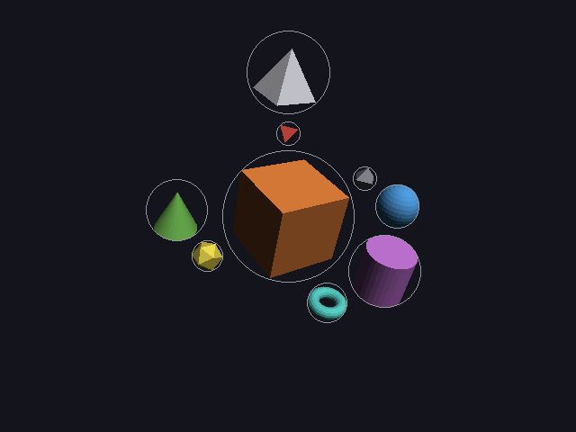

# 14 · Auto camera (solver step D)

Choosing a camera is placement too: where to stand, where to look, how far
back. AIs are as bad at it as at placing objects, so the description only
says **which side** to look from (a word), and the solver works out the
rest so that **the whole scene fits in the picture**.

Code: `layout.cpp` (`frame`, `view_direction`), `scene_spec.h` (`view_word`),
`world.cpp`.

---

## 1. The description: a view word

```cpp
spec.view = view_word::front_above;     // the default
```

| Word | Looks from (normalized) |
|---|---|
| `front` | (0, 0.1, 1): almost level, a little above |
| `front_above` | (0, 0.375, 1): in front and above (≈ 20° down) |
| `left_above` | (−0.7, 0.5, 0.7) |
| `right_above` | (0.7, 0.5, 0.7) |

There's no "straight above": `look_at` breaks when the camera is directly
over its target (04).

## 2. The steps

```
1. one sphere around the whole scene:   center c, radius R
2. the narrower field of view:          half = min(fov_x, fov_y) / 2
3. how far back so the sphere fits:     distance = 1.05 · R / sin(half)
4. the camera:                          eye = c + direction · distance,  target = c
```

### Step 1: a sphere around the whole scene

- **center:** the middle of the box around all the objects' spheres (smallest
  and largest x, y, z, each including its radius)
- **radius:** how far the farthest sphere reaches from that center:

```
R = max over objects of ( |p_i − c| + r_i )
```

This sphere holds every object's sphere, so it holds every object. (It's
not always the *smallest* such sphere. Welzl's algorithm finds that one,
but this is simple and close enough.)

### Step 2: the narrower field of view

`fov_y` (50°) is the vertical field of view. The horizontal one is wider on
a wide image:

```
fov_x = 2 · atan( tan(fov_y / 2) · aspect )
```

The scene sphere must fit in **both** directions, so the narrower one
decides.

### Step 3: the distance

The camera sees a cone with half-angle `half`. A sphere of radius R exactly
fits inside it when the cone's edge just touches the sphere:

```
                    ____
camera  .  half  _-'    '-_
         '.  _-'     R    \
            '._______._____|     the edge touches the sphere: a right angle
         '-._   distance  c|     between the radius and the edge
              '-._        /
                   '-.__.'
```

The radius meets the edge at a right angle, so in that right triangle:

```
sin(half) = R / distance     →     distance = R / sin(half)
```

Then ×1.05 for a little breathing room.

---

## 3. Worked example

Two spheres: A (r = 1) at (0, 0, 0) and B (r = 1) at (4, 0, 0). Camera:
fov_y = 50°, 640×480, `front_above`.

**Step 1:**

```
box: x from −1 to 5,  y from −1 to 1,  z from −1 to 1
c = (2, 0, 0)
R = max( |(0,0,0) − c| + 1,  |(4,0,0) − c| + 1 ) = max(3, 3) = 3
```

**Step 2:**

```
tan(25°) = 0.46631
fov_x = 2 · atan(0.46631 · 1.3333) = 2 · atan(0.62174) = 2 · 31.87° = 63.74°
half  = min(63.74°, 50°) / 2 = 25°
```

**Step 3:**

```
distance = 1.05 · 3 / sin(25°) = 3.15 / 0.42262 = 7.454
```

**Step 4:**

```
direction (front_above) = (0, 0.375, 1) / √(0.375² + 1²) = (0, 0.375, 1) / 1.06800 = (0, 0.35112, 0.93633)
eye = (2, 0, 0) + 7.454 · (0, 0.35112, 0.93633) = (2, 2.617, 6.979)
```

The camera stands 7.45 away, in front and a bit above, looking at (2, 0, 0).
The two spheres fill the picture from top to bottom (minus the 5%).

## 4. Where it fits in the solver

```
greedy  →  frame  →  refine  →  frame
```

- **Frame before refining**, because the screen term (13) needs to know
  where the camera will really be. Otherwise refinement would un-hide things
  for the wrong camera.
- **Frame again after**, because refining moved things. The second framing
  only changes the camera a little, so what refinement achieved still holds.

## 5. Result

From the report ([scene3-framed.txt](images/scene3-framed.txt)):

```
layout (framed): 9 objects, 0 overlapping pairs, 0 pairs overlapping on screen
  camera: from front_above, looking at (-0.27, 0.81, -0.25), scene radius 5.85, distance 14.53
          eye at (-0.27, 5.91, 13.36)
```

Check it: 1.05 · 5.85 / sin(25°) = 6.1425 / 0.42262 = **14.53** ✓

| refined (fixed camera at (0, 6, 16)) | framed (camera placed by the solver) |
|---|---|
|  |  |

The fixed camera was 17.1 away (√(6² + 16²)) and pointed at the origin.
The solver's camera is 14.5 away and aims at the scene's real center, so the
scene is centered and fills more of the picture. On a scene that's bigger
than the fixed camera can see, it backs away instead.

### Something it showed up: the step size

With the closer camera, the screen term got steeper (it grows like
1/depth²), and refinement's fixed step size started overshooting: the
energy went up on 244 of 500 steps. That's what led to the backtracking line
search in 13, which works for any camera. The report now shows it worked:
the energy never went up.

## The whole solver, step by step

| | naive (A) | greedy (B) | refined (C) | framed (D) |
|---|---|---|---|---|
| overlapping pairs (3D) | 36 | 0 | 0 | **0** |
| pairs overlapping on screen | 36 | 6 | 0 | **0** |
| relations satisfied | 0 of 7 | 7 of 7 | 7 of 7 | **7 of 7** |
| camera | fixed | fixed | fixed | **fits the scene** |

From a description with **no coordinates at all**, and one mistake in it, to
a layout where nothing overlaps, nothing hides anything, every relation
holds, and the camera frames it. That's the core idea of the project
working.

---

## Try it on paper

The same two spheres, but on a tall image, 480×640 (aspect 0.75). Which field
of view decides now, and what's the distance?

Answer: fov_x = 2 · atan(0.46631 · 0.75) = 2 · 19.27° = 38.5°, narrower than
50°, so half = 19.27°. distance = 3.15 / sin(19.27°) = 3.15 / 0.330 = 9.54. A
tall picture is narrow, so the camera has to back off further.
