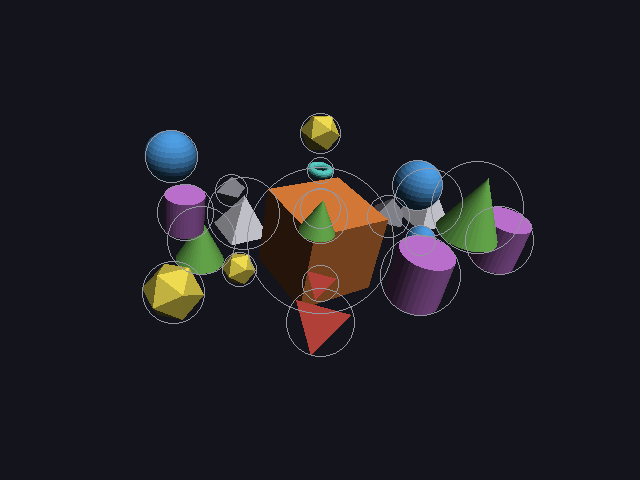
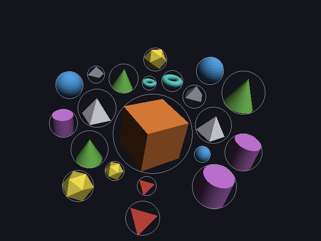
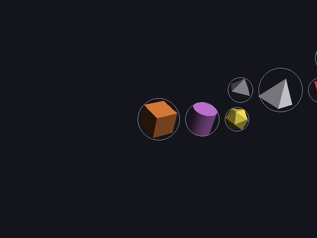
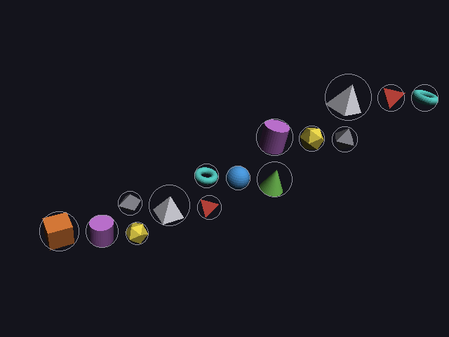

# 15 · Stress tests

Steps A–D (11–14) were built and tuned on **one** scene. An AI will write
scenes nobody has tested: crowded, contradictory, full of typos. So before
the solver grows any further, it gets a set of nasty scenes and a program that
checks the results automatically.

```
make test
```

Code: `test_scenes.h/.cpp` (the scenes), `solver_test.cpp` (the checks),
`layout.h` (`metrics`, `measure`).

---

## 1. The scenes

| Scene | What it attacks |
|---|---|
| `lazy` | the scene from 11–14 |
| `crowd` | 20 objects all `near` one cube: far more than fit |
| `chain` | 15 objects in a row, each relative to the one before: a long scene |
| `cycle` | a `left_of` b, b `left_of` c, c `left_of` a: nobody can go first |
| `contradiction` | a `left_of` b + b `left_of` a; c `above` d + c `below` d |
| `sizes` | huge and tiny objects next to each other |
| `typos` | a misspelled name, a self-reference, two objects with the same name, an empty name |
| `empty` | no objects at all |
| `single` | one object |
| `view_front`, `view_left`, `view_right` | the lazy scene from every camera direction |
| `motion` | scene 4 from 16: orbits, a moon on a moving planet, and a fly-by through a crowded spot |
| `motion_typos` | every way a motion can't work: a circle of orbits, a misspelled name, itself, ending before it starts, flying past a mover |

Any of them can be watched: `./main stress crowd`, or after one step,
`./main stress crowd greedy picture.png`.

## 2. What's measured

For every scene and every step, `layout::measure()` returns:

| Number | Meaning |
|---|---|
| overlaps | pairs of objects whose spheres overlap in 3D |
| hidden | pairs whose circles overlap **on screen** |
| off | objects not completely inside the picture |
| relations | how many are fully satisfied |
| errors | mistakes found in the description |
| warnings | problems while solving |
| halved | refinement steps that overshot and were halved (13) |

## 3. The hard checks

After the full solve (`framed`), every scene must pass:

1. **every position is a real number**: no NaN or infinity anywhere
2. **solving twice gives exactly the same layout**: no randomness, so an AI
   changing one line won't see everything else jump around
3. **no overlaps**
4. **everything is inside the picture**
5. **its mistakes are reported**: at least as many errors as the scene has
6. **moving objects never collide** (added with step E3, 16)
7. **moving objects stay in the picture** at every moment (added with step E4, 16)
8. **nothing is hidden behind something else on screen** (added with tight framing, 14)
9. **planned hits touch exactly on time** (added with intended collisions, 18)
10. **every label has room next to its object** (added with room for words, 31)

If any check fails, `make test` fails.

---

## 4. The off-screen check, on paper

`look()` (13) gives each object's screen position (x, y) and circle radius
in "tan-angle" units. In those units the edges of the picture are at:

```
edge_y = tan(fov_y / 2)            = tan(25°)           = 0.4663
edge_x = tan(fov_y / 2) · aspect   = 0.4663 · 1.3333    = 0.6217
```

An object is **inside** when its circle doesn't cross an edge:

```
|x| + radius ≤ edge_x    and    |y| + radius ≤ edge_y    (and it's in front: depth > 0)
```

Example: a camera at (0, 0, 10) looking at the origin, so right = (1, 0, 0).

**A sphere (r = 1) at (4, 0, 0):**

```
depth = 10,   x = 4 / 10 = 0.4,   radius = 1 / 10 = 0.1
|x| + radius = 0.5 ≤ 0.6217   → inside
```

**The same sphere at (5.5, 0, 0):**

```
x = 0.55,   |x| + radius = 0.65 > 0.6217   → OFF screen
```

Check with NDC (05): 0.65 · focal / aspect = 0.65 · 2.1445 / 1.3333 = 1.045.
More than 1 means past the right edge of the picture. ✓

---

## 5. What the tests found

The first run: **2 of 60 checks failed**, and a third problem wasn't caught
yet. Fixing them took four commits, each found by these tests:

### Bug 1: duplicate names weren't reported
`typos` has two objects called "cube". The solver silently used the **last**
one for "near cube". Now it reports

```
two objects are called "cube" (relations to it use the first one)
```

and uses the first, which is more predictable.

### Bug 2: contradictions weren't reported
"c above d" + "c below d" can't both be true, but nothing said so, and the
solver pulled c both ways at once. Now a relation that contradicts an
earlier one is reported and ignored:

```
c below d contradicts c above d (relation ignored)
b left_of a contradicts a left_of b (relation ignored)
```

`contradiction` went from **0 of 4** relations satisfied to **2 of 2** (the
two left after removing the impossible ones).

### Bug 3: the energy could creep up
While looking at bug 2, the refinement log showed the energy going **up**
between two log lines (329.8373 → 329.8505), even with the line search.
The line search allowed a tiny rise per step (one part in 100,000) for float
rounding. With an energy around 330, that's 0.003 per step, and over 50
steps it adds up. Now a step is kept only if the energy didn't rise at all
(13).

### Bug 4: refinement could make things overlap
In `cycle`, greedy had 0 overlaps but refinement **created** 2. The cycle's
relations can never all be true, and their pull (ρ = 10) was as strong as the
overlap push (γ = 10). Every term in the energy is **soft**: the terms trade
off, and nothing is guaranteed.

But overlapping is never acceptable, while relations are only wishes. So
after refining there's now a **hard** step (`separate`): any pair that's
still too close is pushed straight apart, along the line between their
centers, by exactly what's missing. It's repeated until everything is
clear. The report says when it happened:

```
objects were still overlapping after refining; 28 pushes to separate them (the relations couldn't all be true)
```

**Soft vs hard:** an energy is good at finding a nice compromise between
many wishes; a direct correction is good at enforcing a rule. The solver now
uses both. Scene 3's results didn't change at all (it never had an overlap
to fix).

---

## 6. Results

From [stress-results.txt](images/stress-results.txt), after the full solve:

| Scene | objects | overlaps | hidden | off screen | relations | errors |
|---|---|---|---|---|---|---|
| lazy | 9 | 0 | 0 | 0 | 7 of 7 | 1 |
| crowd | 21 | 0 | 0 | 0 | 12 of 20 | 0 |
| chain | 15 | 0 | 0 | 0 | 14 of 14 | 0 |
| cycle | 3 | 0 | 0 | 0 | 2 of 3 | 1 |
| contradiction | 4 | 0 | 0 | 0 | 2 of 2 | 2 |
| sizes | 5 | 0 | 0 | 0 | 4 of 4 | 0 |
| typos | 5 | 0 | 0 | 0 | 1 of 1 | 4 |
| empty | 0 | 0 | 0 | 0 | 0 of 0 | 0 |
| single | 1 | 0 | 0 | 0 | 0 of 0 | 0 |
| view_front / left / right | 9 | 0 | 0 | 0 | 7 of 7 | 1 |
| motion (added with 16) | 6, 4 of them moving | 0 | 0 | 0 | 1 of 1 | 0 |
| motion_typos (added with 17) | 8, 2 of them moving | 0 | 0 | 0 | 0 of 0 | 5 |
| impact (added with 18) | 5, 3 of them moving, 2 planned hits | 0 | 0 | 0 | 1 of 1 | 0 |
| eased (added with 23) | 6, 4 of them moving, eased | 0 | 0 | 0 | 1 of 1 | 0 |

**ALL PASSED: 0 checks failed.**

Some relations stay unsatisfied, and that's correct:

- **crowd, 12 of 20:** 20 objects can't all be within 2 units of one cube's
  surface. There isn't room. The solver keeps them all visible and
  non-overlapping, and says which `near`s it couldn't keep.
- **cycle, 2 of 3:** one of the three can never be true.

### crowd: greedy vs. full solve

| greedy: 26 pairs hidden on screen | framed: 0 hidden |
|---|---|
|  |  |

### chain: fixed camera vs. auto camera

| refined, camera at (0, 6, 16): 10 objects off screen | framed: all 15 in the picture |
|---|---|
|  |  |

That's the value of step D in one picture: with a fixed camera, most of a
long scene just isn't there.

---

## Why this matters for an AI-written engine

- **Every number is checked every time.** Any later change to the solver
  (like Step E, motion) has to keep `make test` passing, so it can't
  silently break what already works.
- **The bugs were all "it didn't say anything".** A silent wrong answer is
  the worst thing to hand an AI, because it can't see the picture. Three of
  the four fixes were about reporting.
- **Determinism is tested.** The same description always gives the same
  scene.

---

## Try it on paper

With the same camera, at (0, 0, 10) looking at the origin: is a sphere with
r = 2 at (0, 3, 0) inside the picture?

Answer: y = 3/10 = 0.3, radius = 2/10 = 0.2, |y| + radius = 0.5 > edge_y =
0.4663. It's off screen (its top is cut off), even though its center is well
inside.
