# 16 · Motion placement (solver step E)

Steps A–D place things that **stand still**. But these scenes are
animations, and an AI writes motion just as loosely as it writes
positions: "planet orbits sun", "comet flies past sun". It doesn't say
how far out, along which line, or what's in the way.

Step E gives every moving object a **path** and checks the paths **over
time**, so nothing passes through anything at any moment.

Code: `motion.h/.cpp` (paths, the planner, time sampling), `solver.h/.cpp`
(still + moving together), `scene_spec.h` (`orbits`, `flies_past`).

---

## 1. What the AI writes

```cpp
spec.add("sun",     "shapes/sphere.obj", yellow, size_word::big, 10);
spec.add("planet1", "shapes/octahedron.obj", red).orbits("sun", 1.0f, 0.0f, 20.0f);   // 1 turn, 0 → 20 s
spec.add("comet",   "shapes/pyramid.obj", white).flies_past("sun", 4.0f, 10.0f);     // 4 → 10 s
```

| Motion | What the solver decides |
|---|---|
| `orbits(X, turns, start, end)` | the circle's radius, and where on it to start |
| `flies_past(X, start, end)` | the straight line: which side of X, how far |

## 2. Still first, then moving

```
the description
   │  split_motion: who moves?
   ├──► still objects ──► layout (steps A–D) ──► positions      ─┐
   └──► moving objects ─────────────────────────► motion_plan ───┴─► paths
```

A moving object needs something that **stands still** to move around.
`split_motion` checks every motion, and anything it can't use is reported
while that object stands still instead:

| Problem | Message (shortened) |
|---|---|
| unknown name | `there is no object called "sunn" (it stands still instead)` |
| around itself | `it can't move around itself` |
| end ≤ start | `it ends before it starts` |
| around something that **moves** | `moving around something that moves isn't supported yet` |
| a still object placed relative to a mover | `comet moves, so it can't be used to place things (relation ignored)` |

The fourth one is the moon orbiting a planet that orbits the sun. It needs
**parent/child transforms**: the moon's path is relative to the planet,
whose path is relative to the sun. That's a later feature, so for now it's
reported clearly instead of half-working.

## 3. A path's position at time t

Both kinds use the progress `f` from 09: 0 before `start`, 1 after `end`,
a straight line in between.

**Orbit:** a circle in the horizontal plane around the center c:

```
angle = start_angle + 2π · turns · f
p(t)  = c + R · ( cos(angle), 0, −sin(angle) )
```

That's exactly what `rotate_y` (03) does to the point (R, 0, 0), so when
`world` animates it with `object::rotate_around`, the object moves along
precisely the circle the solver checked.

Example: planet1, R = 2.6, 1 turn over 0 → 20 s, start angle 0. At t = 5:

```
f = 5/20 = 0.25,  angle = 2π · 0.25 = 90°
p = (2.6 · cos 90°, 0, −2.6 · sin 90°) = (0, 0, −2.6)      a quarter turn: behind the sun
```

**Fly-by:** a straight line from `from` to `to`:

```
p(t) = lerp(from, to, f)                  (09)
```

## 4. Checking over time: how often is enough?

Collisions are found by looking at the scene at many moments ("samples").
The danger: two objects could pass through each other **between** two
samples, and nobody would notice. So how far apart can the samples be?

**The argument:**

1. Let `v_max` be the fastest any object moves. In a time `dt`, nothing
   moves more than `v_max · dt`.
2. So the distance between two objects changes by at most `2 · v_max · dt`
   in that time (both could move straight towards each other).
3. Every moment is at most `dt/2` from a sample. So at the nearest sample,
   the distance is off by at most `2 · v_max · dt/2 = v_max · dt`.
4. Choose
   ```
   dt = gap / (4 · v_max)        →   off by at most gap/4
   ```
5. A sample flags a pair whenever they're **closer than (r₁ + r₂ + gap/4)**.

If two objects overlap at any moment (distance < r₁ + r₂), then at the
nearest sample their distance is less than r₁ + r₂ + gap/4, so they're
flagged. **No collision can slip between samples.** The price: a near miss
(less than gap/4 = 0.1 of empty space) is flagged too, and that's fine
because we want some space anyway.

**Scene 4's numbers** (from the report):

```
comet:   from (−7.53, 0, 0) to (7.53, 0, 0) in 6 s  →  15.06 / 6 = 2.51 per second   (the fastest)
planet2: radius 2.67, 2 turns in 20 s               →  2π · 2.67 · 2 / 20 = 1.68 per second
dt = 0.4 / (4 · 2.51) = 0.0398 s                    →  about 500 samples over 20 s
```

The report says `checked every 0.0398 s (fastest moves 2.5107 per second)`. ✓

### Worked check: when does the comet hit the sun?

The comet (r = 0.87) goes along x: x(t) = −7.53 + 15.06 · (t − 4)/6. It's
flagged once its distance to the sun's center (r = 1.4) is below
0.87 + 1.4 + 0.1 = 2.37:

```
−7.53 + 2.51 · (t − 4) = −2.37    →    t − 4 = 5.16 / 2.51 = 2.057    →    t = 6.057 s
```

The first sample after that is 153 · 0.0398 = 6.09 s, and the report says
`comet hits sun, first at 6.09 s`. ✓

## 5. Step E1: the naive paths

The simplest paths, checking nothing:

- **orbit:** as small as possible without touching what it goes round:
  `R = r_object + r_center + gap`, starting on the +x side
- **fly-by:** straight along x, right through the middle of what it
  passes

Scene 4 (`./main 4 naive`, `lazy_motion_scene` in `test_scenes.cpp`):

- a sun, and a **rock** near it (greedy puts it at (2.6, 0, 0))
- **planet1** and **planet2** orbiting the sun (1 and 2 turns), with no
  distance given
- a **comet** flying past the sun from 4 s to 10 s
- a **moon** orbiting planet1, which isn't supported yet

The report ([scene4-naive.txt](images/scene4-naive.txt)):

```
motion (naive): 3 moving objects, 9 colliding pairs
    planet1    orbits sun, 0.00-20.00 s: radius 2.60, 1.00 turns
    planet2    orbits sun, 0.00-20.00 s: radius 2.67, 2.00 turns
    comet      flies_past sun, 4.00-10.00 s: from (-7.53, 0.00, 0.00) to (7.53, 0.00, 0.00)
  collisions:
    planet1 hits rock, first at 0.00 s (closest: inside each other by 1.60)
    planet1 hits planet2, first at 0.00 s (closest: inside each other by 1.60)
    comet hits sun, first at 6.09 s (closest: inside each other by 2.24)
    ...
  problems with motions in the description:
    moon orbits planet1: planet1 moves too, and moving around something that moves isn't supported yet (it stands still instead)
```

Planet1's smallest orbit, 1.4 + 0.8 + 0.4 = 2.6, is exactly where greedy put
the rock: they start **in the same place**. Both planets' orbits are nearly
the same size, so they're on top of each other at the start too, and
planet2 laps planet1. The comet flies straight through the sun.

| 0 s | 3 s | 7 s | 12 s |
|---|---|---|---|
| 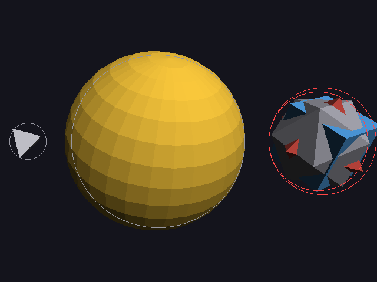 | 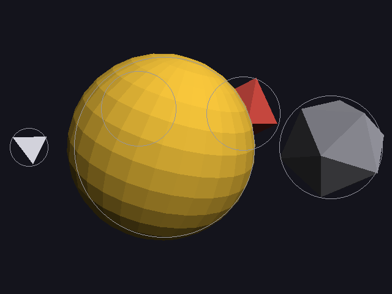 | 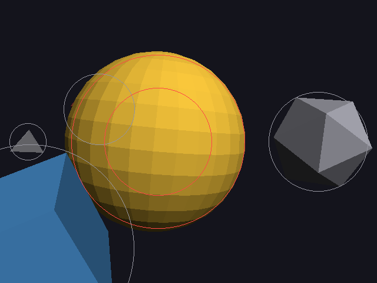 | 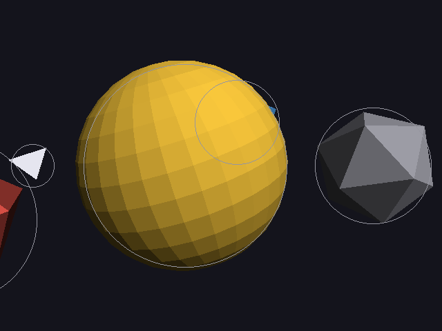 |

The circles now go red **in whichever frame** two spheres overlap
(`render::finish` checks every pair each frame), so collisions blink red as
they happen. At 0 s the rock and both planets are one red tangle; at 7 s
the comet is inside the sun.

The camera only frames the still objects, so moving ones can leave the
picture: all 3 of them do at some point. That gets fixed in E4.

---

## 6. Step E2: orbit radii

An orbit is a whole **circle**, so it doesn't matter where the planet is
right now: if the circle passes too close to something, the planet will hit it
sooner or later. So the radius is picked once, for the whole circle.

### How close does a circle come to a point?

Orbit: center c, radius R, flat (horizontal). A still object at o.
Measure o from c:

```
h = horizontal distance from c to o   (x and z only)
v = height of o above c               (y only)
```

The circle's closest point to o is the one straight "out" towards it, so
in the plane through c, o and that point:

```
closest distance = √( (h − R)² + v² )
```

It must be at least `need = r_planet + r_o + gap`. Square both sides and solve
for R. The circle is too close exactly when

```
|h − R| < w,      w = √(need² − v²)              (if need ≤ |v|, never too close)
```

so each still object **rules out every radius between h − w and h + w**.

**Two orbits round the same center**, with radii R and R_q: every point on one
circle is at least |R − R_q| from the other circle. They can never meet if
|R − R_q| ≥ r + r_q + gap, so an existing orbit rules out R_q − need ..
R_q + need.

**The pick:** the smallest R that is at least `r + r_center + gap` and not
inside any ruled-out range. The answer is always either that minimum or
the top end of some range, so only those values need to be tried.

### Worked example: scene 4

Sun r = 1.4. The rock (r = 0.8) is at h = 2.6, the moon (r = 0.3, standing
still) at h = 2.1, both at v = 0, so w = need.

**Planet1** (r = 0.8). Smallest radius: 0.8 + 1.4 + 0.4 = **2.6**.

| Rules out | need | range |
|---|---|---|
| rock | 0.8 + 0.8 + 0.4 = 2.0 | 2.6 − 2.0 .. 2.6 + 2.0 = **0.6 .. 4.6** |
| moon | 0.8 + 0.3 + 0.4 = 1.5 | 2.1 − 1.5 .. 2.1 + 1.5 = **0.6 .. 3.6** |

Try 2.6: inside 0.6..4.6 ✗. Try 3.6: inside 0.6..4.6 ✗. Try 4.6: on the edge,
allowed ✓ → **R = 4.6**.

**Planet2** (r = 0.87). Smallest radius: 0.87 + 1.4 + 0.4 = **2.67**.

| Rules out | need | range |
|---|---|---|
| rock | 2.07 | 0.53 .. 4.67 |
| moon | 1.57 | 0.53 .. 3.67 |
| planet1's orbit (4.6) | 0.87 + 0.8 + 0.4 = 2.07 | 2.53 .. **6.67** |

Try 2.67 ✗ (rock), 3.67 ✗ (rock), 4.67 ✗ (planet1's orbit), 6.67 ✓ →
**R = 6.67**.

The report ([scene4-orbits.txt](images/scene4-orbits.txt)):

```
motion (orbits): 3 moving objects, 4 colliding pairs
    planet1    orbits sun, 0.00-20.00 s: radius 4.60, 1.00 turns
    planet2    orbits sun, 0.00-20.00 s: radius 6.67, 2.00 turns
  collisions:
    planet2 hits comet, first at 4.58 s ...
    comet hits moon, first at 5.68 s ...
    comet hits sun, first at 6.06 s ...
    comet hits rock, first at 7.35 s ...
```

**9 → 4 colliding pairs**, and every one that's left involves the comet,
which still flies straight through (E3). The orbits are exact: they
can't hit any still object or each other, at any speed and at any moment,
which is better than sampling could ever prove.

One limit: orbits around **different** centers aren't compared this way
(their circles aren't concentric). Time sampling still catches them if they
collide.

| 0 s | 3 s | 7 s | 12 s |
|---|---|---|---|
| 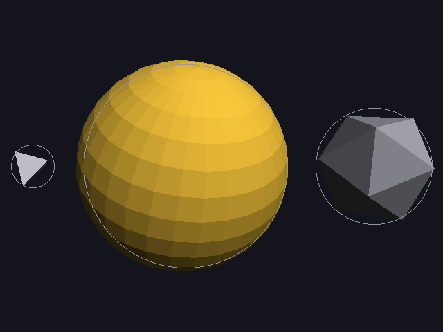 | 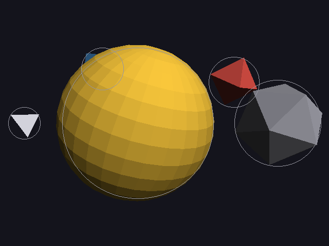 | 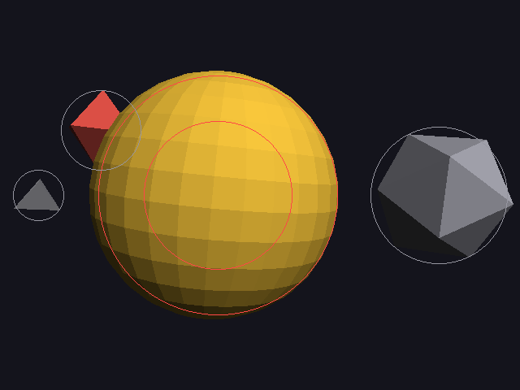 | 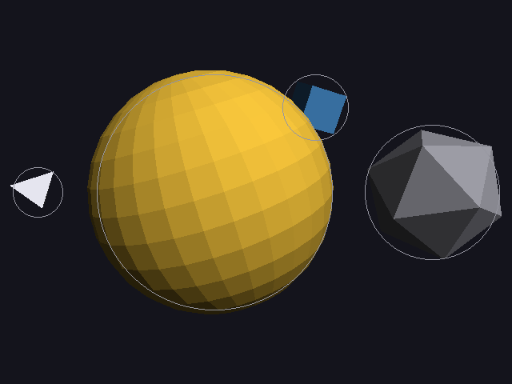 |

The planets are clear of the rock and of each other. Planet2's orbit is
now so wide it's mostly out of the picture, because the camera still only
frames the still objects (E4).

---

## 7. Step E3: fly-by paths

A fly-by is a straight segment. The naive one went right through the
middle of the sun. Now the planner tries lines that **pass** it, in this
order:

```
sides:      in front (+z, towards the usual camera), above, below, behind
distances:  D = r_comet + r_sun + gap,  then ×1.5, ×2, ×3, ×4
```

and takes the first line that's clear of **both** kinds of things.

### Against still objects: exact

The closest point of a segment A → B to a point q:

```
s       = clamp( dot(q − A, B − A) / |B − A|² ,  0, 1 )     how far along the segment (0 = A, 1 = B)
closest = A + s · (B − A)
```

`dot(q − A, B − A) / |B − A|²` is the projection from 01: how far along the
line q is. Clamping keeps it on the segment, so past the ends, the end
itself is the closest point. The distance from `closest` to q must be at
least `r + r_q + gap`.

Example: the rock at q = (2.6, 0, 0), and the "above" line from
A = (−7.53, 2.67, 0) to B = (7.53, 2.67, 0):

```
B − A = (15.06, 0, 0),   q − A = (10.13, −2.67, 0)
s = (10.13 · 15.06) / 15.06² = 10.13 / 15.06 = 0.673
closest = (−7.53 + 0.673 · 15.06, 2.67, 0) = (2.6, 2.67, 0)      straight above the rock
distance = 2.67 ≥ need = 0.87 + 0.8 + 0.4 = 2.07   ✓ clear
```

### Against moving objects: sampling

Both things move, so there's no single formula. The candidate is checked
by time sampling, exactly as in section 4, over the whole video. That
includes the time **before** the fly-by starts and **after** it ends,
because the comet waits at its start and end points then, and something
could run into it there.

### Worked example: why not the line in front?

The first candidate is in front of the sun: z = 2.67, y = 0. Against the
still objects it's fine (the same numbers as above, just sideways). But it
lies in the planets' orbit plane, and it crosses planet2's orbit (R = 6.67)
at x = ±√(6.67² − 2.67²) = ±6.11. Sampling finds that **at 8.84 s**,
planet2 comes within 0.07 of the comet, below the gap/4 = 0.1 it needs. ✗

The next candidate, **above** (y = 2.67, z = 0), is 2.67 above the orbit
plane. A planet would have to be within 0.87 + 0.87 + 0.4 = 2.13 of it, and
it's always at least 2.67 away. That's clear at every moment, without
sampling even needing to find it. ✓

The report ([scene4-flights.txt](images/scene4-flights.txt)):

```
motion (flights): 3 moving objects, 0 colliding pairs
    planet1    orbits sun, 0.00-20.00 s: radius 4.60, 1.00 turns
    planet2    orbits sun, 0.00-20.00 s: radius 6.67, 2.00 turns
    comet      flies_past sun, 4.00-10.00 s: from (-7.53, 2.67, 0.00) to (7.53, 2.67, 0.00)
```

| | naive (E1) | orbits (E2) | flights (E3) |
|---|---|---|---|
| colliding pairs | 9 | 4 | **0** |

| 0 s | 3 s | 7 s | 12 s |
|---|---|---|---|
|  |  |  |  |

Every circle stays grey for the whole video. The stress tests now check
this too: **moving objects never collide** is a hard check for every scene
(15).

What's left: at 7 s the comet is at the top edge, cut off, and planet2's
wide orbit leaves the picture. The camera still frames only the still
objects.

---

## 8. Step E4: framing the paths

Step D (14) fits the camera around every **still** object. Now it also has
to fit every **path**:

| Path | Spheres that hold all of it |
|---|---|
| orbit (center c, radius R, object radius r) | **32 spheres** spread around the circle, each of radius r + 2R·sin(π/64) |
| fly-by (A → B, object radius r) | **two spheres**, at A and at B, radius r |

**Why 32 spheres for an orbit?** One sphere of radius R + r around the center
would hold the whole ring too, but it's as tall as it is wide, and an orbit
is flat. That's a lot of empty space for the camera to make room for. 32
points around the circle are 360°/32 = 11.25° apart. Any point of the ring is
at most half a step from one of them, and **at most 2R·sin(π/64)** away (that's a safe bound for half a step's
chord). So growing
each sphere by that covers the whole ring.

**Why two spheres for a fly-by?** Every point of the segment lies between A
and B, and the distance from a point is "convex": along a straight line,
it's largest at one of the ends. So whatever fits both ends fits the whole
path.

`scene_solver` hands these to the layout (`include_in_frame`) and frames
again (`reframe`), with the tight binary search from 14. A new check walks
every path with the same sample step as section 4 and counts moving objects
that leave the picture at **any** moment.

### Worked example

```
planet1's ring:  R = 4.60,  32 spheres of radius 0.80 + 2·4.60·sin(π/64) = 0.80 + 0.45 = 1.25
planet2's ring:  R = 6.67,  32 spheres of radius 0.87 + 2·6.67·sin(π/64) = 0.87 + 0.65 = 1.52
comet's ends:    (±7.53, 2.67, 0),  radius 0.87

box in y:  from −1.52 (the rings) to 2.67 + 0.87 = 3.54 (the comet)  →  center y = 1.01
farthest:  a comet end,  √(7.53² + (2.67 − 1.01)²) + 0.87 = 7.71 + 0.87 = 8.58
sphere fit:  1.05 · 8.58 / sin(25°) = 21.31,   then the binary search → 16.73
```

| | flights (E3) | framed (E4) |
|---|---|---|
| what the camera fits | still objects only | still objects **and every path** |
| scene radius | 2.90 | **8.58** |
| camera distance | 4.91 | **16.73** (sphere fit: 21.31) |
| moving objects that leave the picture | 3 | **0** |

From [scene4-flights.txt](images/scene4-flights.txt) and
[scene4-framed.txt](images/scene4-framed.txt). The stress tests check it
too: **moving objects stay in the picture** is a hard check for every scene.

| 0 s | 3 s | 7 s | 12 s |
|---|---|---|---|
| 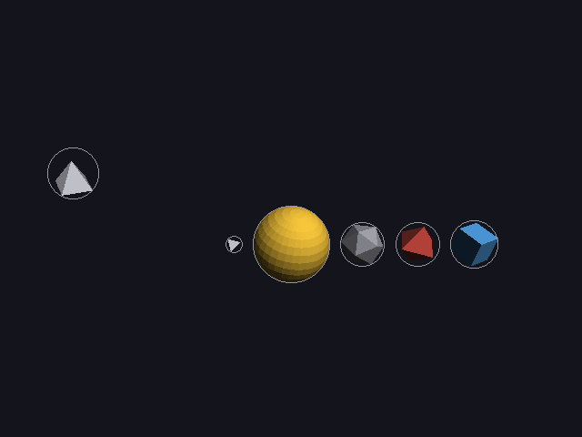 | 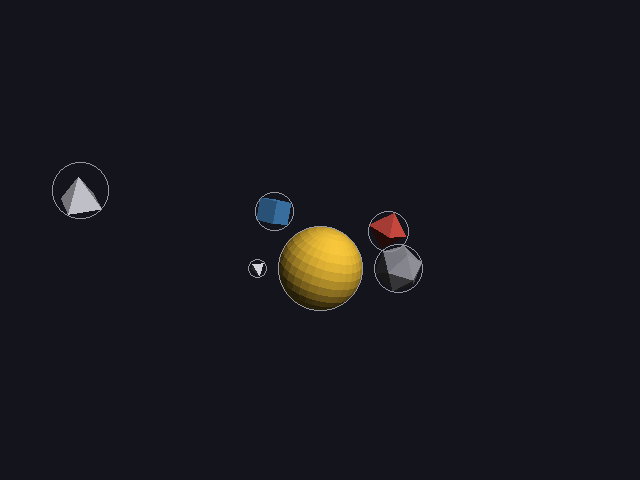 | 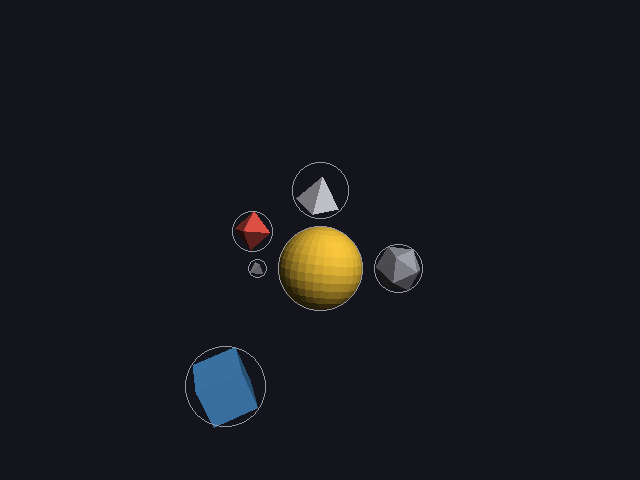 | 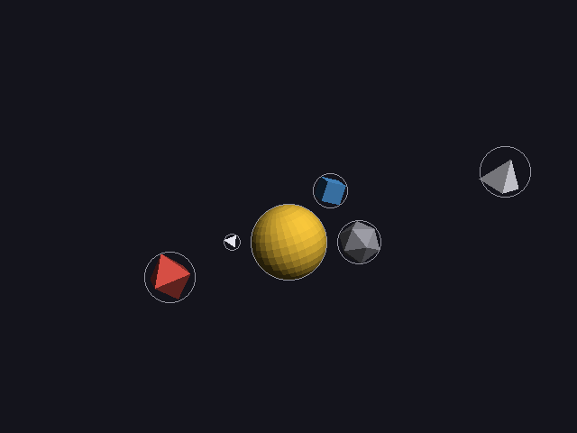 |

The objects still look smallish, and that's correct. The camera has to fit
the **whole** sweep of planet2's orbit and the comet's 15-unit path for the
entire video, not just one moment. At any single moment most of that room
is empty.

---

## 9. The whole of step E

| | E1 naive | E2 orbits | E3 flights | E4 framed |
|---|---|---|---|---|
| colliding pairs | 9 | 4 | 0 | **0** |
| moving objects leaving the picture | 3 | 3 | 3 | **0** |
| orbit radii | 2.60, 2.67 | 4.60, 6.67 | 4.60, 6.67 | 4.60, 6.67 |
| comet's path | through the sun | through the sun | above the sun | above the sun |

From a description that says only "orbits sun" and "flies past sun", the
planner found paths that never collide at any moment, keep everything
visible the whole time, and reported the one motion it can't do yet.

---

## Try it on paper

1. Planet2 (R = 2.67, 2 turns over 0 → 20 s, start angle 0). Where is it at
   t = 2.5 s?
2. An orbit around (0, 0, 0) for an object with r = 0.5. A still box-shaped
   rock with r = 1 sits at (3, 2, 0). Which radii does it rule out? (gap = 0.4)

Answer: f = 0.125, angle = 2π · 2 · 0.125 = 90°, so p = (0, 0, −2.67).
Planet1 at that time: f = 0.125, angle = 45°, p = (1.84, 0, −1.84). Distance
between them = √(1.84² + 0.83²) = 2.02, more than 0.8 + 0.87 = 1.67. At this
moment they don't touch: planet2 has pulled ahead.

2. h = 3, v = 2, need = 0.5 + 1 + 0.4 = 1.9. need ≤ |v| = 2, so it's never in
   the way: the orbit passes underneath with room to spare. (Check: at R = 3
   the closest distance is √(0 + 4) = 2 ≥ 1.9 ✓.)
