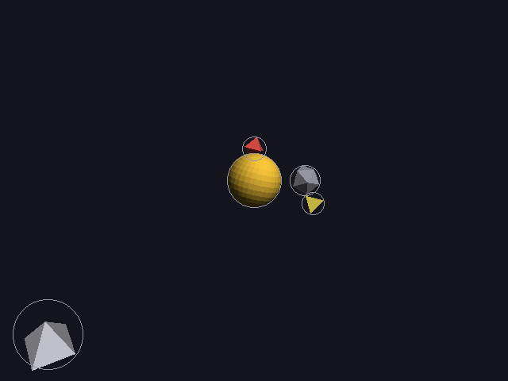
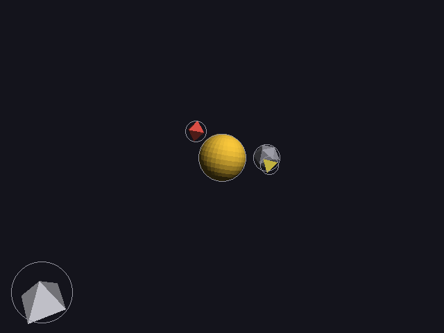
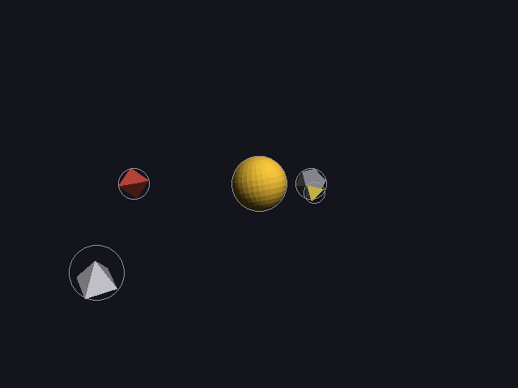
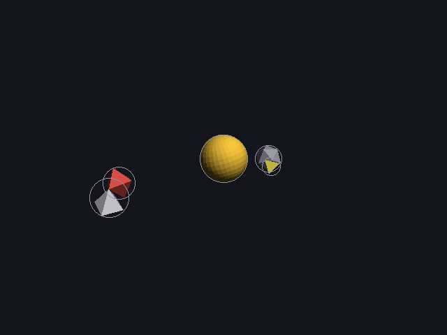
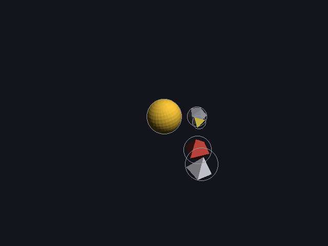

# 18 · Intended collisions

Everything so far treated a collision as a mistake. But sometimes it's the
**point**: a comet slamming into a planet, a ball hitting a wall. So the
description can now say that something hits something else **on purpose**:

```cpp
spec.add("comet", "shapes/pyramid.obj", white, size_word::small).hits("planet", 12.0f, 4.0f);
//                                                          hits what ─┘    at 12 s ─┘   └─ after flying for 4 s
```

The solver then has three jobs:

1. make it touch **exactly** at 12 s, even though the planet is moving
2. let those two touch at that moment, but **only** then: no other collision is allowed
3. after impact, the comet **sticks** and rides along with the planet

Code: `scene_spec.h` (`hits`), `motion.cpp` (`plan_hits`, `meant_to_touch`,
`position`, `reach`), `world.cpp` (`stick_to`, 17).

---

## 1. Hitting a moving target: intercepting

All paths are worked out **in advance**, so where the planet will be at
12 s is known exactly: target(12). Coming in from direction n (a unit
vector), the comet touches the planet when their centers are exactly
r_comet + r_planet apart:

```
contact = target(T) + n · (r_comet + r_target)
start   = contact + n · L
path    = straight line from start to contact, during [T − approach, T]
```

That's the same thing an archer does when leading a moving target: aim
where it **will** be, not where it is. Here it's exact, because the planet's
future is already known.

### Worked example: scene 5

The planet orbits the sun with R = 6.35 (why 6.35: see section 4), 1 turn in
20 s. At T = 12 s:

```
angle = 2π · 12/20 = 216°
planet(12) = (6.35 · cos 216°, 0, −6.35 · sin 216°) = (−5.14, 0, 3.73)
```

The comet (r = 0.87, a small pyramid) and the planet (r = 0.8):

```
touch distance = 0.87 + 0.80 = 1.67
n = in front, (0, 0, 1)        (the first direction that's clear, section 3)
contact = (−5.14, 0, 3.73) + (0, 0, 1.67)  = (−5.14, 0, 5.40)
start   = contact + n · (2 · 1.67 + 3)     = (−5.14, 0, 11.73)
```

The report ([scene5-framed.txt](images/scene5-framed.txt)):

```
comet      hits planet (which moves), 8.00-12.00 s: from (-5.14, 0.00, 11.73), touching at (-5.14, 0.00, 5.40) at 12.00 s, then sticks
planned hit: comet touches planet at 12.00 s (gap 0.00) as planned
```

It flies for 4 s while the planet swings round, and the two meet exactly at
12.00 s with a gap of 0.00.

## 2. Touching only when it's meant to

The collision checks (16) would flag the comet and planet as they get
close. So **that one pair** is let off for a short window: the last part of
the approach, and all the time afterwards while it's stuck.

```
window = 2 · gap / speed            (the time to cover the last gap, twice over)
```

```
comet speed = |start − contact| / 4 s = 6.33 / 4 = 1.58 per second   (11.73 − 5.40)
window      = 2 · 0.4 / 1.58 = 0.51 s      → the pair may touch from 11.49 s on
```

Before 11.49 s, the comet and planet are checked like any other pair, so
hitting the planet **early** (on the way in) is still a collision. The
comet touching anything **else** is too.

## 3. Choosing the way in

Like a fly-by (16), it tries directions and takes the first one that
doesn't run into anything it isn't meant to, checked by time sampling over
the whole video:

```
in front (+z), above, right, left, below, behind;  then the same at 1.5× and 2× the distance
```

**Naive** (`./main 5 naive`) always comes in from the right (+x),
without checking. It still hits exactly on time, but on the way it crashes
through other things:

```
motion (naive): 3 moving objects, 5 colliding pairs
  planned hit: comet touches planet at 12.00 s (gap 0.00) as planned
  planned hit: meteor touches rock at 6.00 s (gap 0.00) as planned
  collisions:
    planet hits rock, first at 0.00 s ...
    comet hits rock, first at 9.54 s ...
    comet hits sun, first at 10.58 s ...
    comet hits meteor, first at 18.13 s ...
    planet hits meteor, first at 19.50 s ...
```

Planned (`./main 5`): **0 colliding pairs**, both hits on time.

## 4. Sticking

After impact, the comet keeps the offset it had at that moment (17, `stick_to`):

```
comet(t) = contact + (planet(t) − planet(T))          for t ≥ T
```

At t = 16 s, the planet is at angle 288°: (1.96, 0, 6.04).

```
comet(16) = (−5.14, 0, 5.40) + ((1.96, 0, 6.04) − (−5.14, 0, 3.73))
          = (−5.14 + 7.10, 0, 5.40 + 2.31) = (1.96, 0, 7.71)
offset from the planet = (0, 0, 1.67)              still touching, same side ✓
```

**A planet with something stuck to it is bigger.** It's the same idea as a
moon (16, reach): for planning its own orbit, the planet counts as

```
reach = r_planet + 2 · r_comet = 0.80 + 2 · 0.87 = 2.53
```

That's why its orbit is 6.35 and not smaller:

```
smallest: 2.53 + 1.4 + 0.4 = 4.33
the rock (at h = 2.62, r = 0.8) rules out 2.62 ± (2.53 + 0.8 + 0.4) = −1.11 .. 6.35
→ R = 6.35
```

Without that, the comet would hit the rock once it's stuck and riding along.

## 5. Scene 5

`impact_scene` in `test_scenes.cpp`, run with `./main 5`:

- the sun, a rock near it, and a planet orbiting the sun
- a **comet** that hits the moving planet at 12 s (a 4 s approach)
- a **meteor** that hits the still rock at 6 s (a 3 s approach)

| 5 s | 6 s: meteor hits | 10 s | 12 s: comet hits | 16 s: riding along |
|---|---|---|---|---|
|  |  |  |  |  |

The circles stay grey: touching isn't overlapping. The stress tests have
`impact` too. They check that planned hits touch **exactly on time**
(a gap of at most 0.01), and that nothing else ever collides.

---

## Try it on paper

1. The meteor (r = 0.5) hits the rock (r = 0.8, standing still at
   (2.62, 0, 0)) at 6 s, coming in from the front. Where does it touch, and
   where does its 3 s flight start?
2. How long is its window?

Answers: 1. contact = (2.62, 0, 0) + (0, 0, 1.3) = (2.62, 0, 1.3); start =
contact + (0, 0, 2 · 1.3 + 3) = (2.62, 0, 6.9). (The report says the same.)
2. Speed = 5.6 / 3 = 1.87 per second, window = 0.8 / 1.87 = 0.43 s, so from
5.57 s on.
