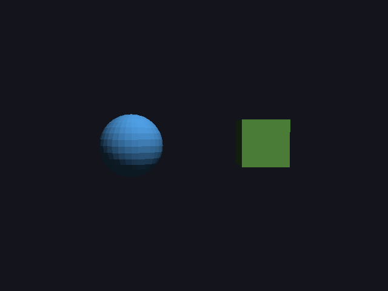
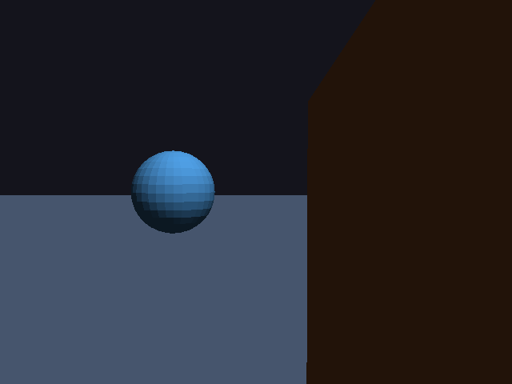

# 19 · Near-plane clipping

Up to now, the camera always stood outside the scene, looking in. To walk
**around inside** a scene (20), triangles will constantly reach from in
front of the camera to behind it: the floor you stand on, the wall you
walk past. The old renderer simply **dropped** any triangle with a corner
behind the camera, so things vanished as soon as you got close.

Code: `render.cpp` (`clip_and_fill`, `to_pixels`), `engine_test.cpp`.

---

## 1. Why you can't just project it anyway

A point behind the camera has w ≤ 0 (05: w = −z in camera space). Dividing
by a negative w flips it to the **wrong side** of the screen, and at w = 0 it
divides by zero. So a triangle with a corner behind the camera can't be
projected as it is. The old fix was to skip it:

```cpp
if(clip.w <= 0.0f) return false;      // the old project(): drop the whole triangle
```

That's fine for a camera far outside, but standing on a floor, **every**
floor triangle has a corner behind you:

| without clipping | with clipping |
|---|---|
|  |  |

(`./main clip off` / `./main clip on`.) Without it, the floor and the column
next to you are simply gone. With it, the floor reaches the horizon, and the
column's near side is cut off cleanly where it passes the camera.

## 2. The fix: cut the triangle at the near plane

Keep only the part of the triangle that's **in front of the near plane**
(z_near = 0.1 in front of the camera). The near plane in clip space is
z_ndc = −1 (05), that is z/w = −1. Since w > 0 in front of the camera, a point
is in front of it when

```
d = z_clip + w_clip  ≥  0
```

`d` is a straight-line ("linear") function of the point: the projection
matrix only multiplies and adds. So along an edge from a to b, d changes
evenly. If a is in front (d_a ≥ 0) and b behind (d_b < 0), the edge crosses
the plane exactly where d = 0:

```
t = d_a / (d_a − d_b)          new point = a + t · (b − a)
```

The clip coordinates are blended with t, and so are the **world**
coordinates (shading needs those, 08). That's all done **before** dividing by
w, while everything is still linear.

### Worked example (on paper)

Camera at (0, 0, 4) looking at the origin, z_near = 0.1, z_far = 100, so
(05) A = −1.002, B = −0.2002. An edge from world z = −1 (in front) to world
z = 5 (behind the camera):

| corner | camera z | z_clip = A·z + B | w = −z | d = z_clip + w |
|---|---|---|---|---|
| a: world (0, 0, −1) | −5 | −1.002·(−5) − 0.2002 = 4.8098 | 5 | **9.8098** |
| b: world (0, 0, 5) | 1 | −1.002·1 − 0.2002 = −1.2022 | −1 | **−2.2022** |

```
t = 9.8098 / (9.8098 + 2.2022) = 0.8167
new point: world z = −1 + 0.8167 · 6 = 3.9           (camera z = −5 + 0.8167 · 6 = −0.1)
```

The cut is at camera z = −0.1: exactly 0.1 in front of the camera, which is
exactly the near plane. ✓

## 3. Sutherland–Hodgman: cutting a whole triangle

Walk round the triangle's three edges a → b. For each edge:

- if a is in front: keep a
- if a and b are on different sides: add the crossing point

```
all 3 in front   → nothing to cut, draw it as before
all 3 behind     → skip it
1 corner behind  → 4 corners left (a quad)   → 2 triangles
2 corners behind → 3 corners left            → 1 smaller triangle
```

```
         c          (behind the camera)
        / \
  - - -x₂- x₁- - -  near plane
      /     \
     a ----- b      (in front)

edge a → b:  a in front → keep a
edge b → c:  keep b;  b in front, c behind → add the crossing x₁
edge c → a:  c behind (not kept);  crossing → add x₂
result: a, b, x₁, x₂  (a quad)  →  triangles (a, b, x₁) and (a, x₁, x₂)
```

The new corners are joined as a **fan** from the first one: (v₀, v₁, v₂),
(v₀, v₂, v₃). That keeps their order round, so back-face culling (07) still
sees the same front and back.

This is the Sutherland–Hodgman algorithm (1974), cutting against a single
plane. GPUs do this exact step in hardware, against all six sides of the
view.

## 4. Why only the near plane?

The other five (left, right, top, bottom, far) don't need cutting here:

- **left/right/top/bottom:** a triangle partly off the side of the screen
  still projects correctly, and `fill` only visits pixels inside the
  image (07, the clamped bounding box)
- **far:** things beyond z_far just get depth > 1; there's nothing that far
  in these scenes

The near plane is the only one where the math itself breaks (dividing by
w ≤ 0).

## 5. Tests

`make test` now also runs `engine_test`:

```
near-plane clipping:
  PASS  a triangle reaching behind the camera is still drawn (4834 pixels)
  PASS  without clipping, the same triangle disappears (0 pixels)
  PASS  a triangle completely behind the camera draws nothing
```

(Writing that test found a mistake in the **test**: its triangle was wound
clockwise seen from above, so it faced down, and back-face culling rightly
skipped it. The engine was right.)

Scenes 1–5 render exactly as before, pixel for pixel: the camera never gets
close enough there for anything to cross the near plane.

---

## Try it on paper

Same camera. An edge from world (0, 0, 0) to world (0, 0, 4.5). Where's
the cut?

Answer: a is at camera z = −4: d = (−1.002·(−4) − 0.2002) + 4 = 3.8078 + 4 =
7.8078. b is at camera z = 0.5: d = (−1.002·0.5 − 0.2002) − 0.5 = −1.2012.
t = 7.8078 / 9.009 = 0.8667, world z = 4.5 · 0.8667 = 3.9. The same plane,
0.1 in front of the camera. ✓
