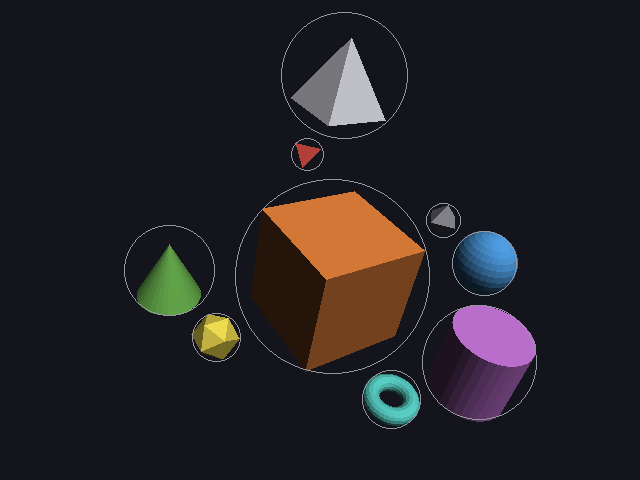
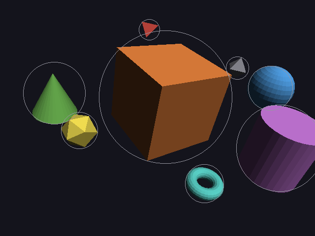
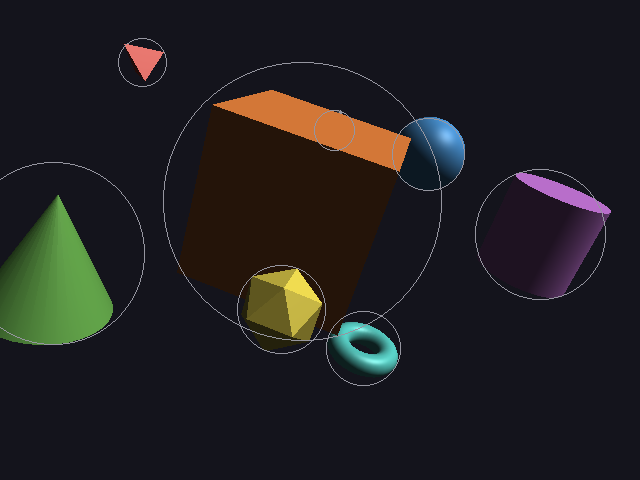

# 20 · Walking around (and looping)

(The keys work in every window: scenes 1–5 and `./main clip`.)

The video player now lets you **walk around inside** the scene while it
plays, like in Minecraft:

| Key | Does |
|---|---|
| **Tab** | switch between the scripted camera and the free camera |
| **W / S** | forward / back |
| **A / D** | left / right |
| **Space / Shift** | up / down |
| **Ctrl** | move 3× faster |
| **mouse** | look around |
| **Esc** | back to the scripted camera (and get the mouse back) |

Code: `fly_camera.h/.cpp` (the math, no SDL), `window.cpp` (reading keys
and the mouse), `player.cpp` (switching cameras), `camera.cpp` (`set_view`).

---

## 1. Where you look: yaw and pitch

The free camera keeps **two angles** instead of a target point:

- **yaw**: turned left/right, around the vertical axis (0 = looking along −z)
- **pitch**: looking up/down (positive = up)

Turning them into a direction: start looking along −z, tip up by pitch
(that sets the height and shrinks the flat part to cos(pitch)), then turn
by yaw:

```
forward = ( cos(pitch) · sin(yaw),   sin(pitch),   −cos(pitch) · cos(yaw) )
```

Check: yaw = 0, pitch = 0 → (0, 0, −1) ✓ (along −z). yaw = 90° → (1, 0, 0),
turned right ✓.

The camera then looks at `eye + forward`, which goes straight into the
same `look_at` as always (04).

### The other way round: starting from the scripted camera

Pressing Tab starts the free camera exactly where the scripted one is.
That needs the angles of a direction d = normalize(target − eye):

```
pitch = asin(d.y)                       (because d.y = sin(pitch))
yaw   = atan2(d.x, −d.z)                (because d.x / −d.z = sin(yaw) / cos(yaw))
```

`atan2` (instead of `atan`) gets the quarter right: it looks at the signs of
both numbers, so looking backwards gives 180°, not 0°.

**Worked example:** scene 3's solved camera, eye (−0.29, 5.35, 11.72) looking
at (−0.29, 0.85, −0.27):

```
target − eye = (0, −4.50, −11.99),   length 12.81
d = (0, −0.351, −0.936)
pitch = asin(−0.351) = −20.6°            (looking down a bit)
yaw   = atan2(0, 0.936) = 0°
```

The walk demo below prints pitch −20.556°, the same up to the rounding of
the printed eye and target.

### Never straight up

Pitch is kept between −89° and 89°. At exactly 90°, `forward` would point
straight up, parallel to `up`, and `look_at`'s cross product would be
(0, 0, 0) (04). The test `looking up stops at 89 degrees` checks it.

## 2. Turning with the mouse

The window **captures** the mouse (`SDL_SetWindowRelativeMouseMode`): the
pointer is hidden, and instead of a position, every movement arrives as
"moved this many pixels" (xrel, yrel). It never hits the edge of the
screen, so you can turn round and round.

```
yaw   += mouse_x · 0.0025          (pixels → radians: 250 pixels ≈ 36°)
pitch −= mouse_y · 0.0025          (screen y goes down, so moving the mouse up looks up)
```

## 3. Moving: flat, and the same speed every way

Like in Minecraft, WASD moves **level**: looking down and pressing W walks
forward; it doesn't dig into the floor. So the movement uses the **flat**
directions (y set to 0):

```
ahead = ( sin(yaw), 0, −cos(yaw) )
right = cross(ahead, up) = ( cos(yaw), 0, sin(yaw) )
up    = (0, 1, 0)
```

Add up the keys held (W: +ahead, S: −ahead, D: +right, ...), then
**normalize**. Without that, W + D would be ahead + right, length
√(1² + 1²) = 1.41: walking diagonally would be 41% faster. Normalized,
every direction is the same speed.

```
eye += direction · speed · dt          (speed 4 per second, 12 with Ctrl)
```

### Real time, again

`dt` is **real** seconds since the last frame (10). At 120 frames per second
that's 1/120 s per frame, at 30 it's 1/30: the same walking speed either way.
The test `60 small steps = 1 big step` checks it.

## 4. Keys: held vs. pressed

Two different questions, two different ways of asking:

| Question | How | Used for |
|---|---|---|
| "is W held down **right now**?" | a snapshot of every key: `SDL_GetKeyboardState` | moving: hold W, keep walking |
| "was Tab **pressed** since last frame?" | key-down **events** from the event queue (10) | switching: one press, one switch |

If Tab used the snapshot, holding it for 5 frames would switch 5 times.

## 5. Not breaking the script

The scripted camera's path is a timeline (09). Moving the free camera with
`cam.move(...)` would change the **start** of that timeline. So it uses
`camera::set_view(eye, target)` instead, which sets the camera for **this
frame only**. Pressing Esc or Tab hands control back, and the scripted camera
carries on exactly where the script is at that moment, because its timeline
was never touched.

## 6. What walking looks like

`./main walk prefix` drives the free camera with **pretend** key presses,
so the walk can be pictured (and tested) without a keyboard: from scene 3's
solved camera, W + Shift for 1 s, then A plus the mouse moving right
(300 pixels) for 1.5 s, which circles round the scene.

| start | W + Shift, 1 s | A + mouse right, 1.5 s |
|---|---|---|
|  |  |  |

From [walk.txt](images/walk.txt):

```
eye at (-0.29, 5.35, 11.72), yaw 0°                      start
eye at (-0.29, 2.52,  8.89), yaw 0°                      W + Shift: forward and down
eye at (-5.66, 2.52,  6.54), yaw 43.0°                   circling
```

Check the second line: W + Shift is (ahead + down), normalized
(0, −0.707, −0.707), times 4 for 1 s → moved (0, −2.83, −2.83):
5.35 − 2.83 = 2.52 ✓, 11.72 − 2.83 = 8.89 ✓.

Third line: 10 steps of 30 pixels = 300 pixels · 0.0025 = 0.75 rad = 43.0° ✓.

## 7. Tests

```
free camera:
  PASS  look_from, then forward(), gives back the same direction
  PASS  looking up stops at 89 degrees (never straight up)
  PASS  W for 1 s moves 4 units forward
  PASS  W + D moves at the same speed as W alone
  PASS  looking down and pressing W doesn't dig into the floor
  PASS  60 small steps = 1 big step (the speed doesn't depend on frame rate)
  PASS  the same inputs always give the same camera
```

The live keyboard and mouse can't be tested automatically, but everything
they feed into can.

---

## 8. Looping

The video now plays **over and over** until the window is closed, so there's
always something moving while you walk around. Real time keeps going up;
the scene's time goes round:

```
scene t = fmod(real t, duration)          fmod = the remainder of a division, for floats
```

| real time | duration 20 s | scene time |
|---|---|---|
| 7 s | | 7 s |
| 25 s | 25 = 1 · 20 + **5** | 5 s |
| 40 s | 40 = 2 · 20 + **0** | 0 s |

### Why this is free

The timeline doesn't remember the previous frame: it **replays from the
start** for whatever time it's asked about (09). So jumping from t = 19.99
back to t = 0 needs no reset, no "rewind", nothing at all. Every frame just
asks a different t. (A design that nudged things a bit each frame would have
to put every object back where it started by hand.)

### Two clocks

```
scene time  = loop_time(real, duration)     → where everything is (animations)
dt          = real − real of last frame     → how far you walk (20, section 3)
```

Walking uses the **real** clock, so you don't jump backwards at the loop
point: only the scene restarts.

### The seam

At the loop point the scene jumps from its last moment to its first. If they
look the same, you can't see the seam:

- **orbits** with whole turns (1, 2, 3) end exactly where they started
- a **fly-by** or a **hit** jumps back to its starting point
- scene 4 is 22 s (the last motion ends at 20 s, plus 2 s, see `world::duration`):
  the planets stop for 2 s at their starting spots, then carry on

To make a seamless loop, give everything whole turns, or make the last
motion bring things back to where they began.

`loop_time(5, 0)` returns 0 instead of dividing by zero; the tests check
all four cases above.

---

## Try it on paper

1. yaw = 90°, pitch = 0. Which way is `forward`, and which way does D move you?
2. You hold W and A together for 0.5 s at yaw = 0. Where do you end up,
   starting from (0, 0, 0)?

Answers: 1. forward = (sin 90°, 0, −cos 90°) = (1, 0, 0): looking along +x.
D moves along right = (cos 90°, 0, sin 90°) = (0, 0, 1): along +z.
2. ahead = (0, 0, −1), left = −right = (−1, 0, 0). The sum (−1, 0, −1),
normalized (−0.707, 0, −0.707), times 4 · 0.5 = 2 → (−1.41, 0, −1.41).
