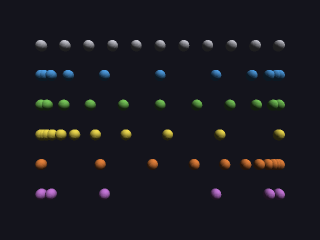

# 23 · Easing

Until now everything moved at a **steady** speed: start at full speed, stop
dead at the end. Real things (and Manim animations) **ease**: they start
gently, speed up, and settle into place. That one change makes motion look
far more natural.

```
comet = pyramid small white flies_past sun 4s-10s smooth
comet hits planet at 12s from 8s smooth
```

Code: `timeline.h` (`rate`, `shape`, `steepest`), `motion.cpp`,
`scene_parser.cpp`, `./main ease`.

---

## 1. The idea: reshape the progress

Every timed change already has a progress f that goes steadily from 0 to 1
(09). Easing just runs f through a curve before using it:

```
f      = (t − start) / (end − start)       steady, 0 → 1
eased  = shape(rate, f)                    still 0 → 1, but not steady
```

The change still starts at its start and ends exactly at its end, because
every curve has shape(0) = 0 and shape(1) = 1. Only the speed in between
changes.

## 2. The curves

These are **Manim's** rate functions (`manim/utils/rate_functions.py`):

| Rate | Formula | Feels like |
|---|---|---|
| `linear` | f | a machine: constant speed (the default) |
| `smooth` | (σ(10(f − ½)) − σ(−5)) / (1 − 2σ(−5)) | Manim's default: gentle start, fast middle, gentle stop |
| `sine` | −(cos πf − 1) / 2 | like smooth, but softer |
| `rush_into` | 2 · smooth(f/2) | slow start, arrives at full speed |
| `rush_from` | 2 · smooth(f/2 + ½) − 1 | leaves at full speed, slow stop |
| `there_and_back` | smooth(2f) for the first half, smooth(2(1−f)) for the second | out, and back again |

σ is the **sigmoid**, σ(x) = 1 / (1 + e⁻ˣ): an S-shaped curve from 0 to 1.
`smooth` uses the part of it from −5 to 5 (that's what 10(f − ½) gives for
f from 0 to 1). σ(−5) = 0.0067 isn't quite 0, so it's subtracted and the
result divided by 1 − 2σ(−5), to stretch the curve to exactly 0 and 1.

### The numbers

From the engine:

| Rate | f = 0 | 0.25 | 0.5 | 0.75 | 1 |
|---|---|---|---|---|---|
| linear | 0 | 0.25 | 0.5 | 0.75 | 1 |
| smooth | 0 | 0.0701 | 0.5 | 0.9299 | 1 |
| sine | 0 | 0.1464 | 0.5 | 0.8536 | 1 |
| rush_into | 0 | 0.0330 | 0.1402 | 0.4379 | 1 |
| rush_from | 0 | 0.5621 | 0.8598 | 0.9670 | 1 |
| there_and_back | 0 | 0.5 | 1 | 0.5 | 0 |

**Check smooth at f = 0.25 on paper:**

```
10 · (0.25 − 0.5) = −2.5
σ(−2.5) = 1 / (1 + e^2.5) = 1 / (1 + 12.18) = 0.0759
(0.0759 − 0.0067) / (1 − 2 · 0.0067) = 0.0692 / 0.9866 = 0.0701 ✓
```

A quarter of the way through the time, a smooth motion has gone only 7% of
the way. It catches up in the middle.

### In one picture

`./main ease`: each row is a ball going left to right, photographed at 11
equal moments (t = 0, 0.1, ..., 1). **Bunched up = slow, spread out = fast.**



Rows from top to bottom: linear (even spacing), smooth (bunched at both
ends), sine (a little less), rush_into (bunched at the start), rush_from
(bunched at the end), there_and_back (out and back over the same spots).

## 3. Easing changes the speed, and the collision checks care

The motion planner looks for collisions every dt seconds, chosen so that
nothing can slip between two looks (16):

```
dt = gap / (4 · v_max)
```

With easing, a path still takes the same time, but its **fastest** moment is
faster than its average. How much faster is the curve's steepest slope:

```
fastest speed = (length / duration) · max |shape′(f)|
```

**For smooth**, the steepest point is the middle, f = ½. There σ's slope is
¼ (the sigmoid's slope at 0), times 10 from inside, divided by the stretch:

```
max |shape′| = 10 · ¼ / (1 − 2 · 0.0067) = 2.5 / 0.9866 = 2.534
```

So a smooth motion is **2.5 times** faster at its fastest than a steady
one, and the planner has to look 2.5 times as often. The engine doesn't
hard-code this: `steepest(rate)` measures every curve over 1000 small
steps, so any new curve is handled automatically.

| Rate | steepest slope |
|---|---|
| linear | 1 (exactly) |
| smooth, rush_into, rush_from | 2.534 |
| sine | π/2 = 1.571 |
| there_and_back | 5.07 (smooth, squeezed into half the time) |

### Worked example: the `eased` stress scene

Scene 5 with easing: the comet hits the planet `smooth`ly, the meteor hits
the rock with `rush_into`, and a probe flies past the sun with `rush_into`.
The fastest is the meteor: it comes in over 11.2 units in 3 s.

```
steady speed  = 11.2 / 3 = 3.73 per second
fastest       = 3.73 · 2.534 = 9.46 per second
dt            = 0.4 / (4 · 9.46) = 0.0106 s
```

The report says `checked every 0.0106 s (fastest moves 9.4599 per second)`. ✓
(Without easing, the same scene would be checked every 0.028 s.)

**And the hits still land exactly on time**, because shape(1) = 1: at the
moment of impact, the eased progress is 1, just like the steady one.

```
planned hit: comet touches planet at 12.00 s (gap 0.00) as planned
planned hit: meteor touches rock at 6.00 s (gap 0.00) as planned
```

## 4. What can ease, and what can't

| Can ease | Why |
|---|---|
| fly-bys, hits | `flies_past sun 4s-10s smooth`, `hits planet at 12s smooth` |
| any timed change in C++ | `object::move(to, start, end, rate::smooth)`, the same for rotate, scale, camera moves |

| Can't | Why |
|---|---|
| orbits | they stay steady, so a loop (20) has no jump in speed. Writing a rate after an orbit is an error. |
| `hits ... there_and_back` | it would come back, and never arrive: reported, and it stands still instead |

The default is `linear`, so every scene written before this works and looks
exactly as it did.

## 5. Tests

```
easing:
  PASS  every curve starts at 0 and ends at 1
  PASS  there_and_back is at 1 halfway and back at 0 at the end
  PASS  smooth is exactly halfway at t = 0.5
  PASS  smooth's steepest slope matches the formula 10/4 / (1 - 2 sigma(-5)) = 2.533922
  PASS  sine's steepest slope is pi/2
  PASS  'flies_past sun 4s-10s smooth' is read as smooth
  PASS  an orbit with a rate is an error (orbits stay steady, so loops have no jump)
```

The stress scene `eased` passes every solver check (15), including "moving
objects never collide" and "planned hits touch exactly on time".

---

## Try it on paper

1. sine at f = 0.25: −(cos(π/4) − 1) / 2 = ?
2. A probe flies 12 units in 4 s with `sine`. How fast is it at its fastest?

Answers: 1. −(0.7071 − 1) / 2 = 0.1464 ✓ (the table). 2. 12 / 4 = 3 per
second on average, times π/2 = 4.71 per second in the middle.
