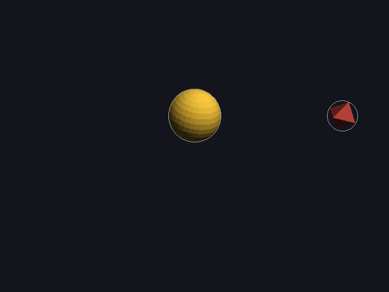
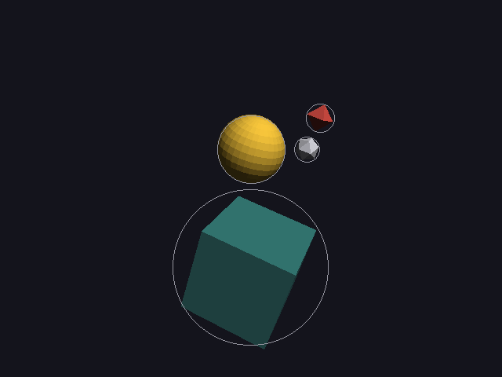
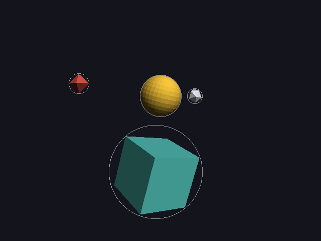
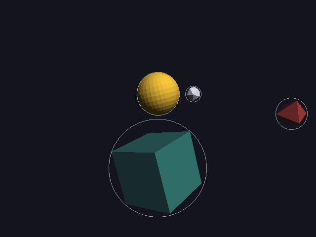

# 24 · Fades and see-through objects

Things can now **fade in** and **fade out**, and anything partly faded is
**see-through**: you can see what's behind it.

```
moon   = icosahedron small white near sun fades_in 0s-3s smooth
glass  = cube big teal in_front_of sun fades_in 1s-4s fades_out 9s-12s
planet = octahedron red orbits sun 1 turn 0s-12s fades_out 10s-12s
```

Code: `object.cpp` (`opacity`, `fade`), `render.cpp` (`draw_see_through`,
`finish`, `fill`), `scene_spec.h` (`fades_in`, `fades_out`), `scenes/fades.dan`.

---

## 1. Opacity is just another number on the timeline

`pose` (03, 09) gets one more number: **opacity**, from 0 (invisible) to 1
(solid). Fading is a timed change like moving or turning, so it blends,
eases (23) and replays (09) like everything else:

```cpp
void object::fade(float to,float start,float end,rate how){
	motion.add({start, end, how}, [to](pose& p,float f){
		p.opacity = lerp(p.opacity, to, f);
	});
}
```

`fades_in` means "start invisible, become solid": if an object's first fade
is a fade **in**, its starting opacity is 0.

## 2. Blending: mixing a color with what's behind it

A pixel of something see-through, with opacity a, over a pixel that's already
there:

```
result = new · a + old · (1 − a)
```

At a = 1 you only see the new color, at a = 0 only the old one, and at
a = 0.5 it's exactly halfway.

**Worked example** (the test): a grey triangle (220) facing the camera.
Solid, its pixel is 220 · 0.6235 = **137**, the front-face brightness from
08. At half opacity over the background (20, 20, 28):

```
red:  0.5 · 137 + 0.5 · 20 = 78.5  → 79
blue: 0.5 · 137 + 0.5 · 28 = 82.5  → 83
```

The engine gave (79, 79, 83). ✓ (The opacity is stored as a byte, so 0.5
becomes 128/255 = 0.502, but that doesn't change the rounded result.)

> **Since 35** the mixing is done in **light**, not in bytes, because bytes
> aren't amounts of light. The same example now gives (101, 101, 101): see
> 35 for the numbers. The idea above (new · a + old · (1 − a)) is the same;
> only what's being mixed changed.

The blending itself was already in `pixel.h`: `Image::Draw` mixes any color
whose alpha is below 255 into what's there. The renderer just has to give
its colors the right alpha.

## 3. Why see-through is hard: the depth buffer

The depth buffer (08) keeps **one** depth per pixel: the closest thing drawn
there. A solid triangle **claims** the pixel: anything farther away is
rejected afterwards. That's what makes draw order not matter for solid
things.

For see-through things it breaks in two ways:

1. **If a see-through triangle wrote its depth**, everything drawn later
   behind it would fail the depth test and never show through. So
   **see-through triangles don't write depth**: they test against it (so
   they're still hidden behind closer solid things), but they don't claim
   the pixel.
2. **Blending depends on order.** `new · a + old · (1 − a)` needs `old` to
   already be what's behind. So everything behind has to be drawn **first**.

So each frame is drawn in two passes:

```
1. everything solid, in any order          (writes depth, as before)
2. everything see-through, FARTHEST FIRST   (tests depth, doesn't write it, blends)
```

This is the **painter's algorithm** for the see-through part: paint the
background first, then what's in front of it. `draw_see_through` only
remembers the object, and `render::finish` sorts them by distance from the
camera and draws them last.

### Its limits

- It sorts **whole objects** by their centers. Two see-through objects that
  pass **through** each other can't both be right everywhere. The solver
  keeps objects apart anyway, so that doesn't happen here.
- A single see-through object is fine on its own: back-face culling (07)
  means a closed, convex shape only draws its front faces, and those never
  cover each other.
- The proper general fix is **order-independent transparency** (for example
  depth peeling, or weighted blending), a good thing to read about later.

## 4. What it looks like

`scenes/fades.dan`: the moon fades in (smooth, 0–3 s), a glass block in front
of the sun fades in (1–4 s) and out again (9–12 s), and the planet fades out
(10–12 s).

| 0 s | 2 s | 5 s | 11 s |
|---|---|---|---|
|  |  |  |  |

At 2 s the glass is a third of the way in (1 s of its 3 s), and faint; the
moon, with smooth easing, is already 85% there (smooth(2/3) = 0.846). At 11 s the glass is
fading away again and the planet is half gone.

## 5. Tests

```
fades:
  PASS  half see-through = halfway in light between it and the background (101, expected 101)
  PASS  something solid behind a see-through one still shows through
```

The second test draws the see-through triangle **first** and a solid red one
**behind** it second. Because the see-through one didn't claim its pixels,
the red one still gets drawn, and shows. (A fully correct picture would then
blend the glass back over the red, which is what the far-to-near pass does in
a real scene.)

Every earlier picture is pixel-for-pixel unchanged: solid things are drawn
exactly as before.

---

## Try it on paper

A white pixel (255) at opacity 0.25 over black (0). And the same over a red
pixel (200, 40, 40)?

Answers: 0.25 · 255 + 0.75 · 0 = 63.75 → 64. Over red: (0.25 · 255 + 0.75 · 200,
0.25 · 255 + 0.75 · 40, the same for blue) = (213.75, 93.75, 93.75) → (214, 94, 94).
