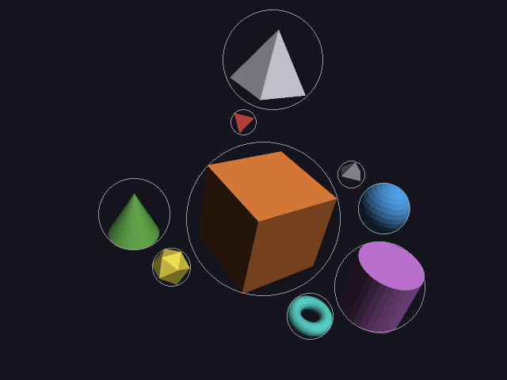
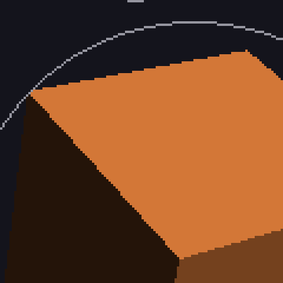
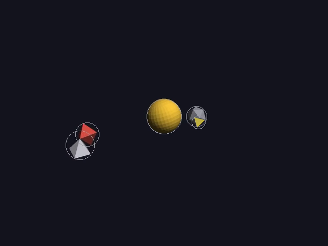

# 25 · Anti-aliasing (and video)

## Part 1: anti-aliasing

Every edge in the pictures so far is a **staircase**. A pixel is either inside
a triangle or not (07), so a slanted edge becomes a row of steps. Add `--aa` to
any command and the edges come out smooth:

```
./main 3 framed picture.png --aa
./main scenes/impact.dan --aa          (live, too)
```

Code: `render.cpp` (the constructor, `finish`, `out`), `player.h` (`samples`),
`main.cpp` (`--aa`, `./main aa`).

### Why edges are jagged

A pixel is a little square, but the rasterizer only asks about **one point**
in it: its center (07). If the center is inside, the whole square gets the
triangle's color; if not, none of it does. An edge that cuts a pixel in
half gets all or nothing. That's **aliasing**: a smooth shape sampled too
coarsely.

The fix is to ask about **more points** per pixel and mix the answers.

### Supersampling: draw it bigger, then shrink it

With `samples = 2`, everything is drawn into an image **twice as wide and
twice as tall** (1280×960 instead of 640×480), with a depth buffer just as
big. The viewport (06) does it with no other change: it maps NDC to
2W × 2H pixels instead of W × H. Then, in `finish()`, each 2×2 block of small
pixels is **averaged** into one real pixel:

```
final pixel = (p₁ + p₂ + p₃ + p₄) / 4          for red, green and blue separately
```

That's a **box filter**: every small pixel in the block counts the same.

**Worked example:** an edge pixel where 2 of the 4 small pixels are orange
cube (210, 120, 55) and 2 are background (20, 20, 28):

```
red   = (210 + 210 + 20 + 20) / 4 = 115
green = (120 + 120 + 20 + 20) / 4 = 70
blue  = ( 55 +  55 + 28 + 28) / 4 = 41.5 → 42      (the code rounds: (sum + 2) / 4)
```

A color halfway between the cube and the background, exactly as much as the
edge covers it. Without supersampling that pixel would be fully orange or
fully dark.

> **Since 35** the samples' **light** is averaged, not their bytes, because a
> byte isn't an amount of light. The same pixel is then
> red: (0.6445 + 0.6445 + 0.0070 + 0.0070) / 4 = 0.3257 → **155**, green → **88**,
> blue → **44**. Brighter than (115, 70, 42), and it's the right answer:
> half the light of the cube. The answers below are the byte version; in
> light they're 225 and 178.

| without | with `--aa` |
|---|---|
|  |  |
|  |  |

The bottom row is the same corner of the cube enlarged 4× (`./main aa`), each
real pixel blown up into a 4×4 square so you can see them. Without: hard steps.
With: every step has an in-between pixel, and the edge reads as a straight line.

### What it costs

Four times the pixels to fill, so about four times the work. Measured on scene 3:

| | time per frame |
|---|---|
| without | 1.29 ms |
| `--aa` (2×2) | 5.50 ms |

That's 4.3×, close to the expected 4 (the averaging adds a little). It's still
under the 8.3 ms a 120 Hz screen allows, so `--aa` works live too.

### Things drawn on top

The debug circles (11) are 1-pixel lines. Drawn into the big image, a
1-pixel line would be averaged with 3 background pixels and come out at a
quarter of its brightness. So they're drawn onto the **final** image instead,
after the averaging, with their projected position and radius divided by
`samples`. Lines and text (26, 27) do the same.

### Other ways

- **MSAA** (multisample, what GPUs usually do): tests coverage at several points
  per pixel, but shades each triangle **once** per pixel. That's cheaper than
  shading everything 4 times.
- **FXAA / SMAA**: draw normally, then find edges in the finished picture and
  blur along them. Very cheap, a bit soft.
- **Analytic coverage**: work out exactly how much of the pixel the edge
  covers. The lines in 26 do this.

Supersampling is the simplest and the most correct: it really does look at 4
points, so it handles every kind of edge (between objects, at depth changes,
inside see-through things) in the same way.

---

## Try it on paper

A pixel where 3 of the 4 small pixels are white (255) and 1 is black (0). With
`samples = 3` there are 9 small pixels: if 4 are white, what's the final value?

Answers: (3 · 255 + 0) / 4 = 191.25 → 191. With 9: 4 · 255 / 9 = 113.3 → 113.

---

## Part 2: video

Add `--video out.mp4` to any scene, and instead of opening a window it
writes an **mp4** you can share:

```
./main scenes/impact.dan --aa --video impact.mp4
./main 4 --video orbits.mp4
```

Code: `player.cpp` (`record`, `shell_quote`), `main.cpp` (`--video`).

### Fixed steps, not the real clock

The live player asks the clock what time it is (10), so a slow frame just
means fewer frames. A **video** has to have every frame, evenly spaced, no
matter how long each one takes to draw. So recording uses **fixed** steps:

```
frame k shows the moment  t = k / 60 s          k = 0, 1, 2, ..., 60 · duration − 1
```

Scene 5 is 22 s long, so 22 · 60 = **1320 frames**. Each is rendered,
then handed to ffmpeg.

Because the timeline can be asked about any moment (09), "draw the scene at
t = 7.35 s" works exactly the same whether that moment comes from the
clock or from a frame counter.

### Talking to ffmpeg through a pipe

ffmpeg is a separate program that turns pictures into video. Instead of
saving 1320 PNGs and running it afterwards, the engine starts it and
**writes the pictures straight into its input** through a pipe:

```cpp
FILE* pipe = popen("ffmpeg -y -loglevel error -f rawvideo -pix_fmt rgba -s 640x480"
                   " -framerate 60 -i - -c:v libx264 -pix_fmt yuv420p -crf 18 'out.mp4'", "w");
...
fwrite(picture.Data(), sizeof(px::Pixel), 640 * 480, pipe);    // once per frame
...
pclose(pipe);                                                   // done: ffmpeg finishes the file
```

| Option | Means |
|---|---|
| `-f rawvideo -pix_fmt rgba` | the input is raw pixels, 4 bytes each, r g b a: exactly `px::Pixel` (10) |
| `-s 640x480 -framerate 60` | how big each picture is and how many per second: raw pixels have no header saying so |
| `-i -` | read from the pipe (`-` means standard input) |
| `-c:v libx264` | encode as H.264, the most widely playable video format |
| `-pix_fmt yuv420p` | the color format every player understands: brightness at full size, color at quarter size |
| `-crf 18` | quality: lower is better, 18 looks lossless |

Each frame is 640 · 480 · 4 = **1,228,800 bytes**, the same block of memory the
window gets (10), written in one go.

**The quotes.** The command goes through the shell, and this project's own
folder is called `sarah's video player`: a `'` in a path would end the
quotes early. `shell_quote` turns every `'` into `'\''` (end the quotes, an
escaped quote, start them again), so any file name is safe.

### Checking the result

```
$ ffprobe -v error -count_frames -select_streams v:0 \
    -show_entries stream=nb_read_frames,width,height,r_frame_rate,codec_name impact.mp4
codec_name=h264
width=640
height=480
r_frame_rate=60/1
nb_read_frames=1320
```

All 1320 frames, the right size and speed. It took 3.2 s to record a 22 s
video with `--aa`: recording is faster than real time, because it never waits
for the screen. The file is 384 KB.

Frame 720 (12 s), pulled back out of the video with ffmpeg: the comet just
touching the planet (18).



---

## Try it on paper

1. A 10 s scene at 30 frames per second: how many frames? How many bytes
   go down the pipe in total?
2. Why can't recording use the real clock like the live player does?

Answers: 1. 300 frames, 300 · 1,228,800 = 368,640,000 bytes (about 369 MB of
raw pixels, which H.264 squeezes to a few hundred KB). 2. Slow frames would
be skipped, or the video would play at the wrong speed. A video needs every
frame exactly 1/fps apart.
