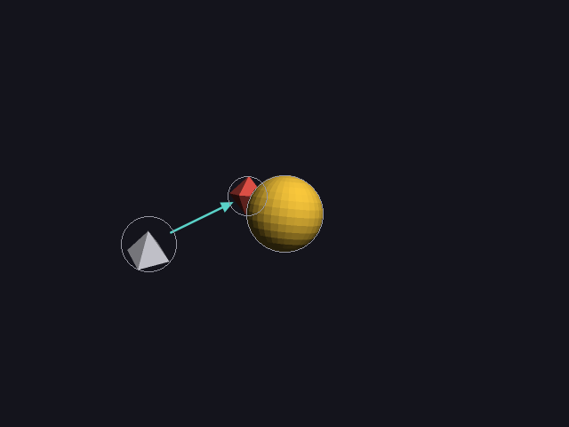
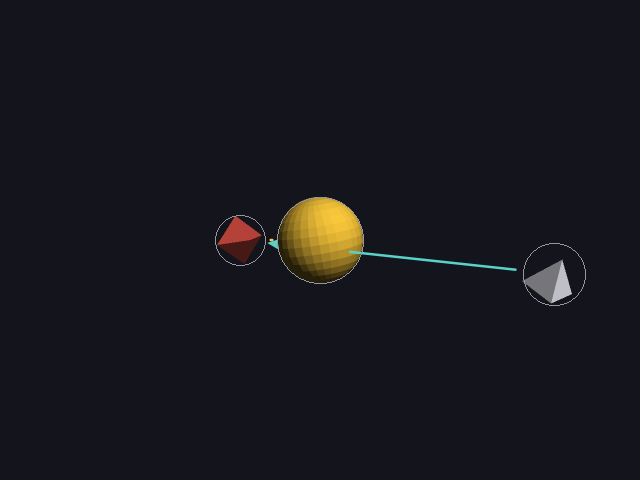

# 26 · Lines and arrows

Explaining something usually means pointing at it: "this pulls on that",
"the comet heads for the planet". So scenes can now have **arrows** from one
object to another. They follow both objects as they move, and they hide
behind things that are in front of them.

```
arrow sun planet gold
arrow comet planet teal 4s-12s        (only from 4 s to 12 s)
```

Code: `render.cpp` (`draw_line`, `draw_arrow`, `line_coverage`,
`rasterize_line`, `clip_segment`), `world.cpp` (`draw_overlays`),
`scene_parser.cpp` (`arrow`), `frame_source.h`, `scenes/arrows.dan`.

---

## 1. A line is drawn on the screen, not as triangles

Everything so far is made of triangles. A line could be too (a long, thin
box), but it would get thinner and thicker with distance and be hard to
keep smooth. Instead, a line is drawn **in screen space**: project its two
ends (03–06), then color the pixels near the segment between them, always
the same number of pixels wide.

### How much of a pixel does the line cover?

For each pixel, take its center p and find the **closest point** of the
segment from A to B. That's the same projection as in 16:

```
s       = clamp( dot(p − A, B − A) / |B − A|², 0, 1 )
closest = A + s · (B − A)
d       = |p − closest|                       (how far the pixel is from the line)
```

A line `width` pixels wide covers everything within width/2 of it. Pixels
well inside are fully covered and pixels well outside not at all, but
the pixel the edge passes through is **partly** covered. A good estimate of
how much:

```
coverage = clamp( width/2 + 1/2 − d,  0, 1 )
```

The edge sits at d = width/2. A pixel is 1 wide, so one centered exactly
on the edge (d = width/2) is about half covered: width/2 + ½ − width/2 = ½ ✓.
Half a pixel further in it's fully covered, half a pixel further out not at all.

The coverage becomes the pixel's **alpha** (24), so the line's color is blended
with what's behind by exactly how much of the pixel it covers. That makes the
edges smooth without any supersampling: it's **analytic anti-aliasing** (25).

### Worked example

A line from A = (10, 10) to B = (30, 20) on the screen, 3 pixels wide. The
pixel whose center is p = (20.5, 16.5):

```
B − A = (20, 10),   |B − A|² = 400 + 100 = 500
p − A = (10.5, 6.5)
s = (10.5 · 20 + 6.5 · 10) / 500 = (210 + 65) / 500 = 0.55
closest = (10, 10) + 0.55 · (20, 10) = (21.0, 15.5)
d = |(20.5, 16.5) − (21.0, 15.5)| = √(0.25 + 1) = 1.118
coverage = 1.5 + 0.5 − 1.118 = 0.882
```

That pixel gets 88% of the line's color. Its neighbour one row up, (20.5, 15.5),
is only 0.22 from the line, so it's fully covered (coverage clamped to 1).

**Past the ends**, s is clamped to 0 or 1, so the distance is to the end point
itself. The line's ends come out round.

The test checks the simplest cases: a 2-wide horizontal line, a pixel 1 away
is covered 2/2 + ½ − 1 = **0.5**, and a pixel 3 away isn't covered at all.

## 2. Hidden behind things: the depth test

A line has a depth at every point too: blend the two ends' depths with the
same s, because depth is linear across the screen (08). A line pixel is only
drawn where nothing solid is closer:

```cpp
float z = sa[2] + (sb[2] - sa[2]) * s;
if(z > depth[pixel] + 1e-4f) continue;          // something solid is in front
```

So lines are drawn in `finish()`, **after** every solid object, when the depth
buffer is complete. They don't write depth themselves, like see-through
things (24).

**Near-plane cut.** An end behind the camera would project to the wrong place
(19), so the segment is cut first, with the same test as triangles:
d = z + w ≥ 0, and t = d_a / (d_a − d_b).

## 3. The arrowhead

At the end B, on the screen:

```
u     = (B − A) / |B − A|                   the direction along the line
base  = B − u · head                        head = 14 pixels (or half the line, if shorter)
left  = base + perpendicular · 0.45 · head
right = base − perpendicular · 0.45 · head
```

The perpendicular of (uₓ, u_y) is (−u_y, uₓ): the same direction turned a
quarter.

The head is a filled triangle with a smooth edge. For each pixel, measure
its **signed distance** to each of the three edges: the 2D cross product (01,
`det`) of the edge and the pixel, divided by the edge's length. It's
positive on the inside. The pixel's coverage is the smallest of the three
distances, plus ½ (the same half-pixel rule as above), clamped to 0..1. The
shaft stops at the base, so the head sits on the end of it.

## 4. From object to object

An arrow is described by two **names**; its ends are worked out every
frame (`world::draw_overlays`):

```
p, q   = the two objects' positions right now
dir    = (q − p) / |q − p|
start  = p + dir · (r_from + 0.15)          on the first object's surface, plus a small gap
end    = q − dir · (r_to + 0.15)            the same at the other end
```

r is each object's bounding radius (11). If the two are so close that there's
no room left between the surfaces (|q − p| ≤ both cuts), no arrow is drawn:
an arrow inside an object wouldn't mean anything. An arrow to a name that
doesn't exist, or from an object to itself, is reported (`problems with
arrows`) and left out.

**Where arrows plug in:** a new hook on the frame source (22),
`draw_overlays(render, t)`. The player calls it after drawing the objects,
whether it's playing live, recording a video (25) or saving a picture. A world
(scenes 3–5 and every `.dan` file) draws its arrows there.

## 5. What it looks like

`scenes/arrows.dan`: the sun pulls on the orbiting planet (gold), and from 4 s
to 12 s the comet's arrow points at the planet (teal). Drawn with `--aa`.

| 7 s | 10 s |
|---|---|
|  |  |

At 7 s the planet is behind the sun, so the gold arrow is hidden with it. At
10 s the teal arrow comes in from the comet on the right and passes
**behind** the sun on its way to the planet: the part behind the sun isn't
drawn.

## 6. Tests

```
lines and arrows:
  PASS  a pixel on the line is fully covered
  PASS  a pixel 1 away from a 2-wide line is half covered (2/2 + 1/2 - 1 = 0.5)
  PASS  a pixel 3 away isn't covered at all
  PASS  past the end, the distance is to the end point (5 away: 0)
  PASS  'arrow comet sun red 2s-8s' is read as an arrow from comet to sun, shown from 2 s to 8 s
```

**Why not Bresenham or Wu?** Bresenham's algorithm (the one in `pixel.h`'s
`DrawLine`) picks one pixel per step: fast, but jagged and only 1 pixel wide.
**Xiaolin Wu's** algorithm draws smooth 1-pixel lines by shading the two
pixels next to the ideal line by how close they are. For **thick** lines and
arrowheads, the distance approach is simpler and handles any width the same
way.

---

## Try it on paper

The same line from (10, 10) to (30, 20), width 3. Is the pixel centered at
(31.5, 21.5) covered?

Answer: s = (21.5 · 20 + 11.5 · 10) / 500 = 545 / 500 = 1.09 → clamped to 1, so
the closest point is B = (30, 20). d = √(1.5² + 1.5²) = 2.12, coverage = 2 − 2.12
< 0 → 0. Not covered: it's past the round end.
