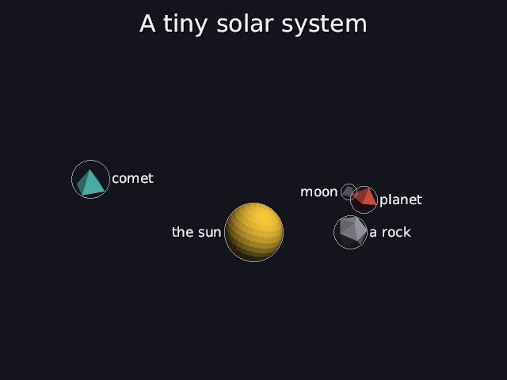
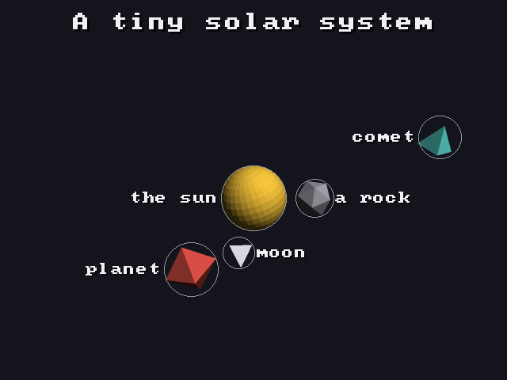

# 28 · Labels: back to where it started

This project began with a page of notes about **placing labels on a map**:
project points to the screen, cull, rank by priority, try candidate boxes
greedily, nudge them with a gradient, check, and carry over to the next
frame. That turned into the 3D layout solver (11–14). Now, at the end, the
original idea comes back for what it was really about: **words next to
objects**.

```
sun    = sphere big gold important label "the sun"
planet = octahedron red orbits sun 1 turn 0s-20s label "planet"
```

| 2 s | 8 s | 14 s |
|---|---|---|
|  |  |  |

Code: `label_layout.h/.cpp` (the steps below, pure 2D), `world.cpp`
(`draw_overlays`: from objects to labels), `render.cpp` (`where_on_screen`,
`draw_screen_line`, `draw_text`), `scenes/labels.dan`.

---

## The steps, as in the notes

Every frame, in screen pixels:

### 1. Visibility
Each labelled object is projected (03–06, `render::where_on_screen`): its
center becomes an **anchor** point, and its bounding sphere (11) a circle of
some screen radius. Behind the camera, off screen, or faded out (24): no
label this frame.

### 2. Priority
Labels near the middle of the screen pick first:

```
d = distance from the anchor to the screen's center
w = 1 / (1 + d / D)          D = a twentieth of the screen width (32 on 640 pixels)
```

The notes used D = 10 on a 200-wide screen, which is the same proportion.

### 3. Candidate boxes
A label w × h, an object with screen radius r at (x, y), and a gap g = 3:

```
right: [x + r + g, x + r + g + w] × [y − h/2, y + h/2]
left:  [x − r − g − w, x − r − g] × [y − h/2, y + h/2]
above: [x − w/2, x + w/2] × [y − r − g − h, y − r − g]
below: [x − w/2, x + w/2] × [y + r + g, y + r + g + h]
```

### 4. The overlap test
Boxes P and Q overlap only if **all four** are true:

```
P.x0 < Q.x1,   P.x1 > Q.x0,   P.y0 < Q.y1,   P.y1 > Q.y0
```

One false and they don't touch. A candidate is **free** if it doesn't overlap
any label already placed or any other object's circle (as its square box),
and it's inside the picture.

### 5. Greedy
In priority order, each label takes the first free candidate. If none is
free, it tries the same sides 3 times as far out, with a thin **leader line**
back to its object. If that fails too, it's hidden for this frame.

### 6. The gradient nudge
From its spot ("home" s), a couple of gradient steps on the energy from the
notes, pushing away from the nearest other object o if it's within reach R
(o's radius + 10 pixels):

```
E(p) = β·|p − s|² + γ·(R − d)²            d = |p − o|, the push only when d < R
∇E   = 2β·(p − s) − 2γ·(R − d)·(p − o)/d
p   ← p − η·∇E                            β = γ = 1, η = 0.1
```

### 7. The stuck check
If the nudged box now overlaps something, it goes back to the plain
candidate spot.

### 8. Next frame
Each label starts from **where it ended last frame**, if it's on the same
side, so it moves smoothly. And it tries **last frame's side first** (that's
**hysteresis**, below).

---

## The notes, replayed by the real code

The tests run the notes' examples through `label_layout` and get the same
numbers.

**Greedy** (200 × 100 screen, labels 40 × 10, dots r = 2, g = 3, A at
(100, 50), B at (106, 58)):

```
PASS  A's label goes right: [105, 145] x [45, 55], as in the notes
PASS  B's right spot overlaps A's label, so B goes left: [61, 101] x [53, 63]
```

**Gradient** (home (81, 58), obstacle (84, 62), R = 10):

```
PASS  gradient step 1: (81, 58) -> (80.4, 57.2)
PASS  gradient step 2: -> (80.04, 56.72)
```

The same two iterations as the hand calculation in the notes.

### Where it settles: 7.5, not 10

The notes asked for R = 10 pixels of clearance. Keep stepping and it settles
at **7.5**. Along the line away from the obstacle, the label starts 5 away and
moves out by some amount u. The energy is then

```
E(u) = β·u² + γ·(R − (5 + u))² = u² + (5 − u)²
dE/du = 2u − 2(5 − u) = 0   →   u = 2.5   →   distance = 5 + 2.5 = 7.5
```

The spring (stay home) and the push (get clear) balance halfway. It's the
same lesson as 13: **soft constraints compromise; they don't obey**. The test:

```
PASS  it settles 7.5 from the obstacle (spring and push balance), not 10 (7.499995)
```

That's why step 7 exists: what the nudge produces is checked with the
**hard** overlap test before it's used.

## Hysteresis: why labels don't flicker

Without step 8's "try last frame's side first", a label always prefers the
same side (right first). If its object jitters near the spot where the right
side just stops being free, the label jumps right, left, right, left: it
**flickers**. Moving labels have this problem everywhere; Vaaraniemi,
Treib & Westermann (2012) call it **temporal coherence**.

**Hysteresis** means: once something has picked a state, it keeps it until
it really has to change. A thermostat works the same way: it doesn't switch
the heating on and off at exactly 20°, or it would switch every second.

The test makes an object jitter 30 pixels back and forth next to another,
for 120 frames:

```
PASS  keeping last frame's side means fewer flips: 0 with, 35 without
```

35 flips in 120 frames is a flip every 3–4 frames: visible flicker at 60 fps.
With hysteresis: none. Over the whole `labels.dan` video (1320 frames, 5
labels) it's **26 side changes with, 50 without**. The 26 left are real
moves: a planet swinging round to the other side of the sun has to move its
label.

## Timed and always-on labels

A label can say **when** it shows, and that it must **never** be hidden:

```
moon   = tetrahedron small white orbits planet 2 turns 0s-20s label "orbit" 5s-15s
sun    = sphere big gold important label math "m_1" always
```

**Timed.** A label (like a title or a formula) shows only during its range,
and fades in and out over 0.3 s at the ends instead of popping
(`appear` in `timeline.h`):

```
appear(start, end, t) = min( (t − start) / 0.3,  (end − t) / 0.3 ),   clamped to 0..1
appear(2, 8, 2.15) = 0.15 / 0.3 = 0.5       halfway through the fade-in
appear(2, 8, 5)    = 1                      fully there
appear(2, 8, 8.5)  = 0                      gone
```

A range starting at 0 doesn't fade in: it's there from the first frame. The
fade multiplies the text's alpha (24), and its shadow fades with it.

**Always on.** Normally a label with no free spot is hidden that frame (step
5). An `always` label is placed **first**, before the priority order, and if
nothing is free it still goes **next to its object**, on the side that
overlaps the fewest things. (Leaving the picture counts double, so it stays on
screen if it possibly can.) With hysteresis it keeps that side, so it stays
steadily beside the object.

The test takes the crowd from below, finds the one label that had no room,
marks it `always`, and checks it's now shown.

**Formulas as labels.** `label math "m_1"` makes the label a formula (30):
its box's width, and height plus depth, are the label's size for the layout.

## Tests

```
labels:
  PASS  A's label goes right: [105, 145] x [45, 55], as in the notes
  PASS  B's right spot overlaps A's label, so B goes left: [61, 101] x [53, 63]
  PASS  gradient step 1: (81, 58) -> (80.4, 57.2)
  PASS  gradient step 2: -> (80.04, 56.72)
  PASS  it settles 7.5 from the obstacle (spring and push balance), not 10 (7.499995)
  PASS  'label "the sun"' is read as the sun's label
  PASS  15 crowded labels: 14 shown, 0 overlapping (0)
  PASS  keeping last frame's side means fewer flips: 0 with, 35 without
  PASS  a label shown 2s-8s: hidden at 1.9 s, there at 5 s, gone at 8.5 s
  PASS  halfway through its 0.3 s fade-in (2.15 s) and fade-out (7.85 s) it's half visible
  PASS  a label with no time range is simply always there, from the first frame
  PASS  'label math "m_1" 2s-8s always' is read as a formula, shown 2 s to 8 s, never hidden
  PASS  the label that had no room is shown once it's marked always (label 6)
```

In the crowd test, 15 labels are packed around points close together: 14
find a free spot and one is hidden that frame. Hiding beats overlapping:
two labels on top of each other are both unreadable.

## Limits

- Labels are placed **per frame**, on the screen. The 3D solver doesn't know
  about them, so it doesn't leave room for them. A future step: give the
  refinement (13) a term for label space.
- They don't avoid **titles** (27) yet. The title area could simply be added as
  a box that's never free.
- Greedy is fast but not optimal: a label placed early can take the only spot
  a later one could use. The 1995 paper's best method was **simulated
  annealing** (random moves, accepted more cautiously over time). It's too slow
  per frame, but worth knowing.

---

## Try it on paper

Same setup as the notes. A third label C's object is at (60, 30), r = 2. Its
right candidate is [65, 105] × [25, 35]. Is it free, with A's and B's labels
placed as above?

Answer:
- Against A's label [105, 145] × [45, 55]: is 65 < 145? yes. Is 105 > 105? **no**. So they don't touch.
- Against B's label [61, 101] × [53, 63]: is 65 < 101? yes. Is 105 > 61? yes. Is 25 < 63? yes. Is 35 > 53? **no**. So they don't touch.
- Against the dots A [98, 102] × [48, 52] and B [104, 108] × [56, 60]: is 35 > 48? no, and is 35 > 56? no. So it touches neither.

It's inside the screen, so it's **free**: C goes right.
