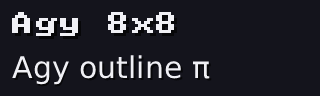
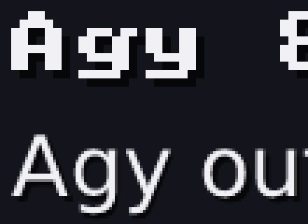

# 29 · Outline fonts

The 8×8 bitmap font (27) is blocky, especially when it's big. Real fonts store
each letter as an **outline**, a shape made of lines and curves, and that
outline can be filled at any size with smooth edges. Titles and labels now
use **DejaVu Sans** that way.

| bitmap (27) and outline, side by side | the same, 4× closer |
|---|---|
|  |  |

Code: `font.h/.cpp` (decoding, curves, filling, spacing), `render.cpp`
(`draw_text`, `paint_outline_text`), `fonts/` (the font files and their
licence), `stb_truetype.h`.

---

## 1. What's ours and what isn't

A `.ttf` file is a compact binary format: tables of outlines, character maps,
spacing. **stb_truetype** (Sean Barrett, public domain) reads those tables:

- which outline belongs to which character
- each outline's points
- each letter's width ("advance")
- the kerning between pairs of letters

Everything that turns an outline into pixels is **ours**, and that's what
this page explains.

The fonts are **DejaVu** (Sans, Serif, Serif Italic). Their licence allows
copying them as they are, with the notice, which is `fonts/DejaVu-LICENSE`.
They include Greek and math symbols, which the math (30) needs.

## 2. Text as code points: UTF-8

"π" isn't one byte. Text is stored as **UTF-8**, where one character is 1 to 4
bytes, and the first byte's top bits say how many:

```
0xxxxxxx                          1 byte   (plain ASCII: a = 0x61)
110xxxxx 10xxxxxx                 2 bytes  (Greek, accents)
1110xxxx 10xxxxxx 10xxxxxx        3 bytes  (most symbols)
```

The **x** bits, put together, are the character's number (its "code point").

**π by hand:** the bytes are `CF 80`.

```
CF = 110 01111  → 2 bytes; keep 01111
80 = 10 000000  → keep 000000
01111 000000 = 0x3C0 = 960            π is code point 960 ✓
```

## 3. Curves: quadratic Béziers

A TrueType outline is a loop of straight lines and **quadratic Bézier
curves**. A quadratic Bézier goes from p₀ to p₂, pulled towards a control point p₁
(it doesn't go through p₁).

**de Casteljau's construction** finds the point at "time" t (0 at p₀, 1 at p₂)
with nothing but lerps (09):

```
a     = lerp(p₀, p₁, t)       t of the way along the first control line
b     = lerp(p₁, p₂, t)       ... and along the second
point = lerp(a, b, t)         t of the way between those two
```

**Worked example:** p₀ = (0, 0), p₁ = (2, 4), p₂ = (4, 0), t = ½:

```
a     = (1, 2)
b     = (3, 2)
point = (2, 2)
```

The curve's middle is at height 2, only half way up to the control point.

### Flattening: curves into short lines

Filling (below) works on straight edges, so each curve is cut into straight
pieces. How far does a curve bulge away from the straight line p₀–p₂? At
most

```
bulge = |p₀ − 2·p₁ + p₂| / 4           (at t = ½)
```

If the bulge is under **0.25 pixels**, a straight line is close enough. If not, cut
the curve in half at t = ½. Each half is again a quadratic Bézier, with a and
the midpoint (or the midpoint and b) as its control points. Then do the same
to each half.

**Worked example** (the same curve):

```
bulge = |(0, 0) − 2·(2, 4) + (4, 0)| / 4 = |(0, −8)| / 4 = 2       too much: split
each half bulges a quarter as much: 0.5                            still too much: split again
each quarter: 0.125 ≤ 0.25                                         done
```

That gives **4 straight pieces** (the test checks it). Every split cuts the
bulge to a quarter, so even big letters need only a few splits.

## 4. Filling: the winding number

A letter like 'o' is **two** loops: the outside, and the hole. Which pixels
are inside?

Draw a horizontal line through the shape and walk along it. Every edge the
line crosses going **down** adds 1, every edge going **up** takes 1 away. The running total
is the **winding number**: where it isn't 0, you're inside (the **nonzero
rule**).

```
     outside loop ──►               crossing an 'o' from left to right:
    ╭──────────╮
    │ ╭──────╮ │          outer edge   +1   → 1   inside the ring
    │ │ hole │ │          inner edge   −1   → 0   in the hole: outside
    │ ╰──────╯ │          inner edge   +1   → 1   inside the ring again
    ╰──────────╯          outer edge   −1   → 0   outside
```

The hole's loop goes round the **other way**, so its edges count against the
outside's. The test `the middle of an 'o' is empty` checks exactly this, and
so does a plain square with a square hole.

### Coverage: how much of each pixel

Asking only at the pixel's center gives jagged edges, like 07 and 25. So each
pixel is looked at along **4 lines**, at **4 points** on each: 16 sample points.
Coverage is the share that are inside:

```
coverage = (points inside) / 16
```

A pixel cut exactly in half by an edge gets 8 of 16 = **0.5** (the test with an
edge at x = 2.5). The coverage then becomes the letter's alpha when it's
blended in (24), exactly like the lines in 26.

Each letter at each size is filled **once** and cached (`font::get`). After
that, drawing it is only blending.

## 5. Spacing: advance and kerning

After drawing a letter, the **pen** moves right by its **advance**. Some pairs
look better tucked together: the slanted sides of **A** and **V** leave a gap,
so the font has a **kerning** value for that pair, usually negative.

At 20 pixels:

```
advance(A) = 13.68     kerning(A, V) = −1.28     advance(V) = 13.68
width("AV") = 13.68 − 1.28 + 13.68 = 26.08
```

The test checks that `width` adds up exactly this way, and that A–V kerning is
negative.

Vertically: text is placed by its **top**, and the baseline (the line letters
sit on) is `ascent` below that. At 30 pixels, DejaVu Sans reaches 27.85 above the
baseline and 7.08 below it (the tail of a g or y).

## 6. Tests

```
outline fonts:
  PASS  UTF-8: "a\xCF\x80" decodes to 97 (a) and 960 (pi)
  PASS  de Casteljau at t = 1/2 of (0,0) (2,4) (4,0) is (2, 2)
  PASS  flattened to within 0.25 px: 4 straight pieces (bulge 2 -> 0.5 -> 0.125)
  PASS  a filled square: inside 1, outside 0
  PASS  an edge through the middle of a pixel: coverage 0.5
  PASS  a loop inside a loop, going the other way, leaves a hole
  PASS  fonts/DejaVuSans.ttf loads
  PASS  width("AV") = advance(A) + kerning(A, V) + advance(V)
  PASS  A and V tuck together: their kerning is negative (-1.279297)
  PASS  the middle of an 'o' is empty: its inner loop makes the hole
  PASS  pi has an outline (the font has Greek)
```

If `fonts/` is missing, text falls back to the bitmap font, so the engine
still works.

---

## Try it on paper

1. The curve from (0, 0) via (0, 8) to (8, 8): where is it at t = ½, and how
   much does it bulge?
2. Which code point is the two bytes `CE B1`?

Answers: 1. a = (0, 4), b = (4, 8), point = (2, 6). Bulge = |(0, 0) − (0, 16) +
(8, 8)| / 4 = |(8, −8)| / 4 = 2.83. 2. CE = 110 01110 → 01110, B1 = 10 110001 →
110001; 01110 110001 = 0x3B1 = 945 = **α**.
