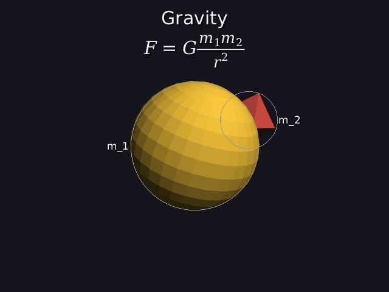
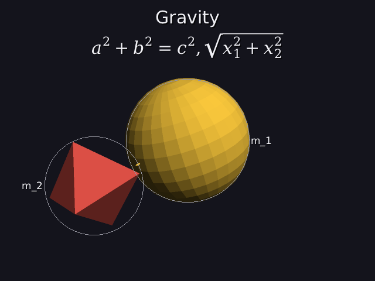

# 30 · Math: our own small TeX

Manim writes formulas with LaTeX. There's no LaTeX here, and it would be a
huge outside dependency, so the engine has its own **small TeX**: the same
idea of **boxes**, for the formulas an explainer actually needs.

```
math "F = G\frac{m_1 m_2}{r^2}" 0s-10s
math "a^2 + b^2 = c^2,  \sqrt{x_1^2 + x_2^2}" 10s-20s
```

| 3 s | 13 s |
|---|---|
|  |  |

Each formula shows only during its time range, centered under the titles.

Code: `math_layout.h/.cpp` (parsing and layout), `render.cpp`
(`draw_math`, `paint_math`), `world.cpp`, `scene_parser.cpp` (`math`),
`scenes/math.dan`.

---

## 1. What it understands

| Write | Get |
|---|---|
| `x^2`, `x^{10}` | a power |
| `x_1`, `x_{i,j}`, `x_1^2` | an index (and both) |
| `\frac{a}{b}` | a fraction |
| `\sqrt{x}` | a square root |
| `\alpha` … `\omega`, `\Gamma` … `\Omega` | Greek |
| `\times \cdot \pm \to \infty \le \ge \ne \approx \sum \int \partial` | symbols |
| letters | *italic*, like TeX: variables are italic |
| digits, `+ − = ( ) ,` | upright |

`-` becomes a real minus sign (−, not a hyphen), and spaces are ignored, as in TeX.

## 2. Step one: parsing into a tree

`F = G\frac{m_1 m_2}{r^2}` becomes:

```
row
├─ F
├─ =               (a relation)
├─ G
└─ fraction
   ├─ top:    row [ scripts(m, down: 1), scripts(m, down: 2) ]
   └─ bottom: scripts(r, up: 2)
```

It's recursive descent again (21): `row`, `item` (something with optional `^`
and `_`), `atom` (a symbol, a `{group}`, `\frac`, `\sqrt` or `\command`).

Mistakes come back with a column and, for commands, a **did you mean** using
the edit distance from 21:

```
\frax{1}{2}      unknown command \frax (did you mean \frac?)       column 1
x^{2             this '{' is never closed with '}'                 column 3
```

In a `.dan` file the column points at the exact character in the line:
`math "E = mc^" 0s-5s` reports column 13, the `^`.

## 3. Step two: boxes

Every piece of a formula becomes a **box** with three numbers:

```
        ┌───────┐  ↑ height   (above the baseline)
        │   x   │  │
 ───────┼───────┼──┴── baseline
        │       │  ↓ depth    (below it: the tail of a y)
        └───────┘
        ← width →
```

Boxes are then put **side by side**, **raised** or **lowered**, **shrunk**,
and **stacked**. That's the core idea of TeX (Knuth's box-and-glue model),
much simplified. All sizes below are at size 30 (em = 30 pixels).

### A symbol

Width = the letter's advance (29). Height and depth = how far its ink reaches
above and below the baseline (measured from its filled outline).

### A row: side by side, with TeX's spacing

Pieces are placed left to right, with space depending on what they are,
counted in **mu** (1/18 em):

| between | space |
|---|---|
| anything and a relation (`= ≤ →`) | 5 mu = 8.33 px |
| anything and a binary operator (`+ − ×`) | 4 mu = 6.67 px |
| after a comma | 3 mu |
| ordinary things (`m c`) | nothing |

That's why `a = b` is a bit wider than `a + b`. The engine puts `=` at 26.22
and `+` at 24.55: both after a's advance of 17.89, plus 8.33 and 6.67.

A `+` or `−` at the start, or right after another operator (`= −x`), is a
**sign**, not an operation, so it gets no extra space.

### A power: x²

```
the exponent:  70% size → 21 px
raised:        its baseline 0.45 em up → 13.5 px
placed:        right after the base, plus 0.04 em
```

Worked out, and the engine's numbers:

```
x (italic, 30 px):  advance 16.92
the 2:              at x = 16.92 + 0.04 · 30 = 18.12,   y = −13.5 (up),   size 21
width = 18.12 + advance(2 at 21 px) = 18.12 + 13.36 = 31.48
height = 13.5 + the 2's own height (16) = 29.5
```

An index (`x_1`) is the same, but lowered 0.2 em; with both (`x_1^2`) the index
goes down 0.25 em so the two don't touch.

### A fraction: ½

```
top and bottom:   85% size → 25.5 px, each centered
the bar:          thickness 0.05 em = 1.5 px, its middle on the "math axis":
                  0.27 em above the baseline (the height of a minus sign),
                  so fractions line up with the = and + next to them
gap:              0.12 em = 3.6 px between the bar and each part
width:            the wider part + 0.1 em padding each side
```

Worked out, and the engine's numbers:

```
width       = advance(1 at 25.5) + 2 · 3 = 16.22 + 6 = 22.22
bar top     = −(0.27 · 30) − 1.5/2 = −8.1 − 0.75 = −8.85
the 1       : baseline at bar top − gap − its depth = −8.85 − 3.6 − 1 = −13.45
the 2       : baseline at bar bottom + gap + its height = −8.85 + 1.5 + 3.6 + 19 = 15.25
```

(y is down, so −13.45 is above the baseline and 15.25 is below it.)

### A square root

The √ character, scaled up until it's as tall as what's inside plus a gap,
then a bar from the top of the √ across the inside.

## 4. Drawing it

`draw_math` blends every glyph's coverage (29) at its place, and fills every
bar with smooth top and bottom edges: a pixel that's 30% covered by the bar
gets 30% of its color. Formulas get the same soft shadow as text, and are
drawn last, on the finished picture.

Each formula is **laid out once**, when the scene is built, and only drawn
every frame.

## 5. Tests

```
math:
  PASS  x^2 parses
  PASS  the 2 in x^2 is 70% size (21 px), raised 0.45 em (13.5 px), right after the x
  PASS  \frac{1}{2}: the 1 above the bar, the 2 below it
  PASS  the bar is as wide as the fraction; top and bottom are 85% size (25.5 px)
  PASS  \pi is the character 960
  PASS  \frax: unknown, at column 1, did you mean \frac
  PASS  x^{2: the { at column 3 is never closed
  PASS  a broken formula in a .dan file points at the exact character: the ^ in column 13
```

The first version of the last test expected column 15. Counting by hand
(`math "` is 6 characters, so `E` is column 7) gives 13, and the engine was
right.

## 6. What it doesn't do (yet)

Real TeX has much more: big operators with limits under and over them,
matrices, `\left( ... \right)` brackets that grow, `\text{}`, and many more
symbols. It also has far finer rules (the actual TeX algorithm has dozens of
font parameters). This covers the formulas of a typical physics or math
explanation, and the box model makes each missing piece a small addition.

---

## Try it on paper

1. Lay out `a^2` the same way, given advance(a at 30) = 17.89: where does the
   2 go, and how wide is it all?
2. Why does the fraction bar sit 0.27 em up, and not on the baseline?

Answers: 1. x = 17.89 + 1.2 = 19.09, y = −13.5, size 21; width = 19.09 + 13.36 =
32.45. 2. So it lines up with the middle of `+`, `−` and `=`: a fraction in
`a + \frac{1}{2}` should look centered on the same line as the `+`.
