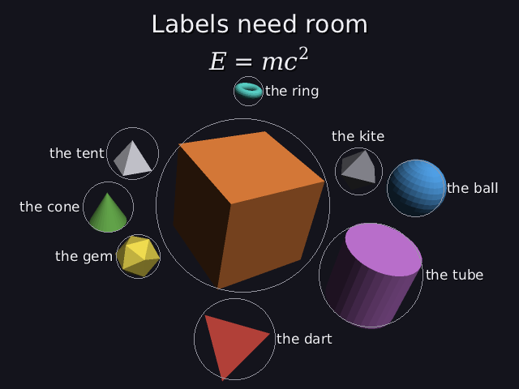
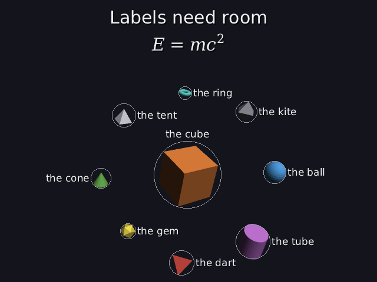

# 31 · Making room for words

Titles (27), formulas (30) and labels (28) are drawn **on top** of the
picture. But the 3D solver (11–14) placed the objects without knowing they'd
be there, so an object could sit right under a title, or so close to the
others that its label had nowhere to go.

| before: the solver doesn't know about the words | after |
|---|---|
|  |  |

`scenes/labelled.dan`: nine labelled things round a cube, under a title and a
formula. **Before**, the cube's own label has no room and is missing, the
ring is jammed up against the formula, and the labels squeeze into whatever
gaps are left. **After**, all nine labels have room, and nothing is under the
words at the top.

Code: `layout.cpp` (`set_words`, `look`, `in_picture`, `labels_without_room`),
`solver.cpp` (`estimate_label_width`), `label_layout.cpp` (`keep_out`),
`world.cpp`.

---

## 1. A band at the top for the titles

Each title takes about 40 pixels, each formula about 60, plus a 12-pixel
margin. The solver reserves that much at the top of the picture:

```
band = 12 + 40 · titles + 60 · formulas          labelled.dan: 12 + 40 + 60 = 112 pixels
```

**Only the ones on screen at the same time count.** The world stacks just
the titles and formulas that are showing right now, so the band is the
**tallest stack at any moment**. A stack only grows when something starts,
so it's enough to count at every start time (`words_band` in `solver.cpp`).
`scenes/showcase.dan` has 3 titles and 2 formulas, but never more than 2
titles and 1 formula at once:

```
at 0 s:   title 1, formula 1             40 + 60      = 100
at 4 s:   titles 1 and 2, formula 1      40 + 40 + 60 = 140   ← the tallest
at 12 s:  title 1, formula 2             40 + 60      = 100
at 13 s:  titles 1 and 3, formula 2      40 + 40 + 60 = 140
band = 12 + 140 = 152 pixels          (adding them all up would give 252)
```

That scene found the bug: with 252 of 480 pixels reserved, the band reached
past the middle of the picture. An object at the center is then already
"under the titles" at **any** distance, so the camera's search backed off to
a distance of 172,600. Now the band is counted properly, and as a safety
net it never takes more than 40% of the picture; past that, the report
says the scene has too many words at once.

The framing's "is it in the picture" test (15) then uses a lower top edge. In
look()'s tan units (13), one pixel is

```
1 px = 2 · tan(fov_y / 2) / picture height = 2 · 0.4663 / 480 = 0.00194
top edge = tan(25°) − band · 0.00194 = 0.4663 − 112 · 0.00194 = 0.2487
```

so an object's circle must stay below 0.2487 instead of 0.4663.

**Aim at the middle of what's left.** The picture left for the scene runs
from the band's bottom edge down to the picture's bottom, so its middle is
**band/2 below** the picture's middle. If the camera kept aiming at the
scene's center, the scene would sit in the middle of the whole picture, and
the camera would have to back off until its top cleared the band, leaving
the bottom empty. So the camera tilts up a little (`place_camera`): looking
at a point u · distance above the center turns the view by atan(u), and the
center then shows up exactly u below the middle.

```
u = (band / 2) · (1 px in tan units) = 56 · 0.00194 = 0.109       labelled.dan
```

The camera's binary search (14) then finds the closest distance where
everything fits below the band. For `labelled.dan` the camera came in from
30.7 to 21.2, and the bottom of the picture is used.

The **label layout** gets the same band as a **keep-out** box: no label may be
placed on it (`label_layout::keep_out`). The world uses the real height of
the titles it actually drew.

## 2. Room for each label

A label sits beside its object (28). For it to fit, the object's neighbours
must leave room. So, for the **refinement** (13), each labelled object's
**footprint** on screen is its circle **plus half its label's width**:

```
footprint radius = r / depth + ½ · label width · (1 px in tan units)
```

The screen term then pushes objects apart until their footprints don't
overlap, which leaves about a label's width between neighbours.

**Label widths without the font.** The solver doesn't load fonts (it's pure
math, so it stays fast and testable). It estimates: about 0.6 of the size per
letter, plus 6 pixels.

```
"the cube" at 17 px:  0.6 · 17 · 8 + 6 = 87.6 pixels       half: 43.8 px = 0.085 in tan units
```

For a formula only what's drawn is counted: `m_1` is 2 characters, not 3.

## 3. What it took two tries to get right

**First try:** the framing also made every labelled object fit with a whole
label width of room on **every** side. The camera backed off to a distance of
**168** (the sphere fit said 25), everything shrank into the middle, and **all 36
pairs** overlapped on screen. A label is a fixed number of **pixels**: backing
the camera off makes the objects smaller but not the labels, so it could never
fit. And a label only needs room on **one** side anyway; the label layout
picks a side that has it.

So the framing only fits the objects themselves (plus the title band), and
only the spacing (the refinement) uses the label widths.

**Second try:** the "hidden on screen" check (15) used the footprints with
labels too, and counted 16 pairs as hidden that weren't. Objects hiding
**each other** is about their real circles. So the check uses the real
circles, the energy uses the footprints, and label room got a check of its
own (below).

## 4. Checking it: run the real label layout

`labels_without_room()` projects every labelled object the way the renderer
does, hands them (with the band as a keep-out) to the same `label_layout` the
world uses (28), and counts the labels it can't place. It's in the report:

```
labels without room next to their object: 0
```

and it's a new hard check in the stress tests (15), for every scene: **every
label has room next to its object**. The `labelled` stress scene is the
crowded one; scenes without labels pass trivially.

## 5. The trade-off

| | before | after |
|---|---|---|
| labels with room | 8 of 9 (the cube's is missing) | **9 of 9** |
| anything under the title band | the ring, right against the formula | **nothing** |
| `near cube` relations | ok | **weak** (within 4 instead of 2) |
| camera distance | 11.4 | 21.2 (30.7 before the camera aimed below the band) |

Room for nine labels round one cube has to come from somewhere: the objects
spread out a little further than "near" allows, and the camera backs off to
show them. The report says so honestly (`weak`), so an AI writing the scene
can decide: fewer labels, or fewer things near the cube.

---

## Try it on paper

A scene with 2 titles and no formulas. How tall is the band, and where's the
top edge in tan units?

Answer: 12 + 2 · 40 = 92 pixels; 0.4663 − 92 · 0.00194 = 0.2876.

And if one title shows 0–5 s and the other 5–10 s? Then they're never on
screen together: 12 + 40 = 52 pixels.
