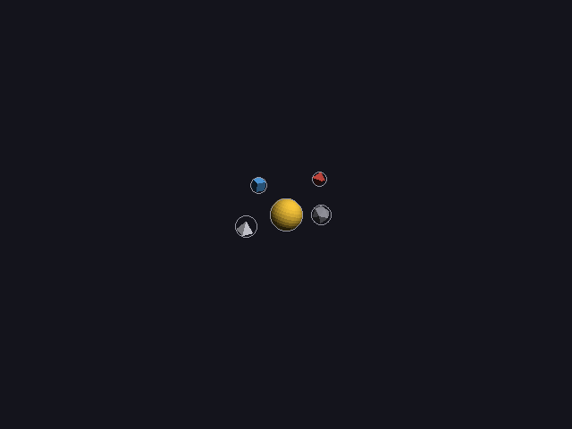
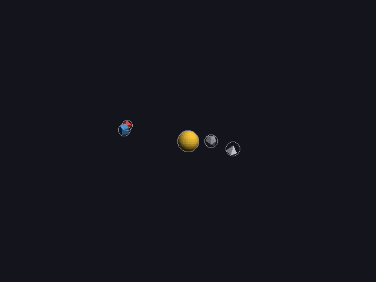
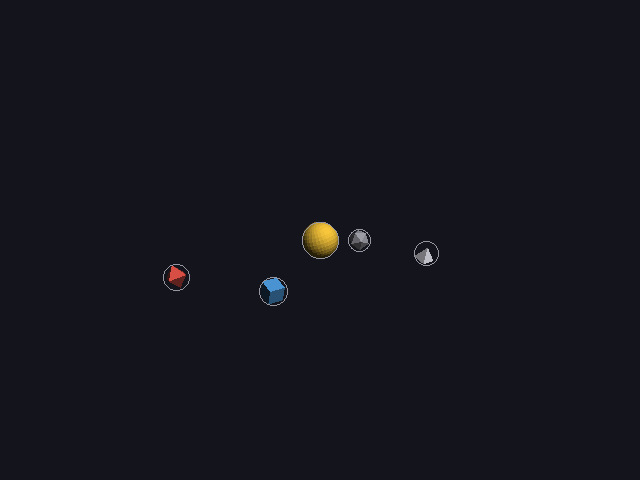

# 32 · Flying past something that moves

A fly-by (16) is a straight line past something: a comet going past the sun.
Until now that something had to stand still. Flying past a **planet** that
is itself going round the sun was reported as a mistake ("not supported
yet") and the object stood still instead. Now it works:

```cpp
spec.add("planet", "shapes/octahedron.obj", red).orbits("sun", 1.0f, 0.0f, 20.0f);
spec.add("probe",  "shapes/cube.obj", blue, size_word::small).flies_past("planet", 4.0f, 12.0f, rate::smooth);
```

| 4 s: the flight starts | 8 s: halfway, right in front of the planet | 12 s: past it |
|---|---|---|
|  |  |  |

The blue probe sweeps past the red planet while the planet keeps going
round the sun.

Code: `motion.cpp` (`split_motion`, `position`, `reach`, `place_naive`,
`plan_flights`, `bounds`), `solver.cpp` (the two-pass solve), `world.cpp`
(`attach_to`), `test_scenes.cpp` (`flyby_mover`).

---

## 1. The idea: measure the line from the mover

A moon's circle is measured from its planet, so it travels along with it
(17). A fly-by past a mover does the same with its line: `from` and `to` are
**offsets from the planet**, not places in the world:

```
probe(t) = planet(t) + lerp(from, to, f)          f = the eased fraction (23)
```

Before the flight the probe waits at `planet(t) + from`, and after it, at
`planet(t) + to`, so it rides along with the planet the whole time.

The offsets don't turn with the planet: "in front" stays +z, towards the
camera. So the probe always passes **in front** of the planet as seen from
the camera, wherever the planet is on its circle. That's the point of a
fly-by in an explainer: you see it go past.

In the world (`world.cpp`), it's the same parent/child link as a moon
(17): the probe is `attach_to` the planet, and its own motion is the line
from `from` to `to`, in the planet's frame.

## 2. Worked example: where is the probe at 8 s?

From the report ([flyby-mover.txt](images/flyby-mover.txt)):

```
planet     orbits sun, 0.00-20.00 s: radius 11.36, 1.00 turns
probe      flies_past planet (which moves), 4.00-12.00 s smooth: from (-6.33, 0.00, 2.07) to (6.33, 0.00, 2.07) measured from planet
```

**The line.** It's planned exactly like a fly-by past something still (16),
but around (0, 0, 0), the planet's own center. The probe (a small cube,
r = 0.87) and the planet (r = 0.8):

```
D    = r_probe + r_planet + gap = 0.87 + 0.80 + 0.4 = 2.07      how far in front
half = 2 · (0.87 + 0.80) + 3 = 6.33                              how long each side
in front:  from = (−6.33, 0, 2.07),  to = (6.33, 0, 2.07)
```

**The planet at 8 s.** One turn in 20 s, so the angle is

```
angle = 2π · 8/20 = 144°
planet(8) = (11.36 · cos 144°, 0, −11.36 · sin 144°) = (−9.19, 0, −6.68)
```

**The fraction.** The flight is 4–12 s, so 8 s is halfway: smooth(0.5) = 0.5
(the S-curve's middle, 23). Halfway along the line is its middle:

```
lerp(from, to, 0.5) = (0, 0, 2.07)
probe(8) = (−9.19, 0, −6.68) + (0, 0, 2.07) = (−9.19, 0, −4.61)
```

The engine says (−9.1888, 0, −4.6100). ✓ Straight in front of the planet,
2.07 from its center: 0.4 clear of touching.

**An eased moment: 10 s.** That's 6 of the 8 seconds, 0.75 of the way. With
smooth it's further along than that, since the middle of the S is fast:

```
smooth(0.75) = (σ(2.5) − σ(−5)) / (1 − 2·σ(−5)) = (0.9241 − 0.0067) / 0.9866 = 0.930
offset   = −6.33 + 0.930 · 12.66 = 5.44              along x, still 2.07 in front
planet(10) = (11.36 · cos 180°, 0, 0) = (−11.36, 0, 0)
probe(10)  = (−11.36 + 5.44, 0, 2.07) = (−5.91, 0, 2.07)
```

The engine: (−5.9137, 0, 2.0660). ✓

## 3. Checking it: sampling, not the exact formula

Past something still, the line is checked against the still objects with
the exact closest-point formula (16, section 7). That formula needs a line
that **stays put**. This one moves with the planet, so the line's closest
point to the rock changes every moment. There's no simple formula for that.

So it's checked like everything else that moves: by **time sampling** over
the whole video (`clear_of_still_sampled`), with the same step as always
(16, section 4):

```
dt = gap / (4 · fastest) = 0.4 / (4 · 7.58) = 0.0132 s
```

The report says `checked every 0.0132 s (fastest moves 7.5793 per second)`.
✓ Then against the moving things with `clear_of_moving`, as before.

The candidates are the same as in 16: in front, above, below, behind, at
1×, 1.5×, 2×, 3× and 4× the distance. Here the first one (in front) is clear.

## 4. A planet with a fly-by is bigger

Like a moon (17) or something stuck to it (18), the probe makes the planet
**reach** further for planning its own orbit. The farthest point of the
line from the planet's center is one of its ends:

```
reach = max(|from|, |to|) + r_probe = √(6.33² + 2.07²) + 0.87 = 6.66 + 0.87 = 7.53
```

The engine: `reach(planet) = 7.5266`. ✓

**But the orbit is planned first.** The order is: orbits, then fly-bys
(which steer round the orbits). So when the planet's orbit is chosen, the
line is still the naive one, straight through the planet:
(−6.33, 0, 0) to (6.33, 0, 0), a reach of 6.33 + 0.87 = 7.20. The rock (at
h = 2.96 from the sun, r = 0.8) then rules out

```
2.96 ± (7.20 + 0.80 + 0.4) = −5.44 .. 11.36        → R = 11.36
```

which is the report's radius. The line that's finally chosen reaches 7.53,
0.33 more than planned for. That's safe, because the sampled check in
section 3 uses the **final** line: the closest the probe ever gets to the
rock is 1.84 (at 0.70 s, waiting at its start), more than the 0.87 + 0.8 =
1.67 it needs. If it weren't clear, that candidate would be rejected and
the next one tried; if none were clear, the report would say so.

## 5. Framing: two passes

The camera has to see everything that moves (16, section 8). Each moving
thing becomes a few spheres for the framing (`bounds()`): an orbit is 32
spheres round its circle, a fly-by is its two ends. A fly-by measured from a
mover adds nothing: it's inside the planet's reach, which the orbit's
spheres already include.

Planning paths needs the still objects' places, and placing the still
objects needs room for the paths. So when there are paths, the solver
(`scene_solver`, `solver.cpp`) goes round twice:

```
1. place the still objects                          (11–14, 31)
2. plan the paths around them                       (16–18, here)
3. place the still objects again, now framing the paths' spheres too
4. plan the paths again, around the new places
5. frame the camera on the still objects + the final paths
```

Before, step 5 reframed the camera without re-placing anything, and the
`motion_typos` scene ended with one pair hidden behind each other on screen.
With the second pass, nothing is hidden. It also nudged scene 5's numbers a
little (the planet's orbit went from 6.33 to 6.35, 18).

## 6. What changed in the tests

- `motion_typos` used to count flying past a mover as one of its 5
  mistakes. It's now allowed, so it reports **4**, and that object now
  flies (3 moving objects instead of 2).
- A new stress scene, `flyby_mover` (15): the sun, a rock, the orbiting
  planet, the probe flying past it, and a comet flying past the sun. It
  passes every hard check: no overlaps, nothing hidden, no collisions over
  the whole video, everything in the picture.

```
./main stress flyby_mover                          watch it
./main stress flyby_mover framed x.png 8           a picture at 8 s
```

---

## Try it on paper

Where is the probe at **4 s**, just as its flight starts? (One turn in 20 s,
R = 11.36; it waits at `from` until it starts.)

Answer: angle = 2π · 4/20 = 72°, planet(4) = (11.36 · cos 72°, 0,
−11.36 · sin 72°) = (3.51, 0, −10.80). probe(4) = (3.51 − 6.33, 0,
−10.80 + 2.07) = (−2.82, 0, −8.74). The engine: (−2.8223, 0, −8.7360).
