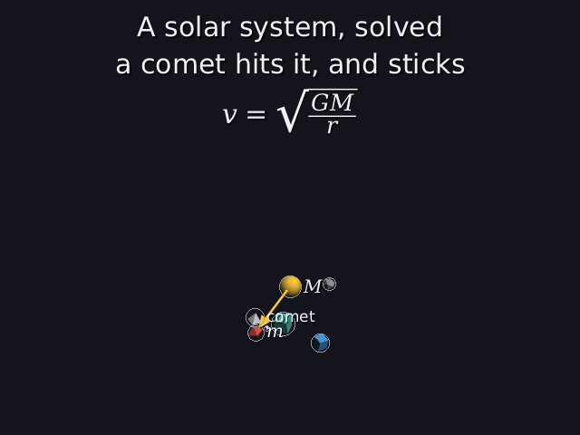

# 33 · Framing where things are, not where they could be

The camera has to keep every moving thing in the picture for the whole
video (16, section 8). The first way to make sure of that was to fit the
camera around every place a thing **could** be: an orbit became a ring of
32 spheres, each as big as the planet's whole **reach** (17). That's safe,
but loose. In `scenes/showcase.dan` the probe flying past the planet gives
the planet a reach of 7.53, so every one of the 32 spheres round its orbit
was 8.8 units across, nearly all of it empty at any moment. The camera
backed off to make room for that, and everything looked small.

Now the camera fits where each thing **actually is**, over time.

| before: fits a fat ring | after: fits the real positions |
|---|---|
|  |  |

`scenes/showcase.dan` at 17 s, as it was then (it has gained a graph and a
morphing shape since). Camera distance **59.7 → 42.0**.

Code: `motion.cpp` (`bounds`).

---

## 1. The idea

Every moving object's position is known for every moment in advance
(`position(k, t)`). So: put a sphere at its position every dt seconds, and
let the camera's tight framing (14) fit all of those spheres.

The catch is the moments **between** samples. A sample at 4.00 s and one at
4.02 s say nothing directly about 4.01 s.

## 2. Why the gaps can't be missed

It's the same argument as the collision checks (16, section 4):

```
between two samples dt apart, a thing moves at most  v · dt          (v = its fastest speed)
any moment is at most dt/2 from the nearest sample
so there it's at most  v · dt/2  from that sample's position
```

So each sphere is made bigger by that much:

```
sphere radius = r + v · dt / 2
```

and then whatever fits the samples fits **every** moment. v includes the
steepest part of the easing curve (23), and for a moon its planet's speed
too (`speed_of`), so the bound holds for eased and nested motion.

**Which dt?** The collision checks already use dt = gap / (4 · fastest)
(16), which makes the padding at most

```
v · dt / 2  ≤  fastest · gap / (4 · fastest) / 2  =  gap / 8  =  0.05
```

With no more than 2000 samples per object, so a very fast object can't make
the framing slow.

## 3. Worked example: scene 4

From [scene4-framed.txt](images/scene4-framed.txt):

```
checked every 0.0184 s (fastest moves 5.4464 per second)
```

planet2 is the fastest: 2 turns of a circle of radius 8.67 in 20 s.

```
v       = 2 · 2π · 8.67 / 20 = 5.447 per second
dt      = 0.4 / (4 · 5.447) = 0.0184 s
pad     = 5.447 · 0.0184 / 2 = 0.050                 (= gap / 8, as promised)
samples = 20 / 0.0184 = 1089.3, so 1091 per object (from 0 s, every 0.0184 s, and 20 s itself)
```

planet2 (r = 0.87) becomes 1091 spheres of radius 0.92 along its circle,
one every 0.0184 s. Before, it was 32 spheres of radius 1.72.

The moon is slower on its own (1.41 per second), but it rides on planet1
(1.76 per second), so v = 1.41 + 1.76 = 3.17 and its pad is
3.17 · 0.0184 / 2 = 0.029.

| | 32 spheres per orbit (16) | sampled (here) |
|---|---|---|
| scene 4 | 19.90 | **18.95** |
| scene 5 | 19.71 | **18.76** |
| flyby_mover (32) | 39.14 | **29.42** |
| showcase | 59.66 | **41.96** |

(camera distances; smaller is closer.) Scene 4 barely changes: its rings
were already thin. The scenes with a fly-by past a mover change the most,
because that's where the reach was much bigger than the thing itself.

## 4. Why this is still safe

Nothing about the guarantee changed, only how tight it is. The stress tests'
hard check **moving objects stay in the picture** (15) walks every path with
its own sampling and counts objects that leave the picture at any moment.
It's 0 for every scene.

**What it costs.** About 1100 spheres per moving object instead of 32, and
the binary search (14) tests all of them each round. That's a few hundred
thousand projections, a few milliseconds, once when the scene is built. The
whole stress suite still runs in about a second.

## 5. Why not this from the start?

Orbits came first (16), and a ring of spheres was the natural shape for a
circle. What changed is that paths got more varied (moons, hits that stick,
fly-bys past movers, easing): each new kind needed its own sphere rule.
Sampling needs none. Anything with a `position(k, t)` and a top speed can
be framed, including motions that don't exist yet.

---

## Try it on paper

A comet flies 15 units in 6 s at a steady speed, and the samples are
0.02 s apart. How much bigger is each of its spheres?

Answer: v = 15 / 6 = 2.5 per second; pad = 2.5 · 0.02 / 2 = 0.025.
