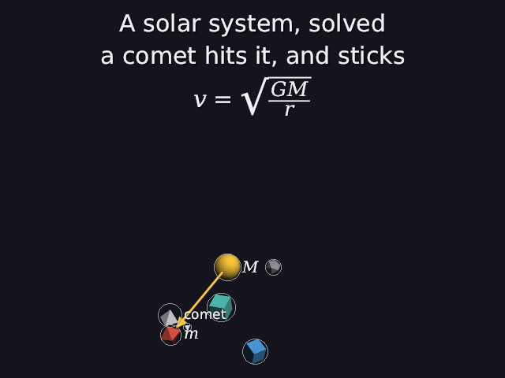
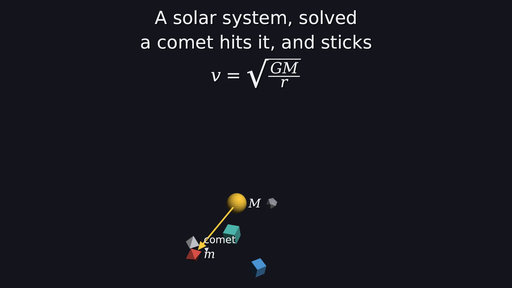

# 34 · Any picture size, and HD

Everything so far was 640×480, the shape of an old TV (4:3). Manim and
YouTube are **1920×1080**, the shape of a modern screen (16:9). Now
`--hd` makes any `.dan` scene at 1920×1080: live, as a picture, or as a
video.

```
./main scenes/showcase.dan --hd --aa                                 live
./main scenes/showcase.dan framed picture.png 17 --hd --aa           a picture at 17 s
./main scenes/showcase.dan --hd --aa --video showcase.mp4            a video
```

| 640×480 | 1920×1080 (`--hd`) |
|---|---|
|  |  |

The same scene, the same layout: just more pixels, a wider picture, and no
debugging circles.

Code: `main.cpp` (`--hd`), `world.cpp` (`ui`), `render.cpp` (`ui_scale`,
`show_circles`), `solver.cpp` and `layout.cpp` (`set_aspect`),
`label_layout.cpp` (`scale`), `live_scene.cpp`.

---

## 1. Three things depend on the picture's size

1. **How many pixels** the renderer fills. That part was already general:
   `render(width, height)`.
2. **The shape** the solver frames for. The layout always assumed 640/480,
   even though it had a setting for it that nothing called.
3. **Every size written in pixels:** titles 30 px, labels 17 px, a 3-pixel
   gap beside each label, arrows 2.5 px wide. On a 1080-pixel picture those
   would all come out less than half as big.

## 2. The shape: 16:9 is wider

The camera's vertical field of view stays 50°. The horizontal one follows
from the shape (14):

```
tan(fov_x / 2) = tan(fov_y / 2) · aspect

4:3:   tan(25°) · 4/3  = 0.4663 · 1.333 = 0.6217   →  fov_x = 2 · 31.87° = 63.7°
16:9:  tan(25°) · 16/9 = 0.4663 · 1.778 = 0.8290   →  fov_x = 2 · 39.66° = 79.3°
```

So an HD picture sees 79° across instead of 64°, and the same height.
`scene_solver` now hands the shape to the layout (`set_aspect`), so the
framing's "is it in the picture" test (15) uses the wider edge.

**Does the camera come closer?** Only if the sides were what limited it.
The binary search (14) stops at the closest distance where **every** edge
is still clear, so whichever edge is hit first sets the distance:

| scene | 4:3 | 16:9 |
|---|---|---|
| lazy | 12.80 | 12.80 |
| labelled | 21.22 | 21.22 |
| labels | 19.31 | 19.27 |

For these scenes it's the top and bottom: seen from the front and above,
and with titles taking the top (31), they're "tall". So 16:9 leaves more
room at the sides instead. That's honest, and fine: an explainer usually
wants room at the sides for words anyway.

## 3. The sizes: one scale for everything on the picture

Every on-screen size was chosen for a picture 480 pixels tall. A taller
picture multiplies them all by

```
ui = height / 480                1080 / 480 = 2.25
```

| | 480 | 1080 |
|---|---|---|
| title | 30 px | 67.5 px |
| label | 17 px | 38.25 px |
| formula | 30 px (labels 20) | 67.5 px (45) |
| gap beside a label | 3 px | 6.75 px |
| arrow width, head | 2.5 px, 14 px | 5.6 px, 31.5 px |

So a 1080p frame looks like a **sharper** 480p frame, not a smaller one.
The text is drawn from its outlines at the bigger size (29), so it's crisp,
not blown up.

`render::ui_scale()` works it out from the picture itself: the image's
height divided by the samples (25) and by 480. Supersampling makes a
bigger image to draw into, but not a bigger picture:
`render(1920, 1080, 2)` still has ui_scale 2.25.

## 4. Why the solver doesn't care about pixels at all

The solver measures the screen in **tan units** (13): x/depth and y/depth.
They're angles, not pixels, so they're the same at any resolution. The only
pixel sizes it uses are the title band and the label widths (31), and
those are in "480-pixel units":

```
1 px = 2 · tan(25°) / 480 = 0.00194 tan units
```

At 1080p, a label is 2.25 times as many pixels, but each pixel is 2.25
times smaller in tan units (2 · tan 25° / 1080). The product is the same.
So the solver keeps working at 480 and gets the same answer at any size.
The test proves it: the showcase framed for 16:9 still has everything in
the picture, nothing hidden, and room for every label.

The 640×480 output didn't change at all: after this step, every picture in
`docs/images` came out identical.

## 5. No debugging circles

The grey and red bounding circles (11) are for checking the solver, not for
a finished video. `--hd` turns them off (`camera::circles`, which the
player hands to `render::show_circles`). The live window, the doc pictures
and the stress tests keep them.

## 6. Exporting an HD video

```
./main scenes/showcase.dan --hd --video showcase-hd.mp4
```

A video doesn't have to keep up with the clock: frame k is the moment
k / 60 s however long it takes to draw (25). So an HD video can afford
**3×3 supersampling** (`--hd --video` uses at least 3):

```
samples per frame = 1920 · 1080 · 9 = 18,662,400
image to draw in  = 5760 × 3240 pixels · 4 bytes = 74.6 MB   (and a depth buffer as big)
```

**Measured** on this machine (the recorder prints it): the 26 s showcase,
1560 frames, took **82 s**: **52.5 ms per frame**, including ffmpeg
compressing at the same time. That's about 3 times slower than real time,
which is fine for a video. The live window has 16.7 ms per frame at 60 fps,
which is why it stays at 640×480 unless you ask for `--hd`.

**The ffmpeg settings** (`player.cpp`):

| flag | what it does |
|---|---|
| `-crf 16` | quality: lower is better (0 = lossless, 23 = ffmpeg's default). 16 keeps text edges clean. |
| `-preset slow` | spend more time compressing, for a smaller file at that quality |
| `-tune animation` | tuned for flat colors and sharp edges, like ours |
| `-pix_fmt yuv420p` | the color format every player understands |

The 26 s showcase comes out at 1.3 MB.

## 7. Tests

```
any picture size:
  PASS  sizes scale with the height: 1 at 480, 2.25 at 1080 (a 30 px title becomes 67.5 px), samples don't count
  PASS  a world made for 1920x1080 has a camera of that size; the default is still 640x480
  PASS  the solver frames for the picture's shape: 16:9 for HD, 4:3 by default
  PASS  the showcase framed for 16:9: everything in the picture, nothing hidden, every label has room
  PASS  label gaps scale too: 3 px becomes 6.75 px at 1080
```

---

## Try it on paper

A 1280×720 picture (720p). What's ui, how big is a title, and how wide is
the view?

Answer: ui = 720 / 480 = 1.5, so a title is 30 · 1.5 = 45 px. 1280/720 is
16:9 again, so fov_x = 79.3°, the same as 1080p: the same picture, just
fewer pixels.
