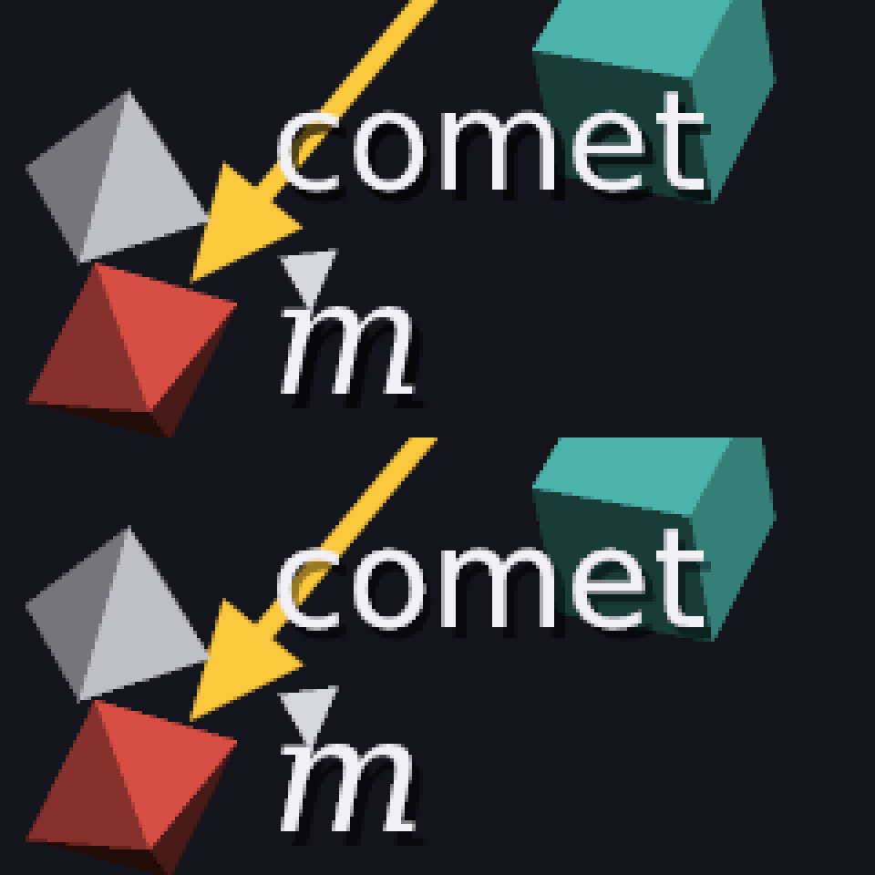

# 35 · Mixing colors as light

Anti-aliasing (25), smooth text (29), lines (26) and see-through objects
(24) all **mix** two colors: a pixel half covered by a white letter is
"half white, half background". Until now the mixing was done on the
**bytes** of the colors. That's wrong, and it's why edges and text looked a
little thin and jagged.



The same 1080p frame, zoomed 4×. **Top:** bytes averaged. **Bottom:** light
averaged. The letters are fuller and smoother, and the edges of the arrow
and the shapes are less stair-stepped.

Code: `srgb.h` (`to_linear`, `to_byte`, `blend`), `render.cpp` (the
anti-aliasing average, and every blend).

---

## 1. A byte isn't an amount of light

A screen doesn't turn byte 128 into half the light of byte 255. It follows
the **sRGB curve**, which spends more of the 256 bytes on dark shades
(where eyes are sensitive) and fewer on bright ones:

```
light = ((c + 0.055) / 1.055) ^ 2.4          c = byte / 255
        (or c / 12.92 for the darkest few, so the curve isn't infinitely steep at 0)
```

```
byte 128:  c = 0.502,   ((0.502 + 0.055) / 1.055)^2.4 = 0.2159
```

**Byte 128 is only 21.6% of the light**, not 50%.

## 2. What goes wrong

A white letter (255) covers exactly half of a black pixel (0). Physically,
the pixel should send out half as much light as a white one.

| mixing | result | light |
|---|---|---|
| bytes: (255 + 0) / 2 | **128** | 21.6%: too dark |
| light: (1 + 0) / 2 = 0.5, back to a byte | **188** | 50% ✓ |

Back to a byte is the curve the other way round:

```
c = 1.055 · light^(1/2.4) − 0.055 = 1.055 · 0.5^0.4167 − 0.055 = 0.7354   →   0.7354 · 255 = 187.5 → 188
```

The engine: `white covering half a black pixel: 188 mixed as light, 128
mixed as bytes`. ✓

So with byte mixing, every half-covered edge pixel was much darker than
it should be. Edges of bright things on a dark background (that's all of
our text, and Manim's whole look) came out **thin**, and the stair-steps
showed more. Mixing light gives the edge pixels the brightness they really
have, which is exactly what makes anti-aliasing look smooth.

## 3. The recipe

Every mix now goes: bytes → light, mix, light → bytes.

```
mix = to_byte( to_linear(new) · a + to_linear(old) · (1 − a) )
```

- **`to_linear`** is a table of 256 numbers, worked out once. There are
  only 256 possible bytes.
- **`to_byte`** uses the formula. Turning a byte into light and back gives
  the same byte for all 256 (a test checks every one).
- **`srgb::blend`** is `px::Image::Draw` (24), but mixing light. `pixel.h`
  itself is unchanged.

**Where it's used:**
- the anti-aliasing average (25): the light of the samples is averaged, not
  their bytes
- the coverage of lines and arrows (26)
- text and formulas (29, 30), including their shadows
- leader lines (28)
- see-through objects (24)

## 4. Page 24's example, again

Page 24's test: a grey triangle (137 when solid) at half opacity over the
background (20). Mixed as bytes it was 79. As light:

```
to_linear(137) = 0.2502,   to_linear(20) = 0.0070,   a = 128/255 = 0.502
0.502 · 0.2502 + 0.498 · 0.0070 = 0.1291   →   to_byte = 100.6 → 101
```

The engine gives 101. ✓ It's brighter than 79 because half the light of
137 is a lot more than "the byte halfway to 20".

## 5. What it costs

`to_linear` is a table lookup. `to_byte` is a `pow`, but only for pixels
that are actually mixed: edges, text, and see-through things. A whole 1080p
frame of the showcase, anti-aliased, still takes well under a tenth of a
second.

## 6. Tests

```
linear light:
  PASS  every byte turned into light and back gives the same byte (all 256)
  PASS  the ends are exact: 0 is no light, 255 is all of it
  PASS  byte 128 is only 21.6% of the light, not half
  PASS  white covering half a black pixel: 188 mixed as light, 128 mixed as bytes (188)
```

and page 24's test now expects the mix in light (101).

---

## Try it on paper

A 2×2 block of anti-aliasing samples (25): one is white (255), three are
black (0). What's the final pixel, mixed as bytes and as light?

Answer: bytes: 255 / 4 = 63.75 → 64. Light: 1/4 = 0.25 →
1.055 · 0.25^0.4167 − 0.055 = 0.537 → 137. The light answer is more than
twice as bright, and it's the right one: a quarter of the light.
