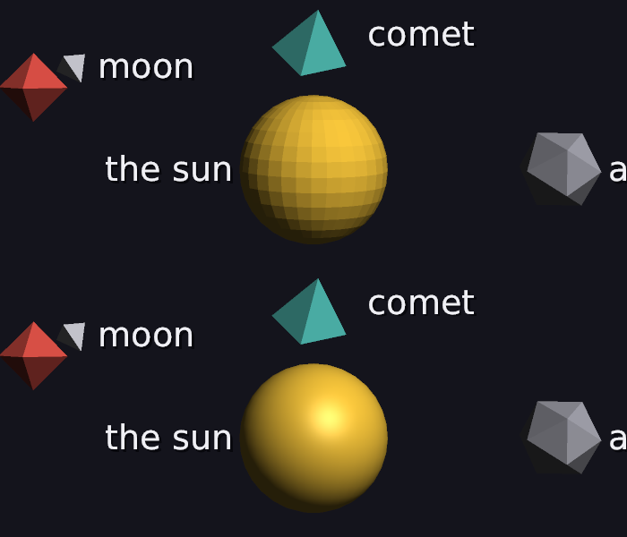

# 36 · Smooth shading

Flat shading (08) gives every triangle one brightness. On a cube that's
right, but a sphere made of 960 triangles shows every one of them as a
facet. Manim's spheres look round and glossy. Now ours do too, and the
cube stays crisp.



`scenes/labels.dan` at 8 s, 1080p. **Top:** flat. **Bottom:** smooth, with a
highlight. The pyramid, octahedron and icosahedron keep their sharp faces.

Code: `mesh.cpp` (`smooth_normals`, `corner_angle`), `render.cpp`
(`draw_mesh`, `clip_and_fill`, `fill`).

---

## 1. One normal per corner instead of one per face

A face's normal is the direction it faces (08). Flat shading uses that one
direction for the whole triangle.

Smooth shading gives each **corner** of each triangle its own normal: the
direction the **surface** faces at that point. For a sphere, that's straight
out from the center. The triangles are flat, but the normals say "this is
really a curved surface", and the lighting follows the normals.

A corner's normal is the average of the normals of the faces around that
vertex:

```
corner normal = normalize( Σ  angle_j · n_j )      over the faces j that share the vertex
```

**Weighted by angle.** Each face counts in proportion to its angle at that
corner, how much of the view round the vertex it takes up. Near a sphere's
poles the triangles are thin slivers next to wide ones. With a plain
average, a sliver would count as much as a wide face. The test measures
the result against "straight out from the center" at every corner of the
sphere:

```
plain average:      worst 1.17°
weighted by angle:  worst 0.34°
```

## 2. Keeping corners sharp: the crease angle

A cube's corner is shared by three faces at 90° to each other. Averaging
them would make the cube look like a soft blob. So a face only counts if
it bends away from **this** face by less than the **crease angle**, 40°:

```
counts if   dot(n_this, n_other) ≥ cos 40° = 0.766
```

| shape | angle between neighbouring faces' normals | dot | smooth? |
|---|---|---|---|
| sphere (16 × 32) | about 11° | 0.98 | yes |
| icosahedron | 41.8° | 0.745 | **no**, just past 40° |
| cube | 90° | 0 | no |

So the cube's corners each keep their own face's normal, and the
icosahedron stays faceted, which is what it should look like. 40° is a
common choice. It's also why the cylinder's sides are smooth but the edge
where they meet the flat top stays sharp.

The `.obj` files have no normals of their own (`vn` lines), so this is all
worked out once when a mesh is loaded.

## 3. Across the triangle: blend the normals

For each pixel, the three corners' normals are blended with the same
barycentric weights that blend the depth (07, 08), then made 1 long
again:

```
n = normalize( w₁·n₁ + w₂·n₂ + w₃·n₃ )
```

Halfway between (1, 0, 0) and (0, 1, 0): (0.5, 0.5, 0), made 1 long =
(0.7071, 0.7071, 0). Blending shortens it, which is why it has to be
normalized again (a test checks this).

This is **Phong shading**: lighting worked out per pixel with a blended
normal. (Gouraud shading lights only the corners and blends the colors,
which is cheaper but smears highlights.)

Normals turn with the object: they go through the model matrix with
w = 0, so the move part doesn't apply (a direction has no position). The
scaling is the same in every direction here, so normalizing afterwards is
enough. With uneven scaling, normals would need the inverse transpose.

The blend uses the screen-space weights, which isn't perspective-correct;
for triangles this small the difference can't be seen.

## 4. The light: Lambert plus a highlight

The base is the same Lambert brightness as 08:

```
brightness = 0.15 + 0.85 · max(0, n · light)          light = (0.3714, 0.7428, 0.5571)
```

On top, a **Blinn-Phong highlight**: the bright spot where the surface
reflects the light into the eye. h is the direction halfway between the
light and the eye:

```
h         = normalize(light + to_eye)
highlight = 0.25 · max(0, n · h)^32 · 255
```

The ^32 makes the spot small: n · h = 0.9 gives 0.9^32 = 0.034, almost
nothing; only where n is very close to h does it light up. It's done with
5 squarings (x², x⁴, x⁸, x¹⁶, x³²), not `pow`. The highlight is added as
white:

```
channel = min(255, color · brightness + highlight)
```

**Worked example: the gold sun at its brightest point,** where n = h. The
camera looks along −z, so to_eye ≈ (0, 0, 1):

```
h = normalize((0.3714, 0.7428, 0.5571) + (0, 0, 1)) = (0.2105, 0.4209, 0.8824)
n · light = h · light = 0.8824       brightness = 0.15 + 0.85 · 0.8824 = 0.900
n · h = 1                            highlight  = 0.25 · 255 = 63.75

gold (250, 200, 60):
r = min(255, 250 · 0.9 + 63.75) = 255
g = 200 · 0.9 + 63.75 = 243.75 → 243
b =  60 · 0.9 + 63.75 = 117.75 → 117
```

That's the pale yellow spot on the sun.

**And a flat face towards the camera** (the test from 08 and 24): n = (0, 0, 1),
so n · h = 0.8824 and the highlight is 0.25 · 0.8824^32 · 255 = 1.16. A grey
(220) face: 220 · 0.6235 + 1.16 = 138.3 → **138**. The engine gives 138. ✓
(It was 137 before; that's the only change on flat faces.)

## 5. What it costs

The normal blend, two normalizes and five squarings per pixel, but only
for pixels that pass the depth test (hidden ones are skipped first). A
1080p anti-aliased frame of the showcase still takes well under a tenth of
a second.

## 6. Tests

```
smooth shading:
  PASS  every corner of the sphere points straight out from its center (worst 0.343781 degrees)
  PASS  a cube's corners keep their own face's normal (its faces meet at 90 degrees, past the 40 degree crease)
  PASS  an icosahedron stays faceted too: its faces meet at 41.8 degrees, just past the crease
  PASS  a grey (220) face towards the camera: 137.2 from the light + 1.16 highlight = 138 (138)
  PASS  halfway between two normals, made 1 long again: (0.7071, 0.7071, 0)
```

---

## Try it on paper

A pixel of a red object (200, 50, 50), where n · light = 0.5 and
n · h = 0.95. What color is it?

Answer: brightness = 0.15 + 0.85 · 0.5 = 0.575. 0.95^32 = 0.194, highlight =
0.25 · 0.194 · 255 = 12.4. r = 200 · 0.575 + 12.4 = 127.4 → 127,
g = b = 50 · 0.575 + 12.4 = 41.2 → 41.
