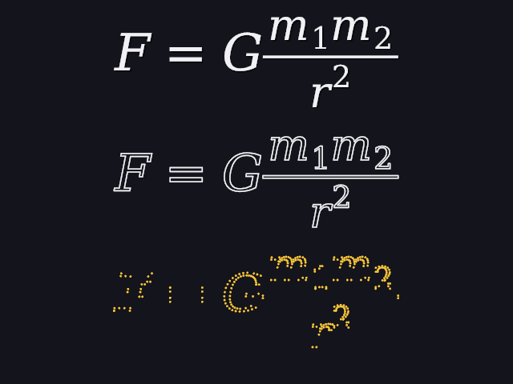

# 37 · Vector paths: letters you can animate

Manim's best-known animations draw a formula in stroke by stroke (**Write**)
or turn one formula into another (**Transform**). Both need the letters as
**shapes made of points**, not as finished pictures. This page is that
foundation: titles and formulas are now **vector paths**.



`./main paths`: the same formula three ways. **Top:** filled, the way it's
normally drawn. **Middle:** only the outline. **Bottom:** the 296 points its
10 pieces are made of.

Code: `vpath.h/.cpp` (`text_paths`, `math_paths`, `loop_length`,
`loop_prefix`), `render.cpp` (`draw_vpiece`, `paint_vpiece`), `world.cpp`.

---

## 1. What a vector path is

The font already stores each letter as closed **loops** (29), which the
engine flattens into short straight sides (within 0.25 px of the curve).
Until now those loops were filled once into a little picture, the **glyph**,
and the loops were thrown away. A picture can be placed and faded, but not
drawn halfway, or turned into another letter.

A **vector path** keeps the loops:

```
vpiece  = one letter (or one bar of a formula):
            key    which letter (its codepoint; −1 for a bar)
            at     where it sits: a letter's pen position on its baseline,
                   a bar's top-left corner
            loops  its outline, as points measured from `at`

vgroup  = a whole title or formula: its pieces, and its box (width, height, depth)
```

**Text** (`text_paths`) walks the letters the same way the text width was
always measured (29): each letter's piece goes at the pen, then the pen moves
on by the letter's advance plus the kerning. A space has no ink, so it gives
no piece, but it still moves the pen. `"E = m"` is 3 pieces: E (69), = (61),
m (109).

**A formula** (`math_paths`) already knows where everything goes (30):
every glyph becomes a piece at its place, and every **bar** (a fraction line,
a root's top) becomes a piece whose loop is its rectangle's 4 corners.
`\frac{1}{2}` is 3 pieces: 1, 2, and the bar.

The bottom row of the picture shows the points. Straight letters (F, =, the
bar) need only their corners. Round ones (G, m, 2) need many, because
every curve was cut into short sides.

## 2. Two ways to draw a loop

**Fill** the inside: the nonzero winding rule (29). For every one of 4×4
points in a pixel, count which way the loops' sides cross a line going right
from it; inside if the count isn't 0. That's how glyphs were always made.

**Stroke** the outline: each pixel gets as much color as the nearest side
covers it, exactly like a line (26):

```
coverage = clamp( width/2 + 1/2 − d,  0, 1 )        d = distance to the nearest side
```

with a width of 1.5 px (times ui, 34). That's the middle row.

Write (38) uses both: first the stroke grows along the outline, then the
fill fades in.

## 3. Drawing part of a loop: arc length

To draw "the first 30% of the outline", the loop is measured along its
sides (its **arc length**), and cut where 30% of the length is used up.

**Worked example:** a 10 × 10 square, its loop going
(0, 0) → (10, 0) → (10, 10) → (0, 10) → back to (0, 0):

```
length = 10 + 10 + 10 + 10 = 40
first 0.25:  0.25 · 40 = 10    →  the whole first side: ends at the corner (10, 0)
first 0.3:   0.3 · 40 = 12     →  the first side (10), then 2 more along the second:
             (10, 0) + (0, 10) · (2 / 10) = (10, 2)
```

`loop_prefix` walks the sides, subtracting each one's length, and cuts the
side where it runs out: `a + (b − a) · (left over / side length)`. The tests
get (10, 0) and (10, 2).

## 4. Still pieces look exactly as before

Filling a letter's loops every frame would cost more than painting its
cached glyph, and might differ by a pixel. So a piece that isn't being
animated (`piece_look::still()`: normal size, fully filled, no outline) is
drawn **exactly** as before: the cached glyph, rounded to the same whole
pixel; a bar with its exact coverage (30). Only an animated piece is filled
and stroked from its loops.

The result: switching every title and formula to vector paths changed **no
pixel** in any picture in `docs/images`. And when a piece *is* filled from
its loops at the same spot, it matches its glyph exactly (a test compares an
'o' drawn both ways: 0 apart). That matters: when an animation ends and a
piece goes back to the cached glyph, nothing jumps.

## 5. How Manim does it differently

Manim keeps the outlines as **cubic Bézier curves** (a `VMobject`'s
points come in groups of four), and draws partial curves by splitting a
Bézier at a parameter t. It also measures "how far along" by the number of
curves, not by length.

Here the curves are flattened into short straight sides first, so:
- the length is a plain sum of side lengths
- cutting a loop is cutting one straight side
- "30% of the outline" really is 30% of its length, so a long stroke and a
  short one grow at the same speed

The price is more points (296 for this formula), which doesn't matter at
this scale.

## 6. Tests

```
vector paths:
  PASS  "E = m" is 3 pieces: E (69), = (61), m (109); the spaces have no ink, so no piece
  PASS  a 10 x 10 square's loop is 40 long (4 sides, back to the start)
  PASS  its first 0.25 ends at the corner (10, 0); its first 0.3 (12 long) at (10, 2)
  PASS  \frac{1}{2} is 3 pieces: 1, 2, and the bar as a 4-corner loop
  PASS  an 'o' filled from its loops looks the same as its cached glyph (at most 0 apart)
```

---

## Try it on paper

A 4 × 2 rectangle's loop: (0, 0) → (4, 0) → (4, 2) → (0, 2). Where does its
first half end? And its first 0.8?

Answer: length 12. Half is 6: the first side (4), then 2 down the second:
(4, 2), a corner. 0.8 is 9.6: 4 + 2 + 3.6 along the third side, which goes
left from (4, 2): (4 − 3.6, 2) = (0.4, 2).
