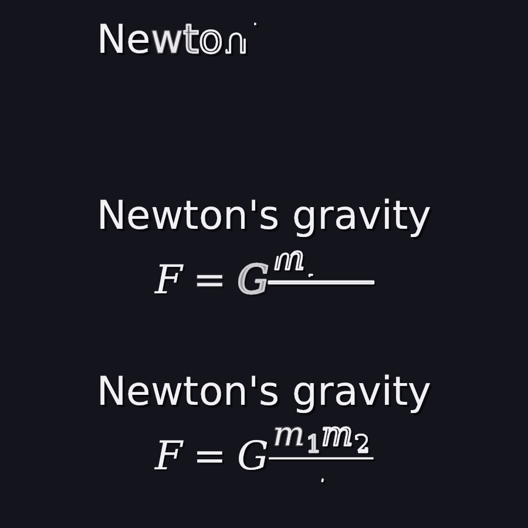
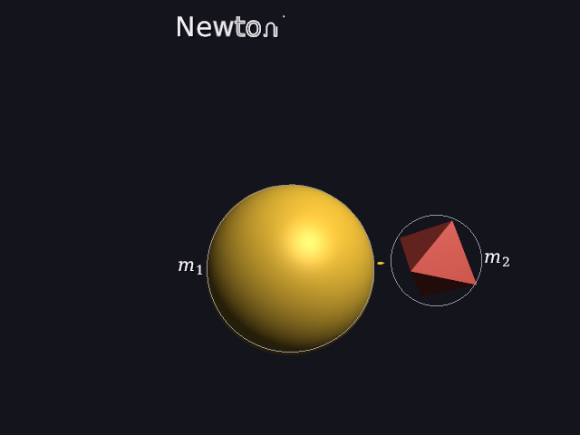
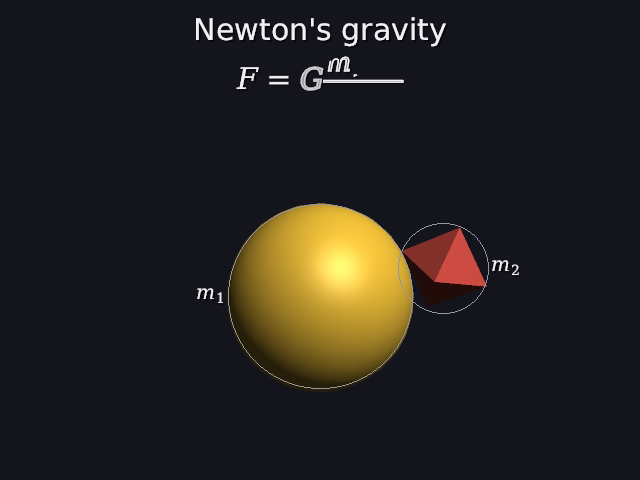
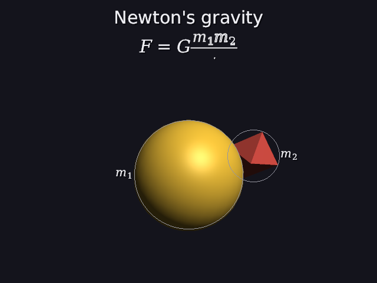

# 38 · Write: letters that draw themselves in

Manim's **Write** draws text and formulas the way you'd write them: each
letter's outline traced first, then filled in, letter after letter, each
starting a little before the one before it finishes. Now a title or formula
can do that:

```
title "Newton's gravity" 0s-20s write 1.5s
math "F = G\frac{m_1 m_2}{r^2}" 1s-20s write 2s
```



`scenes/write.dan` at 0.5 s, 1.8 s and 2.2 s (1080p, cropped). Top: "o"
is an outline, "n" is still being traced. Middle: G half filled, the
fraction line drawn, m being traced. Bottom: almost done.

| 0.5 s | 1.8 s | 2.2 s |
|---|---|---|
|  |  |  |

Code: `vpath.cpp` (`piece_progress`, `border_then_fill`, and the reading
order in `math_paths`), `world.cpp` (`draw_words`, `seen_at`),
`scene_parser.cpp` (`write_in`).

---

## 1. The words

```
title "..." [start-end] write [time]
math  "..." [start-end] write [time]
```

`write` alone takes 1 s. The writing starts at the start of the time range.
Mistakes are reported like any other (21):

```
title "Hi" write -1s            writing can't take a negative time          (column 18, the '-')
title "Hi" 0s-5s write 0s       writing has to take some time
title "Hi" 2s-3s write 2s       the title is only shown for 1s, so writing it can't take 2s
```

A written title doesn't also fade in (writing is how it comes in), but it
still fades out at the end of its range (24).

## 2. One letter: border, then fill

Each piece (a letter or a bar, 37) goes from p = 0 to p = 1. Manim calls
this **DrawBorderThenFill**:

```
first half  (p < 0.5):  the outline grows along every loop:  stroke = smooth(p / 0.5)
                        no fill yet
second half (p ≥ 0.5):  f = smooth((p − 0.5) / 0.5)
                        fill = f,  the outline fades: stroke_alpha = 1 − f
at p = 1:               just the letter, drawn like any still letter
```

"The outline grows" is arc length (37): at stroke = 0.5, the first half of
the length of every loop of the letter is drawn, all its loops together.

| p | outline drawn | outline strength | fill |
|---|---|---|---|
| 0 | 0 | 1 | 0: nothing shows |
| 0.25 | smooth(0.5) = 0.5 | 1 | 0 |
| 0.75 | 1 | 0.5 | smooth(0.5) = 0.5 |
| 1 | | | 1: just there |

Ending as an ordinary still piece matters: at p = 1 the letter is drawn
from the glyph cache exactly as it always was (37), so nothing jumps when
the writing ends.

## 3. Many letters: the lag

If every letter went from 0 to 1 together, the whole formula would appear
at once. If they went strictly one after another, it would feel slow and
jerky. Manim overlaps them with a **lag ratio**: each one starts a fixed
fraction of its own duration after the one before.

With n pieces and lag r = 0.2, the whole writing takes progress 0 → 1, and

```
each piece takes   w = 1 / (1 + r · (n − 1))
piece i starts at  i · r · w
piece i's p      = (progress − i · r · w) / w,  kept within 0..1
```

The last piece starts at (n − 1) · r · w and ends at that plus w, which is
exactly 1: (r(n − 1) + 1) · w = 1.

**Worked example: `E = mc^2`**, 5 pieces (E, =, m, c, 2):

```
w = 1 / (1 + 0.2 · 4) = 1 / 1.8 = 0.5556
starts: 0, 0.1111, 0.2222, 0.3333, 0.4444
```

The 3rd (m) starts at 0.2222 and finishes at 0.7778. The last starts at
0.4444 and ends at 1. The first is done at 0.5556, after the last has
already started: that's the overlap.

## 4. The picture at 1.8 s, worked out

The formula writes over 2 s from 1 s, so at 1.8 s, progress = 0.8 / 2 =
0.4. It has 10 pieces, in reading order: F, =, G, the bar, m, 1, m, 2, r, 2.

```
w = 1 / (1 + 0.2 · 9) = 1 / 2.8 = 0.3571        piece i starts at i · 0.0714
```

| piece | starts | p at 0.4 | what you see |
|---|---|---|---|
| F | 0 | 1 | done |
| = | 0.0714 | 0.92 | filled 0.974, outline almost gone |
| G | 0.1429 | 0.72 | fill smooth(0.44) = 0.352, outline 0.648 |
| bar | 0.2143 | 0.52 | outline whole, fill just starting (0.003) |
| m | 0.2857 | 0.32 | outline smooth(0.64) = 0.806 drawn |
| 1 | 0.3571 | 0.12 | outline smooth(0.24) = 0.063: a dot |
| m, 2, r, 2 | 0.43 and on | 0 | not yet |

The engine's numbers, printed piece by piece, are the same. That's the
middle picture: a greyish half-filled G, the fraction line, an outlined m,
and a dot where the 1 is starting.

## 5. Reading order

The order the pieces are written in is the order they're stored in. For
text that's left to right. A formula's layout (30) lists its glyphs in
order, but its **bars** came after all of them, so the fraction line was
written last, after r². Now each bar goes just before the first glyph at or
after its left end: before the numerator. You draw a fraction's line, then
its top and bottom.

## 6. Tests

```
write:
  PASS  of 5 pieces, the 3rd starts at 0.2222 and takes 0.5556 of the writing
  PASS  the last starts at 0.4444 and ends exactly at 1; the first is done at 0.5556
  PASS  at 0 nothing shows: no outline drawn yet, no fill
  PASS  at 0.25 half the outline is drawn (smooth(0.5) = 0.5), and nothing is filled
  PASS  at 0.75 the outline is whole, the fill half up, the outline half faded
  PASS  at 1 it's simply there (drawn like any still letter)
  PASS  a fraction's bar is written first, before its top and bottom
  PASS  'write 2s' writes it in over 2 s; 'write' alone takes 1 s
  PASS  'write 0s', writing for longer than it's shown, and 'write -1s' are mistakes (the '-' at column 18)
```

The first test version expected `piece_progress` to give exactly 1 for the
last piece at the end. It gave 0.99999988: (1 − 0.4444) / 0.5556 in floats.
That would have left a faint outline on the last letter forever. Now a
progress of 1 or more always means done.

---

## Try it on paper

A title with 3 letters, written over 1 s. When does each letter start and
finish? Where is the middle letter at 0.5 s?

Answer: w = 1 / (1 + 0.2 · 2) = 1 / 1.4 = 0.714. Starts: 0, 0.143, 0.286;
finishes: 0.714, 0.857, 1. At 0.5 s the middle one has
p = (0.5 − 0.143) / 0.714 = 0.5: its outline is complete and the fill is
just about to start.
