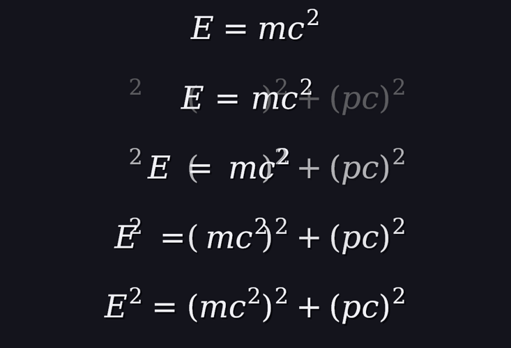
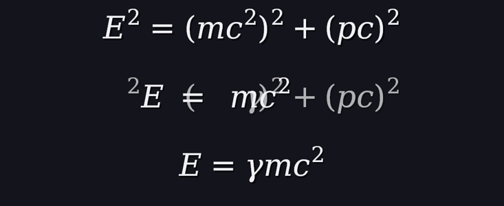
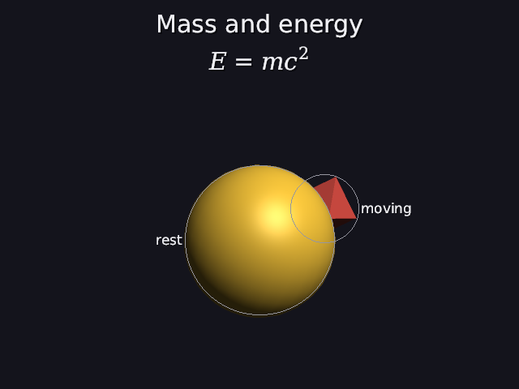
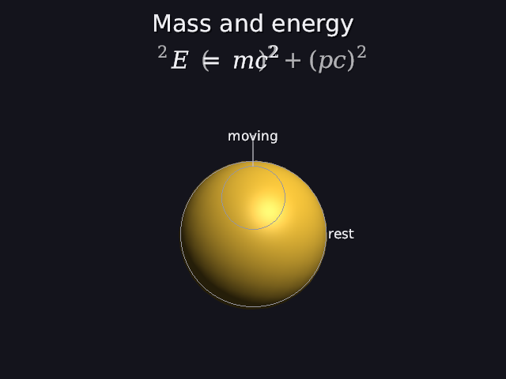
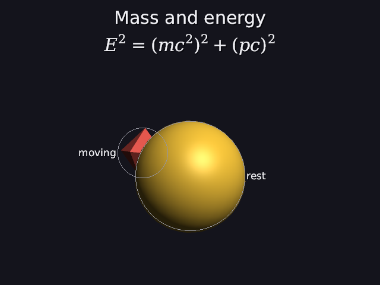

# 39 · Transform: one formula becomes another

The other Manim classic: a formula **turns into** the next step of the
explanation. The symbols that are in both glide to their new places; the
rest fade out or in. In Manim that's **TransformMatchingTex**. Here:

```
math "E = mc^2" 0s-20s write 1.5s becomes "E^2 = (mc^2)^2 + (pc)^2" at 4s-6s becomes "E = \gamma mc^2" at 10s-12s
```



`scenes/transform.dan` at 3, 4.6, 5, 5.4 and 7 s (1080p, cropped). E, =,
m, c and ² slide left and apart to make room; the new pieces fade in at their
places.



The second change, at 7, 11 and 13 s: most of it fades out, γ fades in.

| 3 s | 5 s | 7 s |
|---|---|---|
|  |  |  |

Code: `vpath.cpp` (`match_pieces`), `world.cpp` (`draw_change`, and which
formula is showing), `scene_parser.cpp` (`becomes`).

---

## 1. The words

```
math "..." [start-end] [write ...] { becomes "..." at start-end }
```

Each `becomes` changes the formula during its time range, and the new one
stays until the next change or the end. The new formula is checked like any
other (30), and the times must make sense:

```
math "a" becomes "x^" at 1s-2s                   in the formula: something is missing after '^'   (column 20)
math "a" 0s-12s write 2s becomes "b" at 1s-3s    the change can't start before 2s (when the writing is done)
math "a" 0s-5s becomes "b" at 4s-6s              the change has to be done by 5s, when the formula goes away
```

## 2. Matching: which piece becomes which

Both formulas are lists of pieces (37), each with a key: its letter, or
"bar". Two pieces can only match if their keys are the same. But which
² goes with which ²?

**First try: "follow along".** Take the first free piece with the same key,
but if the piece before went to b[j], try b[j + 1] first. That worked for
E = mc² → E² = (mc²)² + (pc)². For E² = c² → E = c² it goes wrong: E's ²
grabs the only ² (the one after c), and then the ² after c has nowhere to
go. The picture showed it: E's little ² flying across to c.

**The fix: the longest common subsequence**, the same idea `git diff` uses
for lines. Find the largest set of matches that keeps **both** formulas in
reading order. Nothing crosses over, so a piece can't jump past another
matched piece.

### Worked example: E² = c² → E = c²

a = [E, ², =, c, ²],   b = [E, =, c, ²]

L[i][j] = how many pieces a[i..] and b[j..] can match, in order:

```
L[i][j] = 1 + L[i+1][j+1]               if a[i] and b[j] are the same
        = max(L[i+1][j], L[i][j+1])     otherwise: skip one of them
```

Filled from the bottom-right (empty lists match nothing: 0):

|  | E | = | c | ² | (end) |
|---|---|---|---|---|---|
| **E** | **4** | 3 | 2 | 1 | 0 |
| **²** | 3 | 3 | 2 | 1 | 0 |
| **=** | 3 | **3** | 2 | 1 | 0 |
| **c** | 2 | 2 | **2** | 1 | 0 |
| **²** | 1 | 1 | 1 | **1** | 0 |
| (end) | 0 | 0 | 0 | 0 | 0 |

Then walk from the top-left:

```
(E, E):  the same           → match, go to (², =)
(², =):  different. Skip in b: L(², c) = 2. Skip in a: L(=, =) = 3. 3 is bigger → skip a's ²
(=, =):  the same           → match
(c, c):  the same           → match
(², ²):  the same           → match
```

4 matches: E, =, c, ². E's own ² has no partner, so it fades out. That's
the test `E^2 = c^2 -> E = c^2` (result `0, −1, 1, 2, 3`). When skipping in
a or b ties, the code skips in b, so a piece lands as early in b as it can.

**The scene's two changes:**

| change | glide | fade out | fade in |
|---|---|---|---|
| E = mc² → E² = (mc²)² + (pc)² | E, =, m, c, ² (to pieces 0, 2, 4, 5, 6) | none | 10: E's ², the brackets, the outer ²s, +, p, c |
| → E = γmc² | E, =, m, c, ² | 10 | γ |

## 3. During the change

f = smooth((t − start) / (end − start)), so it starts and ends gently (23).

- **A matched piece glides:** its spot is `lerp(spot in a, spot in b, f)`,
  and its size `lerp(size in a, size in b, f)`. A letter grows evenly; a bar
  gets longer or shorter but not thicker (`scale_x`, `scale_y`).
- **A piece only in a** fades out where it is (alpha 1 − f).
- **A piece only in b** fades in where it will be (alpha f).
- The space the formula takes below the titles also changes smoothly, from
  a's height to b's.

**Worked example: E at 5 s.** Both formulas are centred on the 640-pixel
picture (30 px, so ui = 1):

```
a: E = mc^2                    width 123.51   →  starts at (640 − 123.51) / 2 = 258.24
b: E^2 = (mc^2)^2 + (pc)^2     width 288.49   →  starts at (640 − 288.49) / 2 = 175.76
E is the first piece of both:  x = 258.24 in a,  175.76 in b

5 s is halfway through 4–6 s:  f = smooth(0.5) = 0.5
x = 258.24 + (175.76 − 258.24) · 0.5 = 217.00
```

The engine gives 217.00. The baseline doesn't move (both are 29.5 below
the top), so E only slides left.

**Smooth sliding.** A still letter is drawn from its cached glyph, at a
whole pixel (37). A gliding one would then hop a whole pixel at a time. So
a moving piece is drawn from its loops (`piece_look::moving`), which can
sit between pixels, and the slide is smooth. When the change ends, it's a
still piece again, at the same spot, so nothing jumps.

## 4. Manim, and what's next

Manim's TransformMatchingTex matches **parts of the TeX source** (you split
the formula into named parts), and its plain **Transform** morphs one shape
into another point by point: every point of the old outline moves to a
point of the new one. That needs both outlines resampled to the same number
of points, and the points paired up so the shape doesn't twist. That's a
later step, for shapes as well as letters.

## 5. Tests

```
transform:
  PASS  E = mc^2 -> E^2 = (mc^2)^2 + (pc)^2: E, =, m, c, 2 glide (to pieces 0, 2, 4, 5, 6), 10 new ones fade in
  PASS  -> E = \gamma mc^2: 5 glide, 10 fade out (E's own 2 among them: it isn't the 2 of c^2), gamma fades in
  PASS  E^2 = c^2 -> E = c^2: E, =, c, 2 match; E's own 2 fades (the table in docs/39)
  PASS  'becomes "b" at 2s-3s becomes "c" at 5s-6s' is read as two changes, in order
  PASS  changing before the writing is done, or after the formula is gone, is a mistake; a broken new formula points at its '^' (column 20)
```

The last test first expected column 22; counting again (`math "a" becomes "`
is 18 characters, so x is 19 and ^ is 20), the engine was right.

---

## Try it on paper

Match a = [x, +, y] to b = [y, +, x] with the table. How many pieces glide?

Answer: the longest common subsequence has length 1, so only one piece can
glide. Walking the table: (x, y) differ; L(+, y) = 1 and L(x, +) = 1 tie,
so skip in b → (x, +) differ, L(+, +) = 1 vs L(x, x) = 1, tie, skip b →
(x, x) match. So x glides, and y and + fade out and in. Keeping reading
order means "x + y" can't become "y + x" by swapping. A real swap needs
the point-by-point morph.
