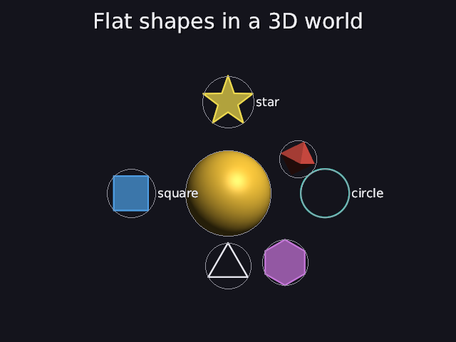
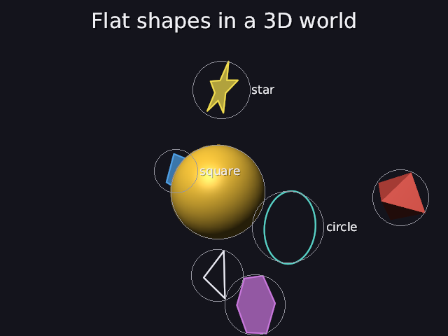

# 40 · Flat shapes: 2D from the front, 3D when you walk round

Manim draws flat shapes: circles, squares, stars, crisp outlines with a
see-through fill. Here they're the same, but they **stand in the 3D world**.
From the scripted camera they look exactly 2D. Walk round them (Tab, WASD)
and they're thin outlines and flat color hanging in space.

```
ring   = circle teal right_of sun label "circle"
box    = square blue filled left_of sun label "square"
spark  = star yellow filled above sun label "star"
```

| from the camera | walked round to the side (`--eye 9,3,5`) |
|---|---|
|  |  |

From the side the circle is an ellipse, the star and triangle are going
thin, and the square is half hidden behind the sun: it's a real flat thing
behind a real sphere.

Code: `shapes2d.h/.cpp` (the shapes), `render.cpp` (`draw_flat`,
`rasterize_flat`), `object.cpp` (holding a flat shape), `world.cpp`
(facing the camera), `scene_parser.cpp` (the shape words, `filled`).

---

## 1. The shapes

A flat shape is a few **paths** in its own plane: x right, y up, z = 0. Like
a mesh fits in its bounding sphere (11), every flat shape fits in a circle
of radius 1, so the solver places it like any object of radius 1 × its size:

| word | the path |
|---|---|
| `circle` | 64 points on the circle of radius 1 |
| `square` | 4 corners on that circle: sides √2 = 1.414 |
| `triangle`, `hexagon` | 3 and 6 corners on it, a corner straight up |
| `star` | 5 tips on it, and 5 dents halfway between them at radius 0.4 |

Without a word, it's an outline (Manim's default). With **`filled`**, its
inside is colored too, at half strength. `filled` on a mesh is a mistake:
"only flat shapes (circle, square, triangle, hexagon, star) can be filled".

## 2. Why it looks exactly 2D from the camera

A point at depth d from the camera lands on the screen at

```
x_screen = x / d,     y_screen = y / d          (05: similar triangles)
```

A flat shape whose plane is **parallel to the picture** has every point at
the same depth d. So every point is divided by the same number: the shape
is only **scaled**, never distorted. A circle stays a perfect circle, a
square stays square.

The test does it with numbers: a 200 × 200 picture with a 50° field of view,
so 1 tan unit (13) = 100 / tan 25° = 214.45 pixels. A circle of radius 1 at
depth 10:

```
across:  2 · (1 / 10) · 214.45 = 42.89 px
up:      2 · (1 / 10) · 214.45 = 42.89 px
```

The engine: 42.890137 across, 42.890137 up. ✓

**From 60° to the side,** the circle's width is seen at a slant, so it
shrinks by about cos 60° = 0.5, while its height doesn't. The engine:
0.504 (not exactly 0.5, because the near half and the far half are now at
slightly different depths: that's the perspective coming back).

## 3. Turning it to face the camera

Each flat shape is turned so its plane is parallel to the picture of the
**scripted** camera: its own +z must point back along the camera's view,
d = normalize(eye − target). The model matrix (09) turns by
`rotate_y(ry) · rotate_x(rx)`, which sends (0, 0, 1) to

```
(cos rx · sin ry,  −sin rx,  cos rx · cos ry)
```

Setting that equal to d:

```
rx = −asin(d.y),     ry = atan2(d.x, d.z)
```

Its own x then stays level, like the camera's "right", so text and shapes
aren't tilted. Flat shapes skip the three-quarter turn and the slow spin
that meshes get: they keep facing the camera.

## 4. Drawing it: fill and outline, in a 3D world

The shape's points go onto the screen like any vertex: model, view,
projection, divide (03–06). Then two things are drawn, unlit, in the
object's color, like Manim:

**The fill** uses the winding rule, `fill_loops` (29), on the projected
loop. But it has to hide behind things in front of it, so every pixel needs
a **depth**. A flat thing has a simple one: on a plane, the screen depth is
a straight-line function of the screen position,

```
z(x, y) = a·x + b·y + c
```

That's the same reason the depth can be blended with barycentric weights
across a triangle (08). a, b and c come from three points of the plane: the
shape's own (0, 0), (1, 0) and (0, 1), projected.

**Worked example:** the camera 60° to the side, 10 away (200 × 200):

```
(0, 0) → screen (100.00, 100.00), z = 0.981982
(1, 0) → screen (111.74, 100.00), z = 0.980084
(0, 1) → screen (100.00,  78.55), z = 0.981982

a = (0.980084 − 0.981982) / 11.74 = −0.0001617     (z changes across: the plane is turned sideways)
b = 0                                               (it doesn't change up: the camera is level)
c = 0.981982 − a · 100 = 0.998152

the middle (0.5, 0.5) → screen (105.60, 88.79):
z = 0.998152 − 0.0001617 · 105.60 = 0.981076
```

Projecting (0.5, 0.5) directly gives 0.981076 too. ✓ Seen straight on from
its own camera, a = b = 0: one depth for the whole shape, which is section
2's "every point at the same depth" again.

A fill pixel is drawn only if nothing nearer is there, and it doesn't claim
the pixel (it's see-through, 24). The test puts a filled square behind a
solid cube: it's hidden (blue 38, the cube's color); in front of the cube
it shows (blue 171).

**The outline** is each path's projected polyline, `2 · ui` pixels wide
(34). A pixel takes the **most** any one side covers it (`line_coverage`,
26), not the sum. Where two sides meet at a corner, both cover the corner
pixels; blending each side separately would make every corner a darker
blob. Its depth is the nearest side's, along that side.

**Order:** after the solid and see-through objects (so they can be hidden
behind them), farthest shape first (like see-through things, 24), before
lines and arrows.

**Walking through one:** if any point of a shape is behind the camera, the
shape isn't drawn that frame. Walk right through a circle and it vanishes
until you're past it.

## 5. Tests

```
flat shapes:
  PASS  from the camera it faces, a circle is round on screen (42.890137 across, 42.890137 up)
  PASS  60 degrees round to the side it's an ellipse, about cos 60 = 0.5 as wide as tall (0.503776)
  PASS  a filled square behind a solid cube is hidden; in front of it, it shows (blue 38 vs 171)
  PASS  'circle teal filled right_of sun' is a filled flat circle, with no mesh file
  PASS  'cirlce' gets a did-you-mean; 'filled' on a cube is a mistake (only flat shapes can be filled)
```

---

## Try it on paper

A square (corners on the circle of radius 1) faces a camera 20 away, on a
480-pixel-tall picture (50°). How many pixels long is each side on screen?

Answer: 1 tan unit = 240 / tan 25° = 514.7 px. A side is √2 = 1.414 long,
so 1.414 / 20 · 514.7 = 36.4 px.
