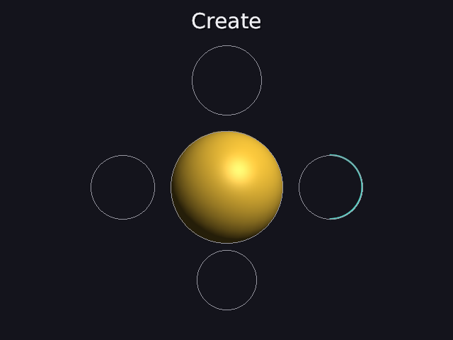
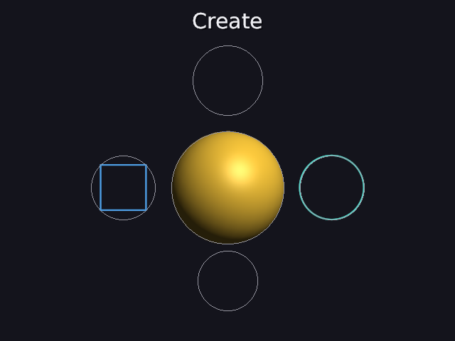
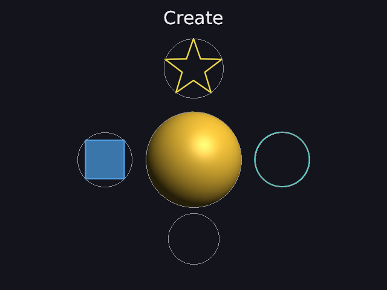

# 41 · Create: shapes that draw themselves in

Manim's **Create** draws a shape along its outline, as if a pen were
tracing it; a filled shape fills in once its outline is done. Flat shapes
(40) can now do that:

```
ring  = circle teal right_of sun create 0s-2s
box   = square blue filled left_of sun create 1s-3s
spark = star yellow filled above sun create 2s-4s
tri   = triangle white below sun create 3s-4s
```

| 1 s | 2 s | 3 s |
|---|---|---|
|  |  |  |

At 1 s the circle is half drawn (from the top, going clockwise). At 2 s the
square's outline is done and its fill is starting. At 3 s the square is
filled and the star's outline is complete. The triangle starts at 3 s.

Code: `shapes2d.cpp` (`path_prefix`, `create_look`), `object.cpp`
(`create`, `update`), `render.cpp` (`rasterize_flat` draws `look.drawn`
of each path), `scene_parser.cpp`.

---

## 1. The words

```
name = <flat shape> ... create [start-end]
```

`create` alone draws it in over the first second (0 s to 1 s). Before it
starts, nothing is drawn. Only flat shapes can be created; on a mesh it's a
mistake that points to `draw_in` (for 3D objects, 44). A range that ends
before it starts is a mistake too.

## 2. How much of the outline: the length, again

As with Write (37, 38), "how much is drawn" is measured **along the path**.
`path_prefix` walks a path's sides until the wanted length is used up and
cuts the side where it runs out. A closed path (a loop) includes its last
side back to the start; an open path (like a graph's curve, 42) doesn't.

**An open path:** (0, 0) → (3, 0) → (3, 4), 3 + 4 = 7 long. Half of it is 3.5:
the first side (3), then 0.5 up the second: it ends at (3, 0.5).

**A square** has its corners on the circle of radius 1 (40), at
(0.7071, 0.7071), (0.7071, −0.7071), (−0.7071, −0.7071), (−0.7071, 0.7071),
going clockwise from the top right. Each side is √2 = 1.414, so the whole
outline is 4 · 1.414 = 5.657.

```
0.6 of it = 0.6 · 5.657 = 3.394
first side down the right:   1.414     (used: 1.414)
second side along the bottom: 1.414    (used: 2.828)
left over: 3.394 − 2.828 = 0.566, up the left side from (−0.7071, −0.7071)
ends at (−0.7071, −0.7071 + 0.566) = (−0.7071, −0.1414)
```

The test gets (−0.7071, −0.1414).

## 3. The timing

p goes from 0 to 1 over the create time. Like Manim, eased with smooth (23):

```
outline only:   drawn = smooth(p)                        the whole time
filled:         drawn = smooth(min(1, 2p))               the outline in the first half
                fill  = smooth(max(0, 2p − 1))           then the fill comes up
```

| p | outline only: drawn | filled: drawn | filled: fill |
|---|---|---|---|
| 0 | 0 | 0 | 0 |
| 0.25 | smooth(0.25) = 0.07 | smooth(0.5) = 0.5 | 0 |
| 0.5 | smooth(0.5) = 0.5 | 1 | 0 |
| 0.75 | smooth(0.75) = 0.93 | 1 | smooth(0.5) = 0.5 |
| 1 | 1 | 1 | 1 |

Unlike Write (38), the outline **stays**: Manim's shapes keep their stroke,
while letters lose theirs.

At 1 s in the pictures, the circle (created over 0–2 s, outline only) is at
p = 0.5: drawn = 0.5, half the circle, from the top round the right side to
the bottom. ✓

## 4. Tests

```
create:
  PASS  an open path 3 + 4 = 7 long: its first half (3.5) ends at (3, 0.5); no side back to the start
  PASS  a square's outline (4 x 1.414 = 5.657) at 0.6: 3.394 = 2 sides + 0.566, at (-0.7071, -0.1414)
  PASS  an outline at 0.5 is half drawn (smooth(0.5))
  PASS  a filled one: at 0.25 the outline is half drawn, at 0.75 it's whole and the fill half up
  PASS  before it starts nothing is drawn; at the end all of it
  PASS  'create 1s-2s' and 'create' (0 s to 1 s) are read; create on a cube, or ending before it starts, are mistakes
```

---

## Try it on paper

A triangle (corners on the circle of radius 1) is created over 3 s to 4 s,
outline only. At 3.5 s, how much of it is drawn, and how long is that?

Answer: p = 0.5, drawn = smooth(0.5) = 0.5. Each side is 2 · sin 60° = 1.732,
so the outline is 5.196 and half of it is 2.598: one whole side and half of
the next.
