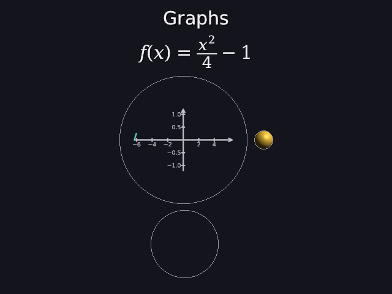
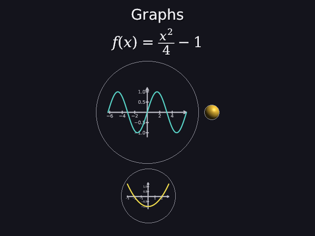
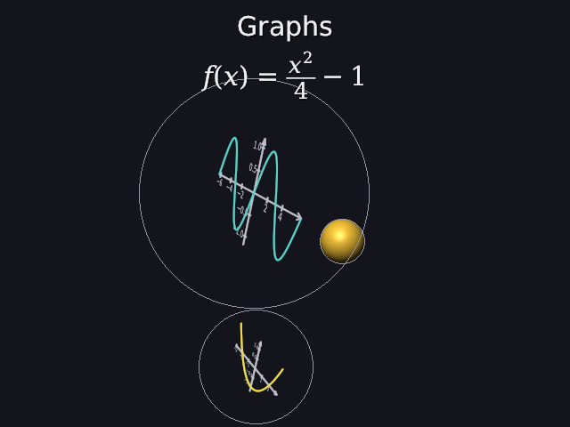

# 42 · Graphs: a function on axes

The thing Manim is most used for in maths: **plotting a function**. A graph
is a flat shape (40): axes, ticks, numbers and the curve, flat in its own
plane. From the camera it looks like Manim's `Axes().plot(...)`; from the
side it's a sheet of lines in space.

```
wave = graph "sin(x)" from -6.28 to 6.28 big teal important create 1s-4s
bowl = graph "x^2/4 - 1" from -3 to 3 yellow below wave create 3s-5s
```

| 2.5 s: axes done, the curve on its way | 8 s | from the side (`--eye 12,4,6`) |
|---|---|---|
|  |  |  |

Code: `expression.h/.cpp` (parsing and working out the function),
`shapes2d.cpp` (`graph_shape`, `tick_step`, `add_text`), `scene_parser.cpp`
(`graph`), `render.cpp` (letters' holes, the curve's own progress).

---

## 1. The function: another small parser

`"2*sin(x) + 1"` is parsed by recursive descent (21, 30), one function per
rule:

```
sum     = product { ("+" | "-") product }
product = unary { ("*" | "/") unary }
unary   = "-" unary | power
power   = atom [ "^" unary ]
atom    = number | x | pi | e | sin(...) cos tan exp log sqrt abs | ( sum )
```

Each rule calls the next one down, so the lower a rule, the tighter it binds:
`*` before `+`, `^` before `*`.

**Two details that match maths:**
- **`-x^2` is −(x²)**, not (−x)². The minus is in `unary`, which is *above*
  `power`, so `x^2` is made first and then negated. At x = 3: −9.
- **`2^3^2` is 2^(3²) = 2⁹ = 512**, not (2³)² = 64. Powers go right to left:
  the right side of `^` is a whole `unary`, which can contain another `^`.

**The tree for `2*sin(x) + 1`, and working it out at x = π/6:**

```
        add                    add      = 1 + 1       = 2
       /   \                   /   \
  multiply   1           multiply   1   = 2 · 0.5     = 1
   /    \                 /    \
  2     sin              2     sin      = sin(π/6)    = 0.5
         |                      |
         x                      x       = π/6
```

`evaluate` walks the tree: work out the parts, then combine them. The test
gets 2.

**Mistakes,** with a column and did-you-mean like everything else:

```
sinn(x)     unknown name 'sinn' (did you mean sin?)                    column 1
2x          unexpected 'x' (to multiply, write *, like 2*x)
sin(x       this '(' is never closed with ')'
```

In a `.dan` file the column points at the exact character of the line (the
same trick as formulas, 30): `g = graph "sin(x"` → column 15, the `(`.

## 2. From function to picture

**1. Sample** the function at 200 points from `from` to `to`. Where it has
no value (log of a negative, √ of a negative, 1/0), the result is NaN or
infinite.

**2. The y range** is where the values are, but robustly:
- leave out the most extreme 2% at each end (`tan` and `1/x` shoot off to
  infinity near their asymptotes, and would squash everything else flat)
- take 0 in if it's close (within a quarter of the range), so the x axis
  shows
- add 10% at each end

**3. The box:** 1.6 times as wide as tall, with its corners on the circle of
radius 0.9, so the numbers still fit inside the shape's radius 1:

```
w = 2 · 0.9 · 1.6 / √(1 + 1.6²) = 2.88 / 1.887 = 1.526        h = w / 1.6 = 0.954
```

x and y are mapped into it in a straight line.

**4. The axes** go through 0 if 0 is in range, otherwise along the edge,
each with an arrow tip.

**5. Ticks** every `tick_step`: 1, 2 or 5 times a power of ten, the smallest
that gives at most 10 ticks:

```
range 6.28 (−3.14 to 3.14):  0.5 → 12.6 ticks, too many;   1 → 6.3   →  step 1
range 12.56 (sin, −6.28 to 6.28):  1 → 12.6, too many;     2 → 6.3   →  step 2
range 2.4 (sin's y, −1.2 to 1.2):  0.2 → 12, too many;     0.5 → 4.8 →  step 0.5
```

That's the −6, −4, −2, 2, 4 and the 1.0, 0.5, −0.5, −1.0 in the picture.

**6. Numbers** are letters on the plane: each digit's outline (29) as filled
loops, `−` a real minus sign. So they're 3D too: in the side picture they're
seen at a slant like the rest. A digit like "0", "6" or "8" is several loops
(the outside and its holes), and they're filled **together**, so the winding
rule (29) can leave the holes empty. Filled one by one, the hole would be
painted in.

**7. The curve** is the samples joined up, one open path per stretch where
the function has a value and stays in range. `log(x)` from −1 to 1 is one
curve, only on the right half (the test checks it).

**Size:** a graph is something to read, like a board, so for the same size
word it's 2.5 times as big as the other shapes (radius 2.5 × the size).

## 3. Create on a graph

Like Manim, the axes come first and then the curve, left to right:

```
p < 0.4:   axes, ticks and numbers drawn in   (drawn = smooth(p / 0.4); the numbers fade in with them)
p ≥ 0.4:   the curve, along its length        (curve = smooth((p − 0.4) / 0.6))
```

The left picture is at 2.5 s, p = (2.5 − 1) / 3 = 0.5: the axes are done and
the curve is at smooth(0.1 / 0.6) = smooth(0.167) = 0.03, just starting at
the left.

## 4. Tests

```
graphs:
  PASS  2*sin(x)+1 at x = pi/6 is 2 * 0.5 + 1 = 2
  PASS  -x^2 at 3 is -(3^2) = -9; 2^3^2 is 2^(3^2) = 512 (powers go right to left)
  PASS  'sinn(x)' is unknown at column 1 (did you mean sin?); '2x' says to write 2*x
  PASS  tick steps: 1 for a range of 6.28, 2 for 12.56, 0.5 for 2.2 (at most 10 ticks)
  PASS  log(x) from -1 to 1: one curve, only where x > 0 (no value to draw for x <= 0)
  PASS  'graph "sin(x)" from -3.14 to 3.14' is read; an unclosed '(' points at column 15; from 3 to -3 is a mistake
```

## 5. Not yet

Formulas can't say `\sin` yet: the small TeX (30) has no upright function
names, so the demo's formula is f(x) = x²/4 − 1. Adding `\sin`, `\cos` and
`\log` as upright words is a small step for the next round.

---

## Try it on paper

1. Draw the tree for `-2^2 + 3` and work it out.
2. What's the tick step for a graph from 0 to 30?

Answers: 1. add(negate(power(2, 2)), 3) = −4 + 3 = −1. 2. range 30: 2 → 15
ticks, too many; 5 → 6: step 5.
