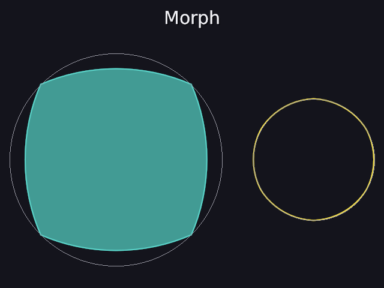
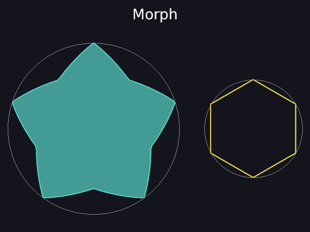
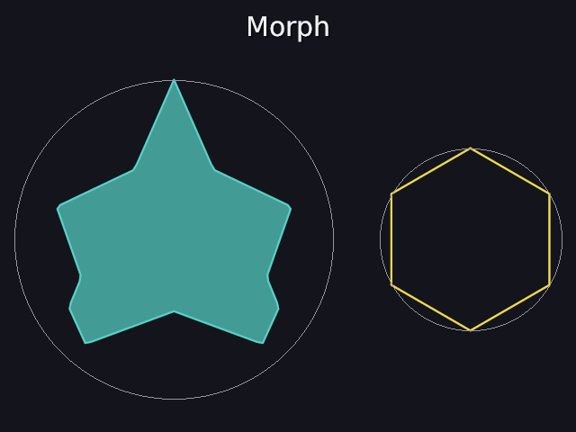

# 43 · Morph: one shape melting into another

Manim's plain **Transform** turns any shape into any other: every point of
the old outline slides to a point of the new one. Flat shapes (40) can now
do it:

```
shape = square teal filled big important create 0s-1s becomes circle at 2s-3s becomes star at 4s-5s becomes triangle at 6s-7s
other = circle yellow right_of shape becomes hexagon at 2s-4s
```

| 2.5 s: square → circle | 4.5 s: circle → star | 6.5 s: star → triangle |
|---|---|---|
|  |  |  |

Code: `shapes2d.cpp` (`resample`, `signed_area`, `align_loop`),
`object.cpp` (`morph_to`, `update`), `scene_parser.cpp` (`becomes` for
shapes).

---

## 1. The words

```
name = <flat shape> ... { becomes <flat shape> at start-end }
```

Like a formula's `becomes` (39), but for shapes, and they can be chained.
Mistakes: a mesh or a graph can't become a shape; a change can't start
before the one before it is done; an unknown shape gets a did-you-mean.

## 2. The problem: which point goes where?

A square has 4 points, a circle 64, a star 10. To slide "every point to a
point", both need **the same number of points**, and they have to be
**paired sensibly**. Pair them badly and the shape twists, folds through
itself, or a corner crosses the whole shape to get to its partner.

Three steps fix that, all worked out **once**, when the scene is built
(`morph_to`). During the change each point just slides in a straight line,
eased with smooth (23):

```
point i = from[i] + (to[i] − from[i]) · smooth(f)
```

## 3. Step 1: resample, so both have 128 points

Walk round each outline once and drop a point every (length / 128), the
same walk as `loop_prefix` (37). Points end up **evenly spaced by length**,
whatever the shape had before.

**Worked example: a square to 8 points.** Corners on the circle of radius 1
(40) at (±0.7071, ±0.7071), sides √2 = 1.414, outline 5.657. A point every
5.657 / 8 = 0.707 = half a side:

```
(0.7071, 0.7071)   corner        (−0.7071, −0.7071)  corner
(0.7071, 0)        middle         (−0.7071, 0)       middle
(0.7071, −0.7071)  corner        (−0.7071, 0.7071)   corner
(0, −0.7071)       middle         (0, 0.7071)        middle
```

Its 4 corners and the middles of its 4 sides, in order round it. The test
gets exactly these.

## 4. Step 2: the same way round

If one outline goes clockwise and the other anticlockwise, pairing point i
with point i makes the shape **turn inside out** on the way. Which way a
loop goes is the sign of its **signed area**, the shoelace formula:

```
area = ½ · Σ (x_i · y_{i+1} − x_{i+1} · y_i)
```

Positive is anticlockwise (with y up), negative clockwise. Our square goes
clockwise from its top-right corner: area −2 (the test). If the two signs
differ, the second one is reversed, keeping its first point first.

## 5. Step 3: the best place to start

Even going the same way round, the two lists can start at different places
on the shape. If the square starts at its top-right corner and the circle
at its top, pairing i with i makes every point slide a little sideways, and
the whole shape **rotates** as it morphs. So try every starting offset k
and keep the one where the points have least distance to travel:

```
cost(k) = Σ_i |from[i] − to[(i + k) mod n]|²
```

**Worked example with 4 points:** from = the square's corners A, B, C, D;
to = the same corners started one later: B, C, D, A. Adjacent corners are
√2 apart (squared: 2), opposite ones 2 apart (squared: 4):

| k | from[i] pairs with | each pair | cost |
|---|---|---|---|
| 0 | the next corner | adjacent: 2 | 4 · 2 = 8 |
| 1 | the opposite corner | 4 | 4 · 4 = 16 |
| 2 | the corner before | adjacent: 2 | 8 |
| 3 | itself | 0 | **0** |

k = 3 lines them back up exactly: nothing moves at all. The test does the
same with the 8-point square started 3 points later, and with it going the
other way round: both come back to the original order. With 128 points
that's 128 · 128 = 16,384 distance sums, once per change: nothing.

## 6. During and after

During a change, the object draws an in-between shape rebuilt every frame
from the two lists. Before the change it's the old shape; after it, it
simply *is* the new one, which is drawn exactly as if it had always been
that shape. Both shapes fit the same circle of radius 1 (40), so the solver
doesn't have to place it again.

## 7. Morph vs Transform (39)

- **Transform** (formulas): matches *pieces* (letters) and moves each one
  whole. Readable: the letters keep their shapes.
- **Morph** (shapes): matches *points*, so the outline itself changes shape.

`x + y → y + x` can't be done by Transform (39 kept reading order); a
point-by-point morph of whole formulas could, which would be a later step.

## 8. Tests

```
morph:
  PASS  a square resampled to 8 points: its 4 corners and the 4 middles of its sides
  PASS  its signed area is -2: area 2 (sides 1.414), negative because it goes clockwise
  PASS  the same square started 3 points later is lined back up (offset 3 is best)
  PASS  the same square going the other way round is turned back first
  PASS  before the morph it's the square; at its start the 128 points are exactly the square's; after it, it's the circle
  PASS  'becomes circle at 2s-3s becomes star at 4s-5s' is two changes; a cube can't, and changes can't overlap
```

---

## Try it on paper

A triangle (corners on the circle of radius 1) resampled to 6 points: where
are they?

Answer: its sides are √3 = 1.732, the outline 5.196, so a point every 0.866
= half a side: the 3 corners and the 3 middles of the sides. The middles are
halfway between corners: for the corners (0, 1) and (0.866, −0.5), (0.433, 0.25).
