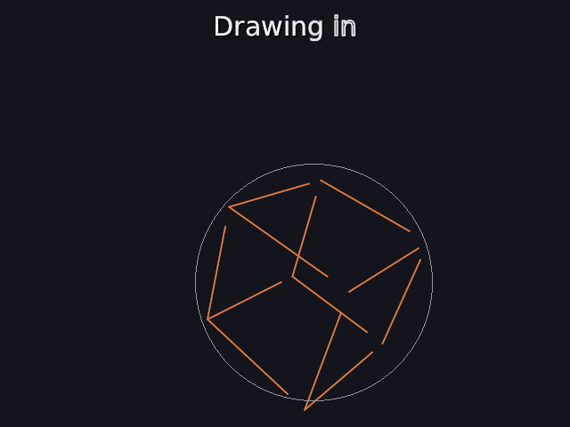
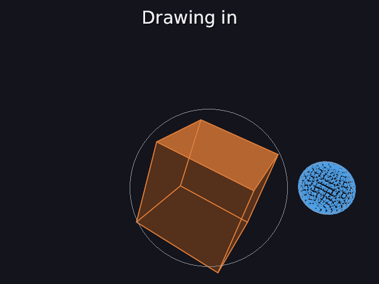
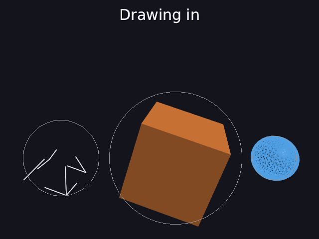
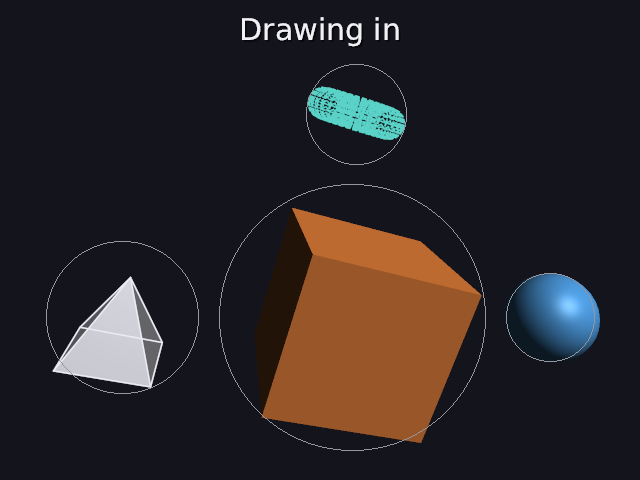

# 44 · Draw-in: 3D objects that draw themselves

Flat shapes have Create (41). 3D objects now have **draw-in**: their edges
trace out like a wireframe being sketched, then the faces fade in, the way
Manim's Create works on a 3D surface.

```
cube = cube big orange important draw_in 0s-2s
ball = sphere blue right_of cube draw_in 1s-3s
tent = pyramid white left_of cube draw_in 2s-4s
ring = torus teal above cube draw_in 3s-5s
```

| 0.8 s | 1.6 s | 2.6 s | 3.6 s |
|---|---|---|---|
|  |  |  |  |

Code: `mesh.cpp` (`find_edges`), `object.cpp` (`draw_in`, `draw`),
`scene_parser.cpp` (`draw_in`).

---

## 1. The words

```
name = <mesh shape> ... draw_in [start-end]
```

`draw_in` alone takes 0 s to 2 s. Before it starts, the object isn't drawn.
It's for 3D objects; a flat shape uses `create` (41), and the message says
so.

## 2. Which edges to trace

A mesh is triangles (02), so it has far more edges than you'd draw by hand:
a cube is 12 triangles with 18 edges, and 6 of those are **diagonals**
across its flat faces. Drawing them would look like a broken cube.

So only **creases** are traced: edges where the two faces meet at an angle
bigger than the crease angle, the same 40° test as smooth shading (36):

```
crease if   dot(n1, n2) < cos 40° = 0.766      (or the edge has only one face)
```

| mesh | all edges | creases | why |
|---|---|---|---|
| cube | 18 | **12** | a face's diagonal: both triangles face the same way, dot = 1 |
| pyramid | 9 | **8** | the base's diagonal is flat |
| icosahedron | 30 | **30** | its faces meet at 41.8°: every edge is a crease (36) |
| sphere | 1440 | 0 → **1440** | no creases anywhere |

A mesh with **no creases at all** (the sphere, the torus) traces every edge
instead, so you see its grid being drawn, like Manim's surfaces. The edges
are found once, when the mesh is loaded, by listing each edge with the faces
on either side (a map from the vertex pair to its faces).

## 3. The timing

p goes from 0 to 1 over the draw-in, eased with smooth (23):

```
lines = smooth(min(1, p / 0.6))           every edge grows from its first end towards its second
faces = smooth(max(0, (p − 0.5) / 0.5))   the faces fade in (see-through, 24) ...
line strength = 1 − faces                 ... while the lines fade out
```

| p | lines drawn | faces | lines' strength |
|---|---|---|---|
| 0.2 | smooth(0.33) = 0.15 | 0 | 1 |
| 0.4 | smooth(0.67) = 0.85 | 0 | 1 |
| 0.6 | 1 | smooth(0.2) = 0.04 | 0.96 |
| 0.8 | 1 | smooth(0.6) = 0.73 | 0.27 |
| 1 | | 1: just the solid object | |

The pictures: at 0.8 s the cube (0–2 s) is at p = 0.4, its 12 edges 85% of
the way. At 1.6 s, p = 0.8: faces 73% in, lines faint. At p = 1 it's drawn
exactly like any solid object; the test checks the finished draw-in is the
same picture, pixel for pixel, as a plain cube.

The lines are the depth-tested lines from 26, 1.5 pixels wide (times ui,
34). While the faces are see-through, the edges at the back show through
them, which is what makes it read as a wireframe.

## 4. Limits

- **Dense grids look busy.** A sphere traces 1440 edges and a torus 1536,
  so mid-way they look speckled more than sketched. Manim draws a few
  latitude and longitude lines; picking those out of a mesh (or making the
  grid from the shape's own parameters) would be the improvement.
- **Smooth sides with creased ends** (a cylinder, a cone) trace only their
  rims: 64 and 32 edges. Their smooth sides have no creases to draw, so the
  sides appear only as the faces fade in.

## 5. Tests

```
draw-in:
  PASS  a cube traces its 12 creases (not the 6 diagonals across its flat faces); a pyramid its 8
  PASS  a sphere has no creases, so it traces all 1440 edges of its grid
  PASS  before its draw-in starts, nothing is drawn
  PASS  when it's done, it's exactly the plain solid cube
  PASS  half way (lines tracing, faces not yet in) it's neither
  PASS  'draw_in 1s-3s' and 'draw_in' (0 s to 2 s) are read; a flat shape uses create instead
```

---

## Try it on paper

An octahedron (8 triangles meeting 4 at each of its 6 corners) has how
many edges, and how many does it trace? Its faces meet at 109.5°: the
angle between neighbouring faces' normals is 180° − 109.5° = 70.5°.

Answer: 8 · 3 / 2 = 12 edges, each shared by 2 faces. cos 70.5° = 0.33 < 0.766,
so every one is a crease: it traces all 12 (the engine counts 12).
